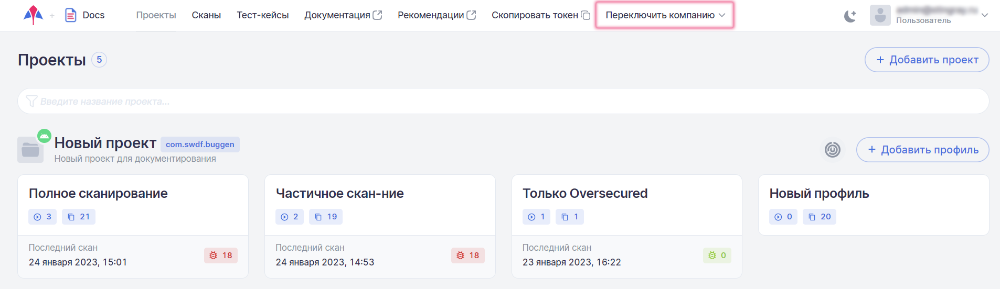
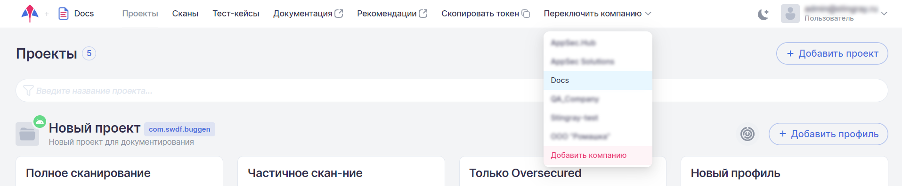
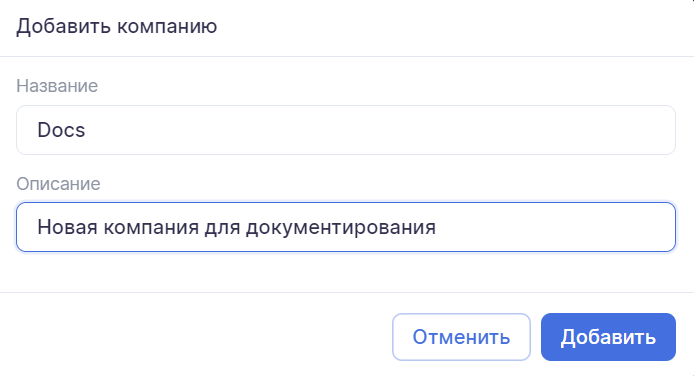
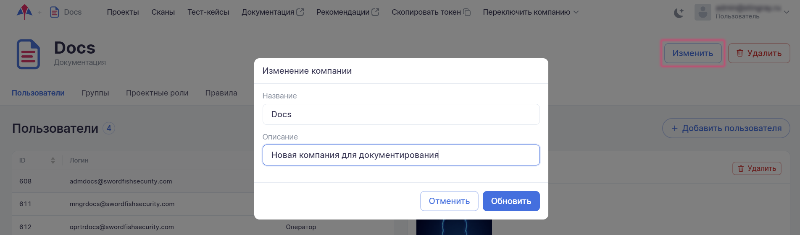
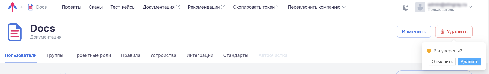

# Компании

!!! note "Примечание"
    Работать в системе со всеми компаниями может только пользователь с правами Супер администратора.

Для каждой организации в системе создается своя компания. Все сотрудники одной организации работают в системе в одной компании. В ней они получают административные права доступа и роли (подробное описание прав доступа и ролей приведено в разделе «[Административные права доступа](../polzovateli/#_3)». Все сотрудники компании не имеют в системе доступа к данным прочих компаний, таким как пользователи, проекты, профили, правила, тест-кейсы, стандарты, требования, собранные данные, дефекты, эмуляторы и т. п. Каждая компания имеет в системе свое выделенное пространство и не знает о существовании других компаний.

Работать в системе со всеми компаниями может только пользователь с правами Супер администратора. Эта роль необходима, в частности, для создания, изменения или удаления компаний.

Компанию, зарегистрированную в системе, можно выбрать из списка в основном меню, включающем для Супер администратора дополнительный пункт **Переключить компанию**.

<figure markdown></figure>

!!! note "Примечание"
    Другой доступный пользователю с правами Супер администратора пункт основного меню **Скопировать токен** позволяет получить токен для работы с системой.

## Добавление компании

Чтобы создать новую компанию, выберите пункт **Переключить компанию** основного меню и в выпадающем меню выберите пункт **Добавить компанию**.

<figure markdown></figure>
 
В появившемся окне введите название компании и ее краткое описание.

<figure markdown></figure>
 
Вновь созданная компания появится в списке компаний, доступных для выбора в выпадающем меню пункта **Переключить компанию** основного меню Супер администратора. При создании компания получает набор стандартов по умолчанию и набор правил по умолчанию, которые могут быть модифицированы в дальнейшем в ходе работы, а также действующий токен CI/CD.

## Изменение компании

При нажатии названия компании в левом вернем углу пользовательского интерфейса открывается страница настроек компании. Для редактирования компании нажмите на кнопку **Изменить**.

В появившемся окне можно изменить название компании и ее краткое описание.

<figure markdown></figure>
 
## Удаление компании

Удаление существующей компании производится на странице настроек компании по нажатию кнопки **Удалить**. Это действие необходимо подтвердить в появившемся диалоговом окне.

<figure markdown></figure>