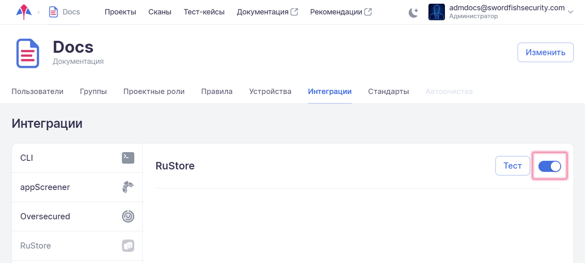
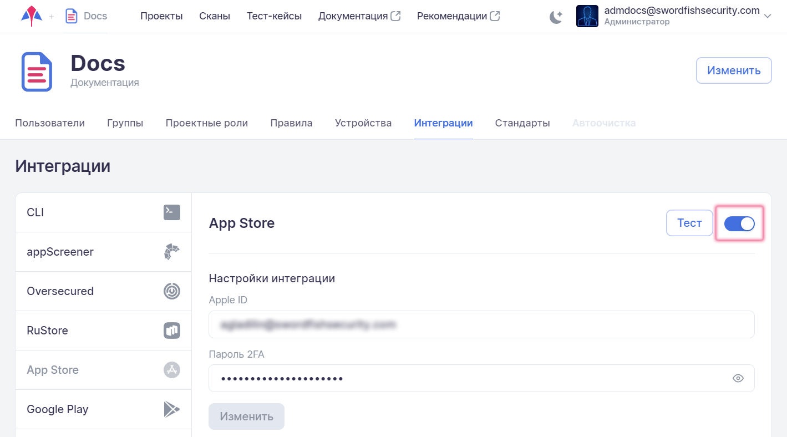
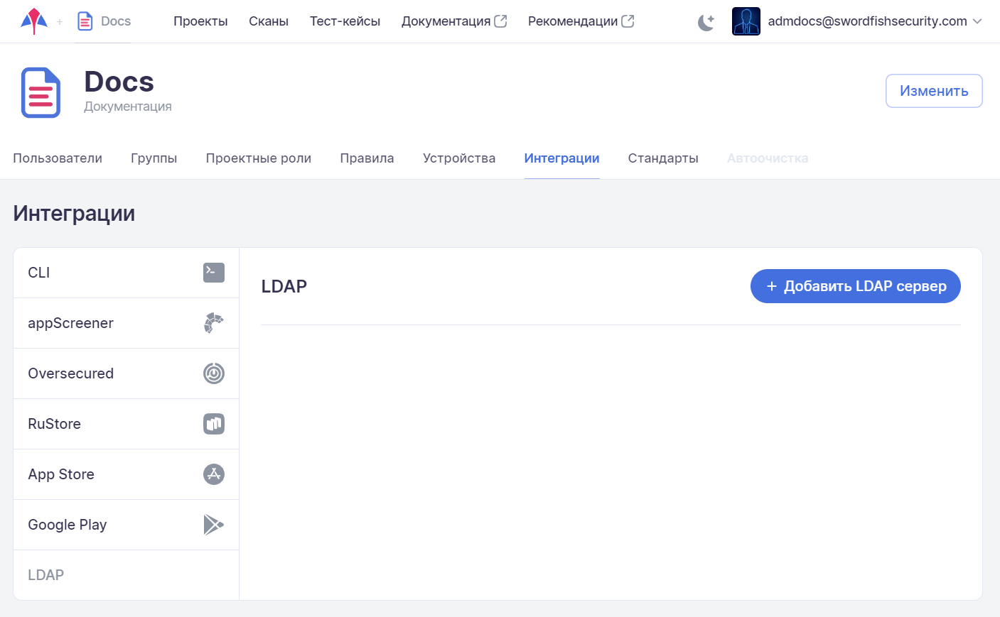

# Интеграции

<!-- !!! note "Примечание"
    Доступ в раздел имеют только пользователи с административными правами **Администратор** или **Менеджер**.

!!! note "Примечание"
    Тестирование приложений могут выполнять пользователи с проектными правами **Администратор** или **Инженер**. -->

Для настройки интеграции с различными инструментами необходимо в левом верхнем углу нажать название компании и выбрать вкладку **Интеграции**.

<figure markdown></figure>
 
Меню в левой части вкладки **Интеграции** позволяет переключаться между настройками инструментов.

## CLI

Удобный интерфейс для формирования строки запуска сканирования, которая может использоваться во внешнем CI/CD-конвейере, например с целью интеграции **Stingray** с различными системами дистрибуции. Непосредственно интеграция осуществляется с помощью специально разработанного средства инструментальной поддержки — [mdast-cli](https://github.com/Dynamic-Mobile-Security/mdast-cli).

Как отмечалось в разделе «[Запуск сканирования](../ug/zapusk_skanirovaniya.md)», сканирование приложения можно запустить не только из пользовательского интерфейса системы, но также из командной строки. Запуск сканирования из командной строки можно производить только имея валидный токен.

Прежде чем приступить к формированию строки запуска, убедитесь, что срок действия токена, указанный под соответствующим полем, не истек. Использование токена позволяет избежать ручной аутентификации при запуске сканирования. Время жизни токена — один год. Если необходимо продлить срок, нажмите на кнопку **Продлить**. При необходимости заменить токен нажмите на кнопку **Заменить** (старый токен при этом инвалидируется).

<figure markdown></figure>

<!-- Для эффективной работы внутри компании пользователь с административными правами **Администратор** или **Менеджер** может передавать токен другим пользователям для проведения сканирования приложения и анализа результатов. -->

!!! note "Примечание"
    С помощью токена можно получить доступ к информации об архитектурах, сканирующих агентах, тест-кейсах, сканированиях (общая информация и скачивание отчета), а также осуществлять запуск сканирований. При этом возможно только получение информации, но не ее изменение.

Переходим к формированию строки запуска.

<figure markdown></figure>

* Выберите проект, в рамках которого будет выполняться сканирование, в поле **Проект**.
* Выберите профиль сканирования в соответствующем поле.
* Выберите архитектуру и версию операционной системы в поле **Архитектура**.
* Выберите тест-кейс, с помощью которого будет выполняться автоматическое сканирование.
* Чтобы не ожидать окончания запущенного сканирования, активируйте соответствующую опцию. В этом случае опции **Получить отчет в виде JSON-файла** и **Получить отчет в виде PDF-файла** становятся неактивными.
* При необходимости получения отчетов выберите опции **Получить отчет в виде JSON-файла** и/или **Получить отчет в виде PDF-файла**, а также укажите имена файлов, с которыми будут сохранены отчеты.
* Выберите один из вариантов запуска скрипта:

    * PyPi — запуск скрипта, предварительно установленного из PyPi-репозитория.   
    * Docker — запуск скрипта в Docker-контейнере.
    * Source — выполнение исходного кода скрипта с помощью интерпретатора **Python**.

* Выберите систему дистрибуции. В зависимости от сделанного выбора система предложит указать ряд дополнительных параметров, описание которых приведено в следующих разделах:

    * [Системы CI/CD](../ag/sistemy_ci_cd.md).
    * [Система дистрибуции AppCenter](../ag/sistema_distribucii_appcenter.md).
    * [Система дистрибуции Nexus Repository 3.х](../ag/sistema_distribucii_nexus_repository.md).
    * [Система дистрибуции Nexus Repository 2.х](../ag/integraciya_s_nexus_2.md).
    * [Интеграция с Firebase](../ag/integraciya_s_firebase.md).
    * [Интеграция с Google Play](../ag/integraciya_s_google_play.md).
    * [Интеграция с RuStore](../ag/integraciya_s_rustore.md).

    Более подробная информация приведена в [документации mdast-cli](https://github.com/Dynamic-Mobile-Security/mdast-cli#readme), доступ к которой также можно получить, нажав на кнопку **Документация** в правом верхнем углу данной вкладки.

<figure markdown></figure>

В расположенном ниже окне отображается сформированная строка запуска. Чтобы скопировать ее, нажмите на иконку .

## AppScreener

Выберите в расположенном слева меню пункт **AppScreener**. Для интеграции с AppScreener понадобится токен, порядок создания которого подробно описан в разделе «[Интеграция с AppScreener](./integraciya_s_appscreener.md)» Руководства по установке и интеграции.

Переведите селектор, расположенный справа, в положение «включено».

Вставьте полученный токен для интеграции в соответствующее поле.

<figure markdown>

</figure>

!!! note "Примечание"
    **URL** задается при установке системы и не может быть изменен **Пользователем** или **Администратором** системы.

Нажмите на кнопку **Тест**, чтобы проверить соединение с инструментом. В случае успешного соединения в левом нижнем углу пользовательского интерфейса появится соответствующее сообщение, в противном случае отобразится предупреждение об ошибке.

В нижней части страницы располагается таблица, позволяющая задать соответствия между проектами **Stingray** и **AppScreener**. Для настройки используйте раскрывающиеся меню.

<figure markdown>

</figure>

Для завершения настройки интеграции необходимо перейти в профиль выбранного проекта и на вкладке **Модули** активировать соответствующий модуль, см. раздел «[Профили](../ug/profile.md)».

<figure markdown>

</figure>

!!! note "Примечание"
    Если в ходе настройки интеграции с инструментом не были заданы соответствия проектов **Stingray** и **AppScreener**, то при первом запуске сканирования в AppScreener будет создан проект, название которого будет сформировано по следующей маске:
    <figure markdown>
    *Название компании_название проекта*
    </figure>

Все последующие сканирования в выбранном проекте **Stingray** будут выполняться в созданном проекте **AppScreener** при условии, что в профиле проекта **Stingray** включена соответствующая интеграция.

## Oversecured

Выберите в расположенном слева меню пункт **Oversecured**. Для интеграции с **Oversecured** понадобится токен, порядок создания которого подробно описан в разделе «[Интеграция с Oversecured](./integraciya_s_oversecured.md)» Руководства по установке и интеграции.

Дальнейшая настройка интеграции с **Oversecured** выполняется аналогично интеграции с **AppScreener**, описанной выше в разделе «[AppScreener](./integracii.md#appscreener)».

## Интеграция с RuStore

В **Стингрей** реализована возможность скачивания пакетов непосредственно из магазина приложений [RuStore](https://www.rustore.ru/).

1. Перейдите на экран настроек компании, нажав ее название в правом верхнем углу пользовательского интерфейса.
 
2. Перейдите на вкладку **Интеграции** и выберите слева в меню пункт **RuStore**.

3. Активируйте интеграцию с магазином приложений с помощью переключателя.

	<figure markdown></figure>
 
4. Нажав кнопку **Тест**, убедитесь, что интеграция настроена правильно.

## Интеграция с App Store

В **Стингрей** реализована возможность скачивания пакетов непосредственно из магазина приложений [AppStore](https://www.apple.com/app-store/).

1. Перейдите на экран настроек компании, нажав ее название в правом верхнем углу пользовательского интерфейса.
2. Перейдите на вкладку **Интеграции** и выберите слева в меню пункт **App Store**.
3. Активируйте интеграцию с магазином приложений с помощью переключателя.

	<figure markdown></figure>

4. Укажите электронную почту аккаунта Apple в поле **Apple ID**.
5. Укажите пароль и код двухфакторной аутентификации в поле **Пароль 2FA**.

    !!! note "Примечание"
        Пароль и код двухфакторной аутентификации указываются в данном поле без пробела, например, `PASSWORD213123`, где:
        
        * `PASSWORD` — пароль учетной записи Apple;
        * `213123` — код двухфакторной аутентификации. 

        Для получения кода двухфакторной аутентификации попробуйте залогиниться, например на [iCloud.com](https://www.icloud.com/). Очевидно, что двухфакторная аутентификация для аккаунта должна быть включена.

6. Нажав кнопку **Тест**, убедитесь, что интеграция настроена правильно.

<!-- Скачивание пакета
1.	Перейдите на вкладку Сканы.
2.	Нажмите на кнопку +Добавить скан.
[скрин]
3.	Выберите магазин приложений, нажав соответствующую кнопку.
[скрин]
4.	Укажите имя сканируемого пакета в поле Имя пакета.
Примечание: https://itunes.apple.com/jp/lookup?id=<id>. 
bundle_id
 -->

## Интеграция с Google Play

В **Стингрей** реализована возможность скачивания пакетов непосредственно из магазина приложений [Google Play](https://play.google.com/store/games).

1. Перейдите на экран настроек компании, нажав ее название в правом верхнем углу пользовательского интерфейса. 
2. Перейдите на вкладку **Интеграции** и выберите слева в меню пункт **Google Play**.
3. Активируйте интеграцию с магазином приложений с помощью переключателя.

    <figure markdown></figure>

4. Для успешной интеграции необходимо указать следующие параметры:

    * адрес электронной почты и пароль аккаунта Google;
    * `GSF ID`;
    * `Auth Sub Token`.
    
    !!! note "Примечание"
        Порядок получения `GSF ID` и `Auth Sub Token` приведен в разделе «[Сбор необходимых параметров](../ag/integraciya_s_google_play.md#_1)» раздела «Интеграция с Google Play» Руководство по установке и интеграции.

5. Нажав кнопку **Тест**, убедитесь, что интеграция настроена правильно. 

## LDAP

### Создание конфигурационного профиля LDAP

1. Перейдите на экран настроек компании, нажав ее название в правом верхнем углу пользовательского интерфейса.
2. Перейдите на вкладку **Интеграции** и выберите слева в меню пункт **LDAP**.
4. Добавьте профиль подключения к LDAP-серверу, нажав кнопку **+Добавить LDAP сервер**.

    <figure markdown></figure>

5. В появившемся окне укажите следующие параметры (все поля обязательны для заполнения):

    * **Название** — название профиля подключения к LDAP-серверу.
    * **Описание** — краткое описание профиля.
    * **URL** — адрес LDAP-сервера.
    * **Base DN** — атрибут, однозначно определяющий объект Distinguished Name сервера LDAP, к которому производится подключение. 
    * **Логин администратора** — логин LDAP-пользователя, из-под которого будет производиться подключение к LDAP-серверу. 
    * **Пароль администратора** — пароль LDAP-пользователя, из-под которого будет производиться подключение к LDAP-серверу. 
    * **Фильтр пользователей** — параметр в формате фильтра для LDAP, определяющий, какие пользователи смогут авторизоваться в системе. Пользователи, которые не попадают под заданный фильтр, не смогут войти в систему.
    * **Атрибут логина** — атрибут записи LDAP-пользователя, который будет использоваться в качестве логина для авторизации в Stingray (возможно использование полей, по которым осуществляется логин в LDAP, например, userPrincipalName).  
    * **Group DN** — параметр в формате фильтра для LDAP, который идентифицирует группы (чтобы отличить их от остальных записей в LDAP).
    * **Фильтр групп** — параметр в формате фильтра для LDAP, определяющий, какие группы будут доступны в дальнейшем для связи с группами внутри системы Stingray.
    * Если выбрана опция **Автообновление групп**, при авторизации пользователя осуществляется обновление информации о группах Stingray и LDAP.
    * Если выбрана опция **Использовать домен логина** и в появившемся поле указан соответствующий домен (например, `stingray.ourcompany.com`), то при последующей авторизации пользователи могут не указывать адрес электронной почты полностью (`myname@stingray.ourcompany.com`), а ограничиться логином (`myname`).

6. Заполнив все поля, нажмите на кнопку **Добавить**.

7. Завершив создание конфигурационного профиля, можно проверить соединение с LDAP-сервером, нажав на кнопку **Тест** — в левом нижнем углу пользовательского интерфейса появится соответствующее сообщение.

### Сопоставление групп пользователей

Сопоставление (мапирование) групп пользователей позволяет при первой авторизации автоматически добавлять LDAP-пользователей, входящих в определенные группы, в соответствующие группы системы **Stingray**. Таким образом, сразу после входа LDAP-пользователь получает необходимый набор прав и возможностей в системе **Stingray** без необходимости выполнения дополнительных настроек прав доступа.

1. Нажмите на карточку конфигурационного профиля LDAP.
2. На открывшейся странице нажмите на кнопку **+Добавить мапирование**.
3. В открывшемся окне настройте соответствие групп пользователей. Более подробная информация о группах пользователей Stingray приведена в разделе «[Группы пользователей](../polzovateli/#_10)».

### Авторизация LDAP-пользователей

Чтобы авторизоваться в качестве LDAP-пользователя, необходимо на странице авторизации выбрать соответствующий конфигурационный профиль LDAP, а затем ввести имя пользователя и пароль.

<figure markdown></figure>

После авторизации пользователю предоставляются права, соответствующие группе, в которую он включен в результате сопоставления групп. См. раздел «[Сопоставление групп пользователей](./integracii.md#_2)».

После первоначальной авторизации LDAP-пользователи отображаются на вкладке **Пользователи** страницы настроек компании, а также в списке пользователей соответствующей группы на вкладке **Группы**, см. раздел «[Пользователи, группы, проекты](./polzovateli.md)».