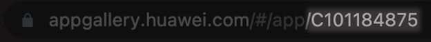

# Интеграция с Appgallery

При запуске скрипта укажите систему дистрибуции `distribution_system appgallery` и обязательный параметр `appgallery_app_id` — идентификатор пакета скачиваемого приложения.

Чтобы получить `appgallery_app_id`, откройте страницу приложения в браузере и скопируйте параметр из адресной строки браузера.

<figure markdown></figure>

В данном примере `appgallery_app_id` — `С101184875`.

Также, используя опциональный параметр `appgallery_file_name`, можно указать имя файла, с которым сохранится скачиваемое приложение.

## Типы сканирования

Существует нескольо способов запуска сканирования Android-приложения: с использованием предварительно записанного тест-кейса или без.

* В первом случае будет воспроизведен выбранный тест-кейс.

* Во втором случае приложение будет установлено на устройство, запущено и, спустя 30 секунд, остановлено с последующим выполнением анализа.

### Запуск сканирования с использованием тест-кейса

Укажите параметр `--testcase_id`.

mdast_cli \
    --testcase_id 4 \
    --distribution_system file \
    --file_path "/files/demo/apk/demo.apk" \
    --url "https://saas.mobile.appsec.world" \
    --profile_id 1 \
    --company_id 1 --architecture_id 1 \
    --token "********************"

### Запуск сканирования без тест-кейса

Не указывайте параметр `--testcase_id`.

mdast_cli \
    --distribution_system file \
    --file_path "/files/demo/apk/demo.apk" \
    --url "https://saas.mobile.appsec.world" \
    --profile_id 1 \
    --company_id 1 \
    --architecture_id 1 \
    --token "********************"
