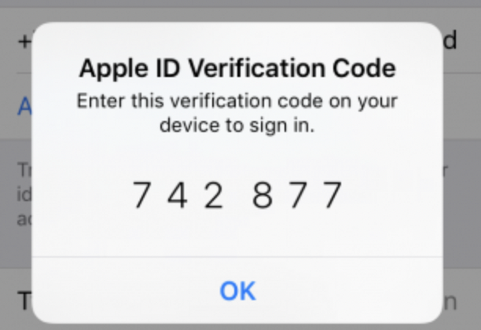
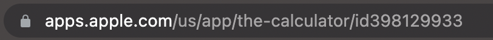

# Интеграция с AppStore

## Интеграция с использованием CLI

### Сбор необходимых параметров

Интеграция с AppStore производится через [mdast_cli](https://github.com/Dynamic-Mobile-Security/mdast-cli). Чтобы скачать приложение с AppStore, необходимо располагать учетными данными аккаунта iTunes.

Для успешной авторизации с использованием аккаунта iTunes необходимо получить и сохранить код двухфакторной аутентификации.

При первом запуске скрипта с указанием адреса электронной почты и пароля вы столкнетесь с ошибкой авторизации (это ожидаемое и нормальное в данном случае поведение), при этом на ваше устройство придет код двухфакторной аутентификации. 

<figure markdown></figure> 

Необходимо сохранить полученный код. Теперь при запуске скрипта пароль и код двухфакторной аутентификации необходимо передавать в следующем виде:

`--appstore_password2FA password2FA`, где:

* `password` — пароль;
* `2FA` — код двухфакторной аутентификации.

Например, если для входа в аккаунт используется пароль `P@ssword`, а полученный код двухфакторной аутентификации — `742877`, передаваемый параметр будет выглядеть следующим образом: `--appstore_password2FA P@ssword742877`.

Повторное получение кода двухфакторной аутентификации не потребуется в течение следующих 6 месяцев.

Для запуска сканирования, необходимо указать или `appstore_bundle_id` или `appstore_app_id`.

Чтобы получить параметр `appstore_app_id`, в браузере перейдите на страницу приложения в AppStore и скопируйте параметр из URL.

<figure markdown></figure> 

В данном примере `appstore_app_id` — `398129933`.

При запуске скрипта указываются следующие обязательные параметры:

* `distribution_system appstore` — признак того, что приложение скачивается из AppStore;
* `appstore_bundle_id` или `appstore_app_id`;
  * `appstore_bundle_id` — идентификатор бандла приложения в AppStore;
  * `appstore_app_id` — идентификатор приложения в AppStore, который можно получить из ссылки приложения в магазине AppStore, взяв числовое значение `id` нужного приложения: apps.apple.com/app/id**{appstore_app_id}**;
* `appstore_apple_id` — электронная почта аккаунта iTunes;
* `appstore_password2FA` — пароль и код двухфакторной аутентификации аккаунта iTunes.

Также используя параметр `appstore_file_name`, можно указать имя, с которым файл будет сохранен (данный параметр не является обязательным).

!!! note "Примечание"
    Если вы авторизовались и потеряли код двухфакторной аутентификации, сессия будет оставаться активной в течение одного дня (достаточно `appstore_app_id` и пароля). Вы не сможете завершить сессию с помощью данного скрипта. Таким образом, чтобы скрипт продолжал корректно работать, необходимо вновь авторизоваться спустя 24 часа с использованием пароля и кода двухфакторной аутентификации.

!!! note "Примечание"
    Если при запуске сканирования возникает ошибка, связанная с неправильным apple_id, например: «Вход в App Store». Чтобы открыть «Telegram», войдите с Apple ID, с которым была произведена покупка», обратитесь в службу технической поддержки компании Stingray для согласования Apple ID, с помощью которого будет выполняться интеграция с AppStore, вам будет предложено решение этой проблемы.

### Пример запуска скрипта

Чтобы запустить сканирование приложения, скачанного с AppStore, необходимо выполнить следующую команду:

    python mdast_cli/mdast_scan.py \
      --architecture_id 3 \
      --profile_id 1246 \
      --distribution_system appstore \
      --appstore_app_id 564177498 \
      --appstore_apple_id ubet******@icloud.com \
      --appstore_password2FA pass*******31******454 \
      --url "https://saas.mobile.appsec.world" \
      --company_id 2 \
      --token 5d5f6****************2d9f --appstore_file_name my_b3st_4pp

## Интеграция с использованием пользовательского интерфейса

В Стингрей реализована возможность скачивания пакетов непосредственно из магазина приложений **App Store**.

### Настройка

1. Перейдите на экран настроек компании, нажав ее название в правом верхнем углу пользовательского интерфейса.
2. Перейдите на вкладку **Интеграции** и выберите слева в меню пункт **App Store**.
3. Активируйте интеграцию с магазином приложений с помощью переключателя.

	<figure markdown></figure>

4.	Укажите электронную почту аккаунта Apple в поле Apple ID.
5.	Укажите пароль и код двухфакторной аутентификации в поле Пароль 2FA.
Примечание: Пароль и код двухфакторной аутентификации указываются в данном поле без пробела, например, PASSWORD213123, где PASSWORD — пароль учетной записи Apple, а 213123 — код двухфакторной аутентификации. 
Примечание: Для получения кода двухфакторной аутентификации попробуйте, например, залогиниться на iCloud.com. Очевидно, что двухфакторная аутентификация для аккаунта должна быть активирована.
6.	Указав необходимые параметры, проверьте соединение с магазином приложений, нажав кнопку Тест.
Скачивание пакета
1.	Перейдите на вкладку Сканы.
2.	Нажмите кнопку +Добавить скан.
[скрин]
3.	Выберите магазин приложений, нажав соответствующую кнопку.
[скрин]
4.	Укажите имя сканируемого пакета в поле Имя пакета.
Примечание: https://itunes.apple.com/jp/lookup?id=<id>. 
bundle_id

