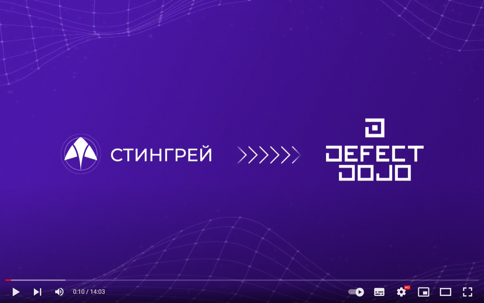
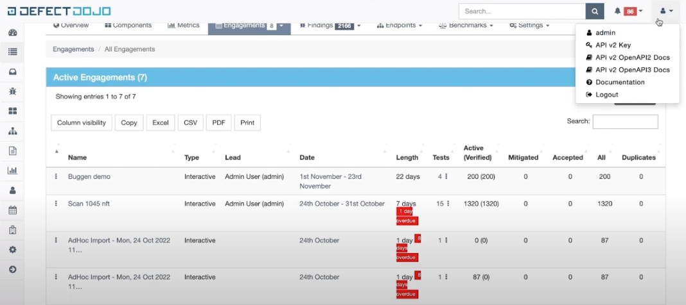
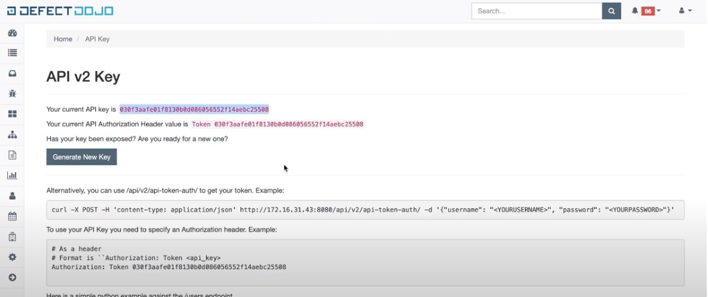
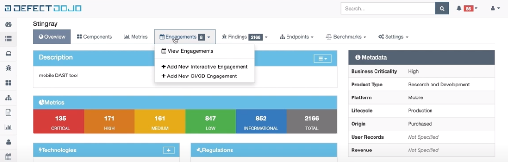
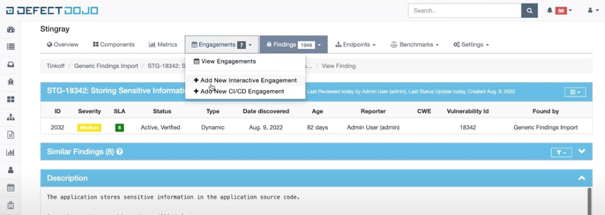
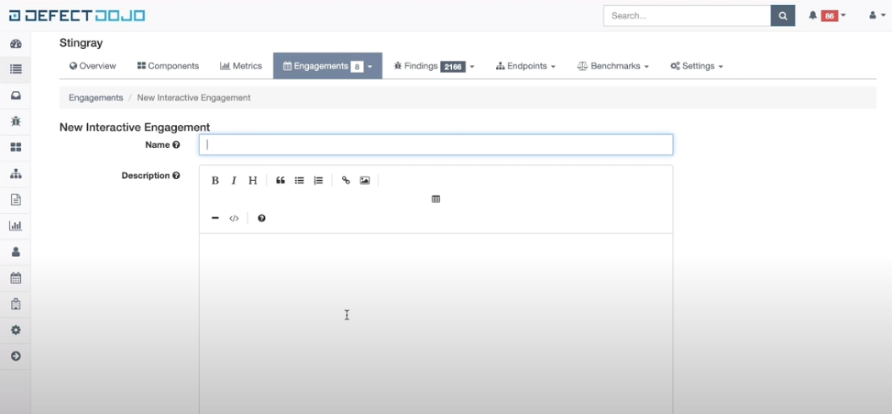
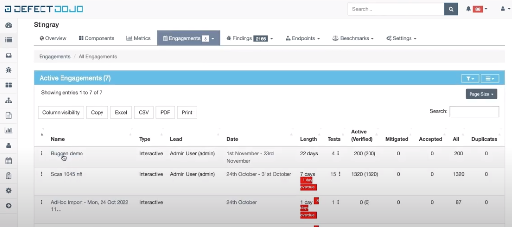
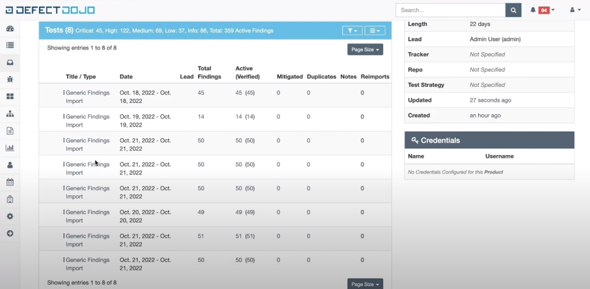
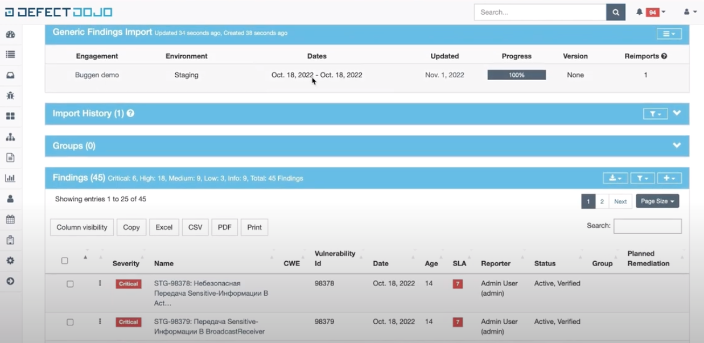
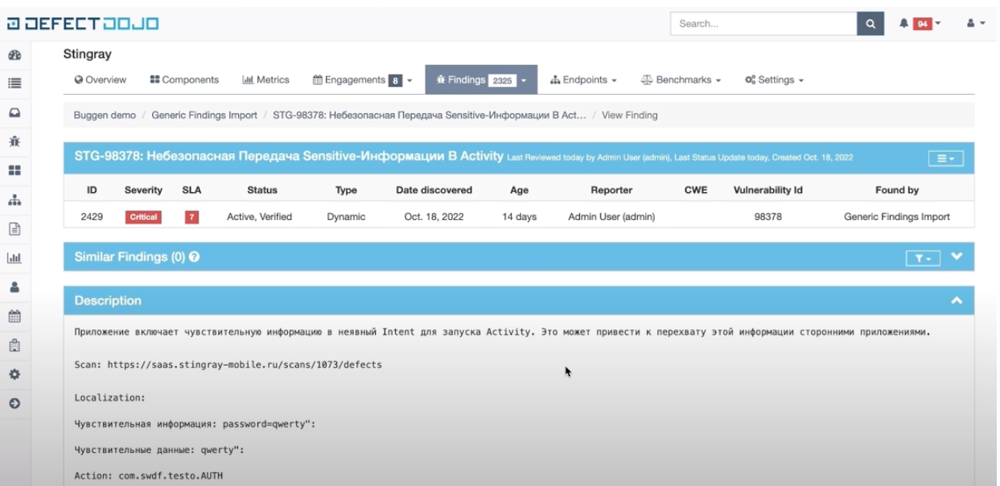

# Интеграция с DefectDojo

Стингрей предоставляет скрипт, написанный на языке Python, для экспорта результатов сканирования в JSON-файл в формате DefectDojo generic findings и последующего импорта данного файла в проект DefectDojo.

!!! note "Примечание"
    Видео, описывающее интеграцию **Стингрей** с DefectDojo.
    
    

## Параметры запуска скрипта

Для запуска скрипта необходимо указать ряд параметров как со стороны Стингрей, так и со стороны DefectDojo.

Обязательные параметры со стороны Стингрей:

* `--login` — имя пользователя **Стингрей** (логин);
* `--password` — пароль пользователя Стингрей;
* `--url` — сетевой адрес системы Стингрей, который в конце должен включать в себя элемент /rest, например, https://saas.stingray.ru/rest;
* `--scan_id` — ID (идентификатор) сканирования в Стингрей. Результаты данного сканирования будут экспортированы в DefectDojo.

Обязательные параметры со стороны Defect Dojo:

* `--dojo_url` — URL сервера DefectDojo;
* `--dojo_key` — DefectDojo API v2 key. Значение API v2 key можно получить в настройках пользователя DefectDojo, выбрав соответствующий пункт в выпадающем меню в правом верхнем углу.

<figure markdown></figure>
 
Значение API v2 key можно увидеть на открывшейся странице.

<figure markdown></figure>
 
* `--engagement_id` — engagement id в DefectDojo. При интеграции **Стингрей** с DefectDojo применяется следующее правило: один проект в **Стингрей** – один engagement в DefectDojo. Такой подход позволяет наиболее корректно импортировать результаты из **Стингрей** в DefectDojo.

<figure markdown></figure>
 
Опциональные параметры:

* `--file_name` — имя, с которым будет локально сохранен JSON-файл на компьютере, на котором запускается скрипт. По умолчанию используется значение `stingray_scan`, в этом случае полное имя файла будет выглядеть так: `stingray_scan_{scan_id}_defectDojo_format.json`. Если скрипт запускается в директории, где нет прав на запись, в этом параметре можно указать полный путь к JSON-файлу;

* `--dojo_environment` — окружение, для которого был создан просканированный артефакт. Этот параметр позволяет при импорте результатов разделить в DefectDojo найденные дефекты по стадиям жизненного цикла программного обеспечения. Значение параметра по умолчанию: ''. Возможные варианты: `Default`, `Development`, `Lab`, `Pre-prod`, `Production`, `Staging`, `Test`;

* `--dojo_min_severity` — минимальный уровень серьезности дефектов, которые будут импортированы в DefectDojo. Значение параметра по умолчанию: `'Info'`. Возможные варианты: `Info`, `Low`, `Medium`, `High`, `Critical`.

Чтобы импортировать в DefectDojo результаты из проекта в Стингрей, результаты которого еще ни разу не импортировались, нужно создать новый engagement в DefectDojo. Для этого выберите пункт меню **Add New Interactive Engagement**.

<figure markdown></figure>
 
Заполните всю необходимую информацию об engagement на открывшейся странице. В поле **Name** рекомендуется указать имя проекта в Стингрей.

<figure markdown></figure>
 
## Пример запуска скрипта

Перед первым запуском необходимо установить пакеты pip, в том числе высокоуровневую обвязку над Стингрей, написанную на языке Python и включающую в себя mdast-cli-core версии 2022.8.12 или выше:

    pip install -r requirements.txt

После этого можно запускать скрипт, например, с такими параметрами:

    python3 stingray-defectdojo/import_scan.py \
        -u https://saas.stingray/rest \
        -l admin \
        -p P@ssw0rd \
        -id 1337 \
        --file_name buggen \
        --dojo_url https://dojo.com \
        --dojo_key D0j0S3cr3t \
        --engagement_id 1 \
        - env Staging

## Результаты работы скрипта

После завершения выполнения скрипта результаты его работы можно посмотреть в DefectDojo.

Выберите engagement, соответствующий проекту, к которому относятся результаты сканирования.

<figure markdown></figure>

Выберите необходимый результат сканирования из списка импортированных.

<figure markdown></figure>
 
На экране появится подробная информация о результатах сканирования со списком обнаруженных дефектов, где **Vulnarability Id** соответствует ID дефекта в Стингрей.

<figure markdown></figure>
 
Нажмите в поле **Name** название дефекта, чтобы просмотреть подробную информацию о нем.

<figure markdown></figure>