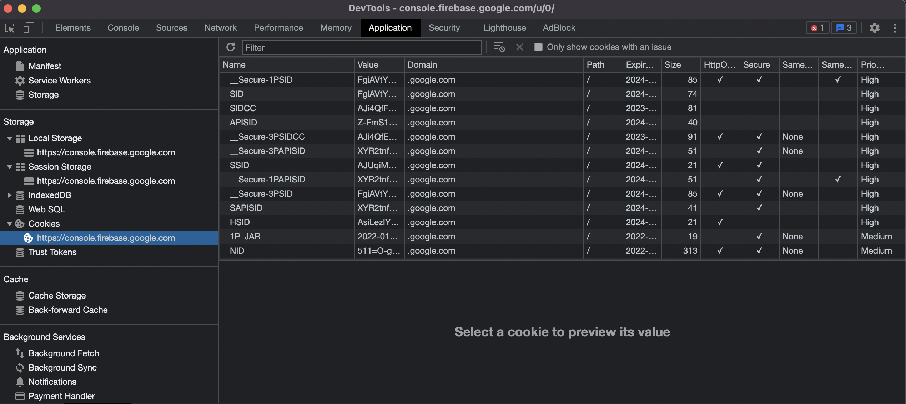
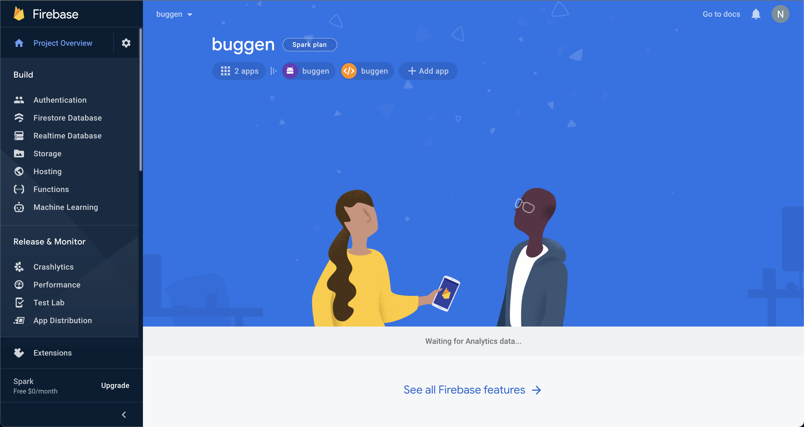
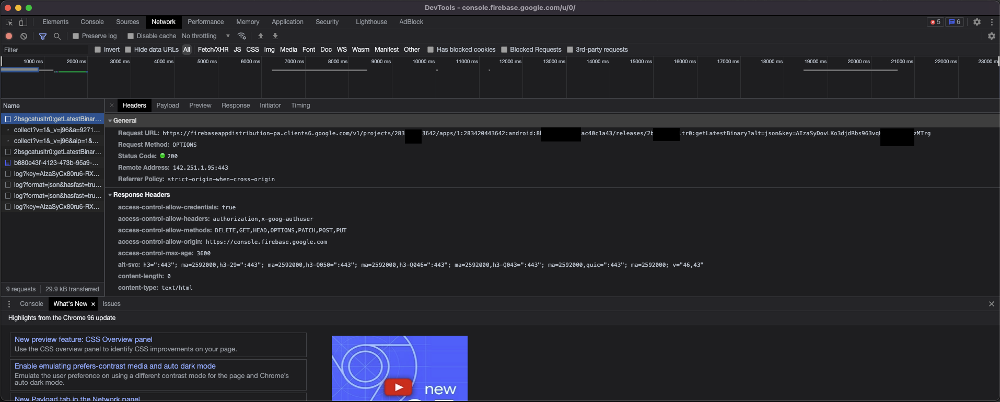

# Интеграция с Firebase

## Сбор необходимых параметров

Система Stingray предлагает возможность интеграции с популярным набором сервисов [Firebase](https://firebase.google.com/) от компании Google, который используется на всех этапах жизненного цикла разработки программного обеспечения для мобильных устройств.

Интеграция с Firebase производится с помощью скрипта [mdast_scan.py](https://github.com/Dynamic-Mobile-Security/mdast-cli). Для запуска скрипта в режиме интеграции с Firebase необходимо указать параметр `--distribution_system firebase`.

Чтобы скачать приложение с Firebase и просканировать его, необходимо собрать информацию о значениях cookies для Google SSO аутентификации, а также о значениях параметров проекта в Firebase. 

!!! note "Примечание"
    Не используйте личные учетные записи, так как параметры, используемые в процессе аутентификации в Firebase, привязаны к вашему аккаунту. Мы рекомендуем создать специальную техническую учетную запись для интеграции.

В браузере авторизуйтесь в Firebase с использованием Google SSO и соберите информацию о неоходимых cookies. Например, при использовании браузера Google Chrome или Microsoft Edge откройте DevTools, нажав F12 или использовав специальную комбинацию клавиш, которая применяется для этого в вашем браузере, перейдите на вкладку **Application**, а затем, выбрав в меню слева пункт **Cookies**, скопируйте значения следующих cookies: **SID**, **SSID**, **APISID**, **SAPISID** и **HSID**. Данная информация впоследствии будет использоваться в качестве параметров запуска скрипта `mdast_scan.py`.

<figure markdown>

</figure>

Далее необходимо получить следующие параметры проекта: **project_id**, **app_id**, **app_code** и **api_key**. Для этого перейдите на страницу проекта, адрес которой имеет следующий вид:

    https://console.firebase.google.com/u/0/project/{project_id}/overview

<figure markdown>

</figure>

Слева в меню в разделе **Release & Monitor** выберите пункт **App Distribution**. Предварительно открыв DevTools (F12), выберите необходимый релиз из списка и нажмите кнопку **Download**.

<figure markdown>

</figure>

В окне DevTools на вкладке **Network** отследите запрос, содержащий URL следующего вида:

    https://firebaseappdistribution-pa.clients6.google.com/v1/projects/{project_id}/apps/{app_id}/releases/{app_code}:getLatestBinary?alt=json&key={api_key} 
 
<figure markdown>

</figure>

Из данного URL получаем остальные необходимые параметры.

В результате все необходимые параметры для запуска скрипта `mdast_scan.py` собраны. В зависимости от того, какое приложение скачивается, необходимо с помощью параметра `firebase_app_extension` указать расширение файла: для Android приложения — `apk` , а для iOS — `ipa`.

Приведем полный список собранных параметров:

* `firebase_SID_cookie` — SID;
* `firebase_HSID_cookie` — HSID;
* `firebase_SSID_cookie` — SSID;
* `firebase_APISID_cookie` — APISID;
* `firebase_SAPISID_cookie` — SAPISID;
* `firebase_project_id` — {project id};
* `firebase_app_id` — {application id};
* `firebase_app_code` — {application code};
* `firebase_api_key` — {api key}.
* `firebase_app_extension` — расширение файла: apk для Android или ipa для iOS.

Также возможно задать название скачиваемого файла, для этого надо задать опциональный параметр `firebase_file_name`.

## Пример запуска скрипта

Чтобы запустить сканирование приложения, скачанного с Firebase, необходимо выполнить следующую команду:

    python mdast_cli/mdast_scan.py \
      --profile_id 468 \
      --architecture_id 2 \
      --distribution_system firebase \
      --firebase_project_id 2834204**** \
      --firebase_app_id 1:283***3642:android:8b0a0***56ac40c1a43 \
      --firebase_app_code 2b***sltr0 \
      --firebase_api_key AIzaSyDov*****qKdbj-geRWyzMTrg \
      --firebase_SID_cookie FgiA*****ZiQakQ-_C-5ZaEHvbDMFGkrgriAByQ9P9fv7LfRrYJ5suXgrCwIQBoOjA.  \
      --firebase_HSID_cookie AsiL****OjPI \
      --firebase_SSID_cookie A****dwcZk1Z-1pE \
      --firebase_APISID_cookie Z-FmS1aPB****djK/AjmG0h2Hc-GG9g2Ac \
      --firebase_SAPISID_cookie XYR2tnf****0zOt/AEvVZ8JVEuCnE6pxm \
      --url "https://saas.mobile.appsec.world" \
      --company_id 1 \ 
      --token 2fac9652a2fbe4****9f44af59c3381772f \
      --firebase_file_name your_app_file_name  \
      --firebase_file_extension apk