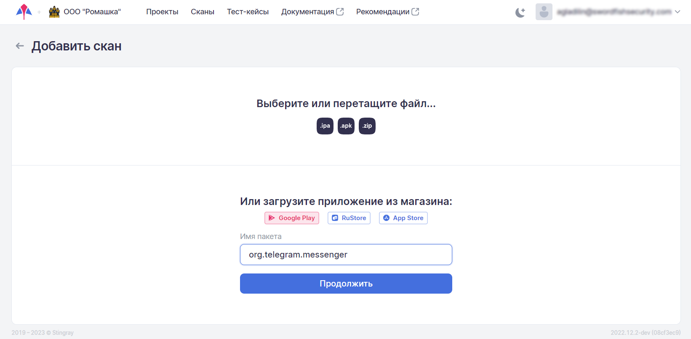
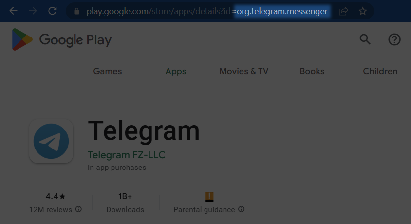

# Интеграция с Google Play

## Интеграция с использованием CLI

Интеграция с Google Play осуществляется через [mdast_cli](https://github.com/Dynamic-Mobile-Security/mdast-cli).

### Сбор необходимых параметров

!!! note "Примечание"
    Поскольку передача учетных данных осуществляется в незащищенном виде, для интеграции с Google Play следует использовать специально выделенный для этих целей сервисный Google-аккаунт. Двухфакторная аутентификация для аккаунта должна быть отключена. 

При предварительном запуске скрипта обязательна передача следующих параметров:

* `google_play_package_name` — имя скачиваемого пакета. Чтобы узнать имя пакета приложения, можно открыть его страницу в Google Play — имя пакета является частью URL (параметр `id`);

    <figure markdown>
    
    </figure>

* `google_play_email` — электронная почта аккаунта Google;
* `google_play_password` — пароль аккаунта Google;
* `distribution_system` — для Google Play указываем значение `google_play`.

!!! note "Примечание"
    Если на этом этапе необходимо скачать приложение, добавьте параметр `--google_play_download_with_creds`.

```
mdast_cli -d \
    --distribution_system google_play \
    --google_play_package_name org.telegram.messenger \
    --google_play_email ********@gmail.com \
    --google_play_password ******** \
    --google_play_download_with_creds
```

Результатом работы будут следующие сообщения:

    19/01/2023 12:00:46 - INFO Google Play - Google Play integration, trying to login
    19/01/2023 12:00:46 - INFO Google Play - Logging in with email and password, you should copy token after
    19/01/2023 12:00:50 - INFO Google Play - gsfId: 444*************402, authSubToken: Swh****************************************rjQ.
    19/01/2023 12:00:50 - INFO Google Play - You should copy these parameters and use them for next scans instead of email and password:
    19/01/2023 12:00:50 - INFO Google Play - "--google_play_gsfid 444*************402 --google_play_auth_token Swh****************************************rjQ."
    19/01/2023 12:00:52 - INFO Google Play - Successfully logged in Play Store
    19/01/2023 12:00:52 - INFO Google Play - Downloading org.telegram.messenger app with split apks to downloaded_apps/org.telegram.messenger-v1.1.1
    19/01/2023 12:00:52 - INFO Google Play - Creating directory downloaded_apps/org.telegram.messenger-v1.1.1 for downloading app with split apks
    19/01/2023 12:00:59 - INFO Google Play - Application with split successfully downloaded!

В третьей строке указаны два параметра `gsfId` и `authSubToken`, которые необходимо скопировать. В дальнейшем они будут использоваться для скачивания приложения и запуска сканирования. Использование этих параметров вместо электронной почты и пароля позволит избежать дальнейших проверок безопасности в браузере.

### Пример запуска скрипта

!!! note "Примечание"
    Более подробная информация об остальных параметрах запуска скрипта приведена в разделе «[Системы CI/CD/Параметры запуска](./sistemy_ci_cd.md#_4)».

После сбора необходимых параметров можно, запустив скрипт, скачать приложение и начать его ручное сканирование.

    python mdast_cli/mdast_scan.py \
      --profile_id 1337 \
      --architecture_id 1 \
      --distribution_system google_play \
      --url "https://saas.mobile.appsec.world" \
      --company_id 1 \
      --token 5d5f6c98*********487a68ee20d4562d9f \
      --google_play_package_name com.instagram.android \
      --google_play_gsfid 432******************43 \
      --google_play_auth_token JAgw_2h*************************************8KRaYQ.
      --google_play_file_name best_apk_d0wnl04d3r

В результате приложение будет скачано в папку `downloaded_apps` под именем `best_apk_d0wnl04d3r.apk`, а также запустится ручное сканирование.

!!! note "Примечание"
    Если приложение опубликовано в формате **split apk**, будет скачан **zip**-архив, который также может использоваться для проведения DAST анализа.

## Интеграция с использованием пользовательского интерфейса

В Стингрей реализована возможность скачивания пакетов непосредственно из магазина приложений **Google Play**.

### Настройка

1. Перейдите на экран настроек компании, нажав ее название в правом верхнем углу пользовательского интерфейса. 
2. Перейдите на вкладку **Интеграции** и выберите слева в меню пункт **Google Play**.
3. Активируйте интеграцию с магазином приложений с помощью переключателя.

    <figure markdown></figure>

4. Для успешной интеграции необходимо указать следующие параметры:

    – адрес электронной почты и пароль аккаунта Google;
    
    – `GSF ID` и `Auth Sub Token`.
    
    !!! note "Примечание"
        Порядок получения `GSF ID` и `Auth Sub Token` приведен в разделе «[Сбор необходимых параметров](../ag/integraciya_s_google_play.md#_1)».

5.	Указав необходимые параметры, проверьте соединение с магазином приложений, нажав кнопку **Тест**. 

### Запуск сканирования

1.	Перейдите на вкладку **Сканы**.

2.	Нажмите кнопку **+Добавить скан**.

	<figure markdown></figure>

3.	Выберите магазин приложений, нажав соответствующую кнопку.

	<figure markdown></figure>

4.	Укажите имя сканируемого пакета в поле **Имя пакета**.

	!!! note "Примечание"
		Имя пакета является частью URL соответствующего приложения в веб-версии магазина.
		
        <figure markdown></figure>
 
5.	Нажмите кнопку **Продолжить**.
 
6.	После скачивания пакета приложения укажите проект, профиль, архитектуру и выберите режим сканирования в соответствующих полях.

7.	Нажмите кнопку **Запустить**. 
