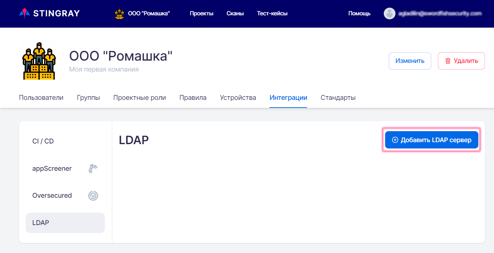
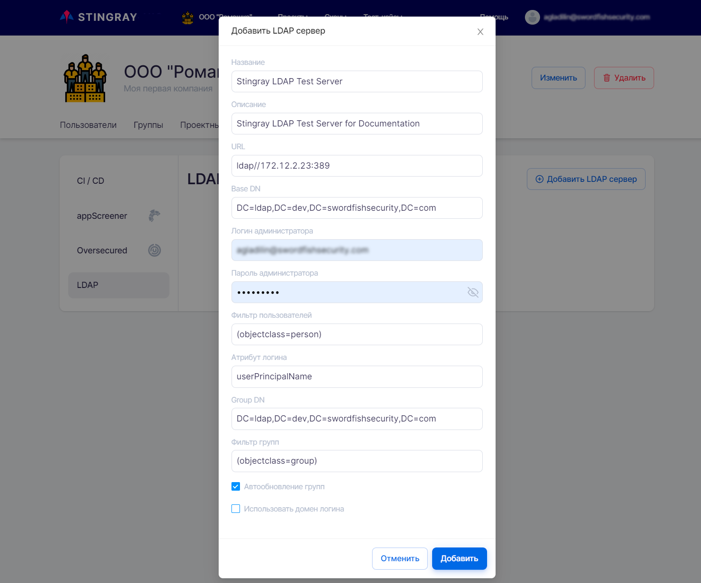
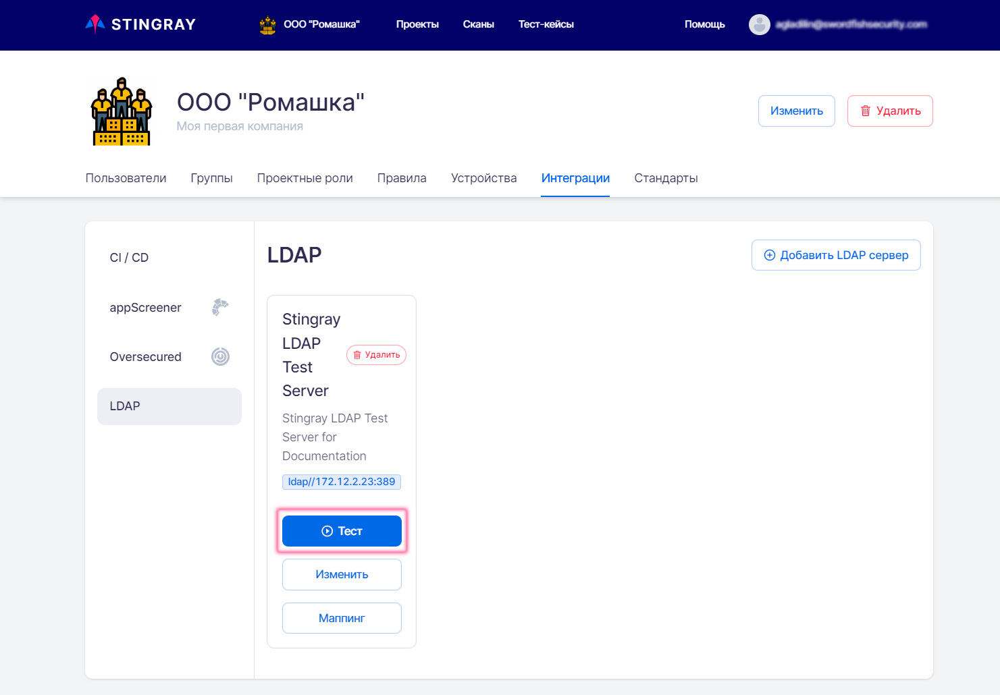
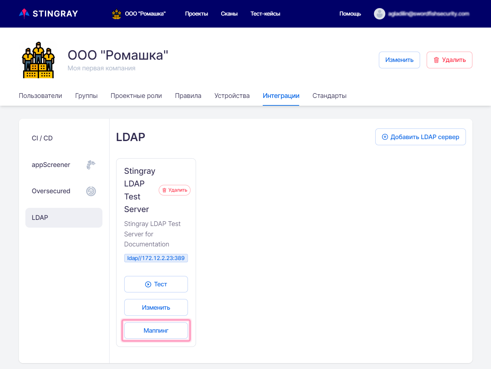
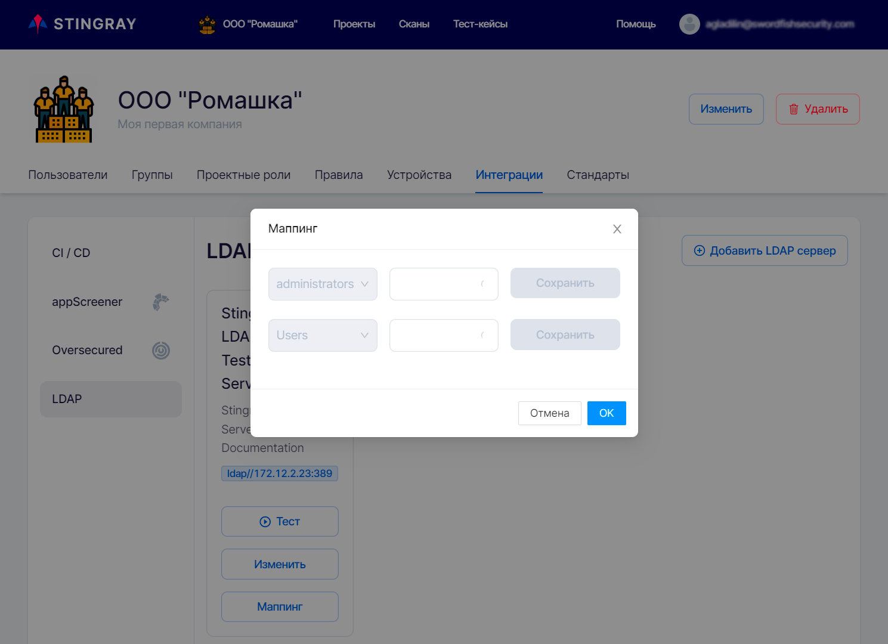
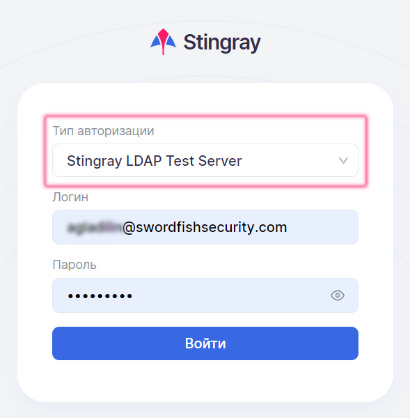

# Интеграция с LDAP

## Создание конфигурационного профиля LDAP

Перейдя на страницу настройки компании, выберите вкладку **Интеграции** и перейдите в раздел **LDAP**.

<figure markdown>

</figure>

Чтобы добавить новый LDAP сервер, нажмите на соответствующую кнопку в правой части пользовательского интерфейса.

<figure markdown>

</figure>

В открывшемся окне **Добавить LDAP сервер** укажите следующие параметры (все поля обязательны для заполнения):

<figure markdown>

</figure>

* **Название** — название профиля подключения к LDAP-серверу.
* **Описание** — краткое описание профиля подключения к LDAP-серверу. 
* **URL** — адрес LDAP-сервера. 
* **Base DN** — атрибут, однозначно определяющий объект Distinguished Name сервера LDAP, к которому производится подключение. 
* **Логин администратора** — логин LDAP-пользователя, из-под которого будет производиться подключение к LDAP-серверу. 
* **Пароль администратора** — пароль LDAP-пользователя, из-под которого будет производиться подключение к LDAP-серверу. 
* **Фильтр пользователей** — параметр в формате фильтра для LDAP, определяющий, какие пользователи смогут аутентифицироваться в системе. Пользователи, которые не попадают под заданный фильтр, не смогут войти в систему.
* **Атрибут логина** — атрибут записи LDAP-пользователя, который будет использоваться в качестве логина для авторизации в Stingray (возможно использование полей, по которым осуществляется логин в LDAP, например, userPrincipalName).  
* **Group DN** — параметр в формате фильтра для LDAP, который идентифицирует группы (чтобы отличить их от остальных записей в LDAP).
* **Фильтр групп** — параметр в формате фильтра для LDAP, определяющий, какие группы будут доступны в дальнейшем для связи с группами внутри системы Stingray.

Если выбрана опция **Автообновление групп**, при авторизации пользователя осуществляется обновление информации о группах Stingray и LDAP.

Если выбрана опция **Использовать домен логина** и в появившемся поле указан соответствующий домен (например, `stingray.ourcompany.com`), то при последующей авторизации пользователи могут не указывать адрес электронной почты полностью (`myname@stingray.ourcompany.com`), а ограничиться логином (`myname`).

После успешного создания конфигурационного профиля можно проверить соединение с LDAP-сервером, нажав на кнопку **Тест**. В результате успешного соединения в левом нижнем углу пользовательского интерфейса появится соответствующее сообщение.

<figure markdown>

</figure>

## Сопоставление групп пользователей

Сопоставление групп пользователей позволяет при первой авторизации автоматически добавлять LDAP-пользователей, входящих в определенные группы, в соответствующие группы системы Stingray. Таким образом, сразу после входа LDAP-пользователь получает необходимый набор прав и возможностей в системе Stingray без необходимости выполнения дополнительных настроек прав доступа.

Чтобы выполнить сопоставление групп пользователей LDAP и Stingray, нажмите кнопку **Маппинг** на карточке конфигурационного профиля LDAP.

<figure markdown>

</figure>

В открывшемся окне **Маппинг** настройте соответствие групп пользователей. Более подробная информация о группах пользователей Stingray приведена в разделе «[Группы пользователей](../polzovateli/#_10)».

<figure markdown>

</figure>

В левой колонке отображаются группы пользователей в системе Stingray, а в правой — на сервере LDAP.

!!! note "Примечание"
    Настройку групп пользователей необходимо выполнять последовательно (по одной), каждый раз подтверждая сделанный выбор нажатием соответствующей кнопки **Сохранить**. Не следует пытаться установить соответствия сразу для двух пар групп, а затем нажать кнопки **Сохранить**.

При необходимости можно удалить созданное ранее сопоставление групп пользователей. Нажмите на кнопку **Маппинг**, а затем — на кнопку **Удалить**, расположенную рядом с парой групп пользователей.

Важно заметить, что, например, пользователь с ролью Менеджер не сможет удалить сопоставление для групп пользователей с ролью Администраторы. 

## Авторизация LDAP-пользователей

Чтобы авторизоваться в качестве LDAP-пользователя, необходимо на странице авторизации выбрать соответствующий конфигурационный профиль LDAP, а затем ввести имя пользователя и пароль.

<figure markdown>

</figure>

После авторизации пользователю предоставляются права, соответствующие группе, в которую он включен в результате сопоставления групп. См. раздел «[Сопоставление групп пользователей](../integraciya_s_ldap/#_1)».

После первоначальной авторизации LDAP-пользователи отображаются на вкладке **Пользователи** страницы настроек компании, а также в списке пользователей соответствующей группы на вкладке **Группы**, см. раздел «[Пользователи, группы, проекты](./polzovateli.md)» Руководства пользователя.