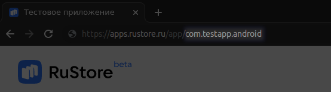
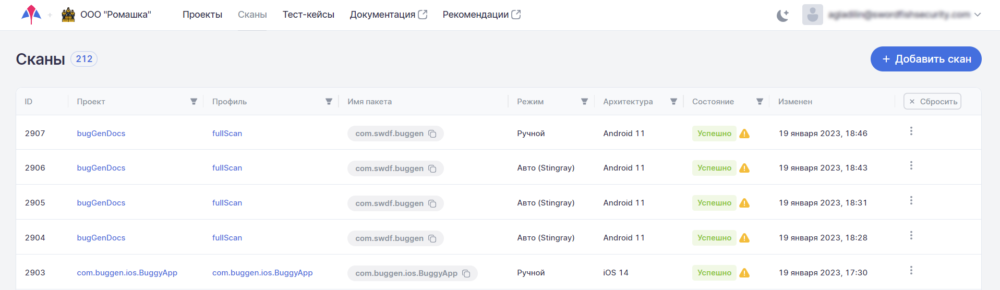
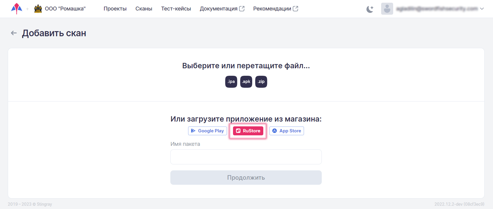
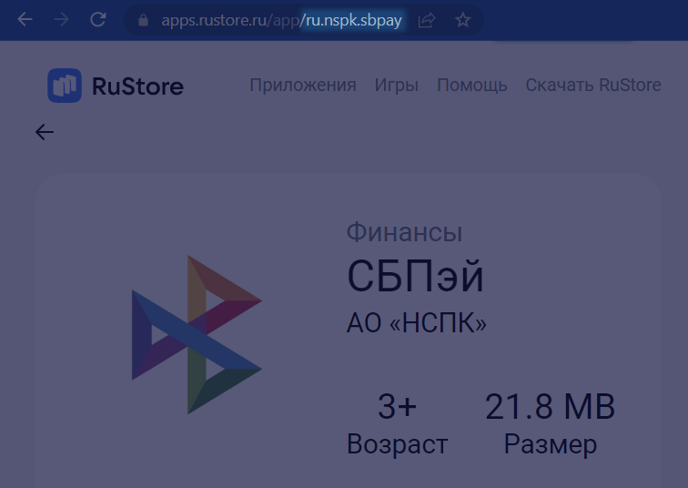

# Интеграция с RuStore

## Интеграция с использованием CLI

Интеграция с Rustore осуществляется с использованием специального средства инструментальной поддержки — [mdast_cli](https://github.com/Dynamic-Mobile-Security/mdast-cli).

### Сбор необходимых параметров

Чтобы скачать приложение с [RuStore](https://www.rustore.ru/), необходимо знать имя пакета. При запуске скрипта оно передается с параметром `rustore_package_name`.

<figure markdown></figure>

Кроме этого, потребуется указать соответствующую систему дистрибьюции (`distribution_system rustore`).

### Примеры запуска

!!! note "Примечание"
    Более подробная информация об остальных параметрах запуска скрипта приведена в разделе «[Системы CI/CD/Параметры запуска](./sistemy_ci_cd.md#_4)».

После сбора необходимых параметров можно, запустив скрипт, скачать приложение и начать его сканирование.

``` bash hl_lines="7 8"
mdast_cli \
  --url "https://saas.mobile.appsec.world" \
  --profile_id 1 \
  --company_id 1 \
  --architecture_id 1 \
  --token "eyJ**********QiLbJhcGciO5JIU4I1NiJ1..." \
  --distribution_system rustore # (1) \
  --rustore_package_name com.testapp.android # (2) \
  --testcase_id 4 \
  --file_path "/files/demo/apk/test.apk" \
```

1. Система дистрибьюции
2. Имя пакета приложения

## Интеграция с использованием пользовательского интерфейса

В Стингрей реализована возможность скачивания пакетов непосредственно из магазина приложений **RuStore**.

### Настройка

1.	Перейдите на экран настроек компании, нажав ее название в правом верхнем углу пользовательского интерфейса.
 
2.	Перейдите на вкладку **Интеграции** и выберите слева в меню пункт **RuStore**.

3.	Активируйте интеграцию с магазином приложений с помощью переключателя.

	<figure markdown></figure>
 
4.	Нажав кнопку **Тест**, убедитесь, что интеграция настроена правильно.

### Запуск сканирования

1.	Перейдите на вкладку **Сканы**.
2.	Нажмите кнопку **+Добавить скан**.

	<figure markdown></figure>

3.	Выберите магазин приложений, нажав соответствующую кнопку.

	<figure markdown></figure>

4.	Укажите имя сканируемого пакета в поле **Имя пакета**.

	!!! note "Примечание"
		Имя пакета является частью URL соответствующего приложения в веб-версии магазина.
		<figure markdown></figure>
 
5.	Нажмите кнопку **Продолжить**.
 
6.	После скачивания пакета приложения укажите проект, профиль, архитектуру и выберите режим сканирования в соответствующих полях.

7.	Нажмите кнопку **Запустить**. 
