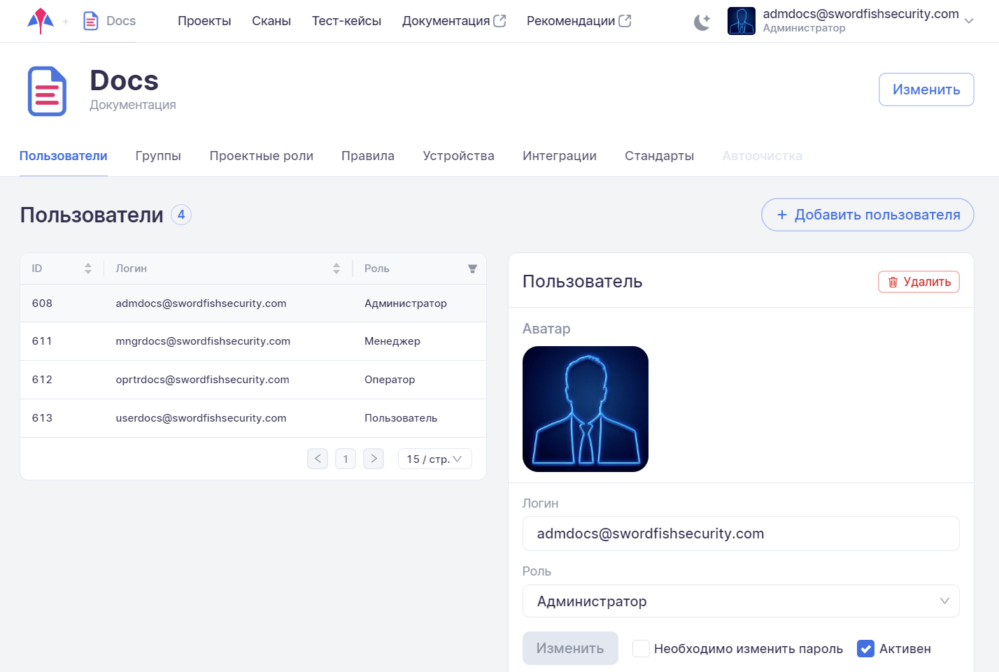
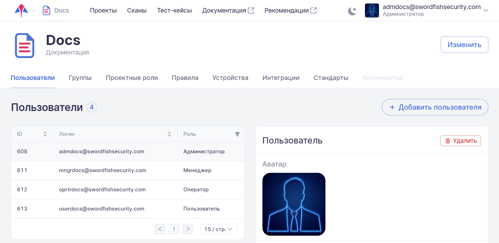

# Страница компании

!!! note "Примечание"
    Все настройки системы, описанные в данном разделе, может производить только пользователь с правами Администратора или Супер администратора. Работать в системе со всеми компаниями может только пользователь с правами Супер администратора.

Для перехода на вкладку настроек компании необходимо в левом верхнем углу нажать название компании. Настройки компании доступны только пользователям с правами **Администратора**.

<figure markdown></figure>
  
На странице настроек доступны несколько вкладок: **Пользователи**, **Группы**, **Проектные роли**, **Правила**, **Устройства**, **Интеграции**, **Стандарты**.
  
<figure markdown></figure>