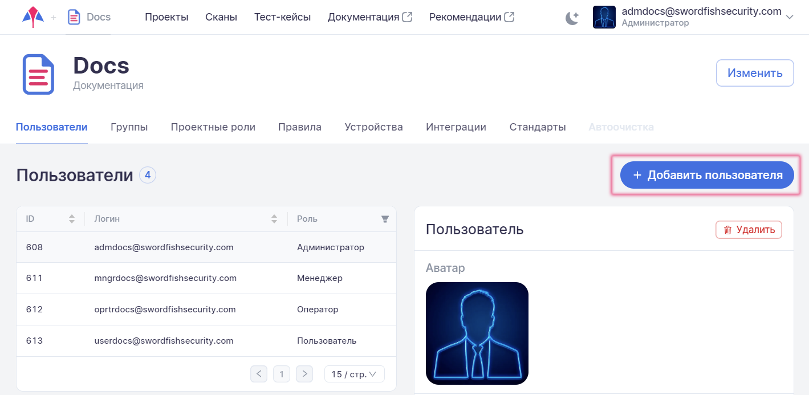
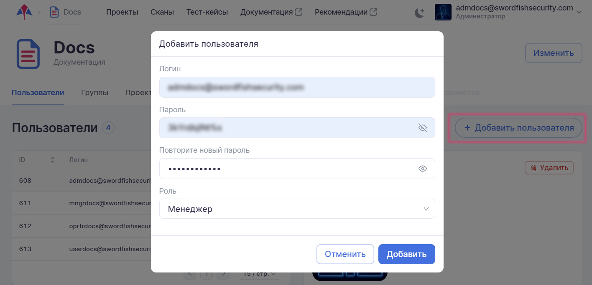
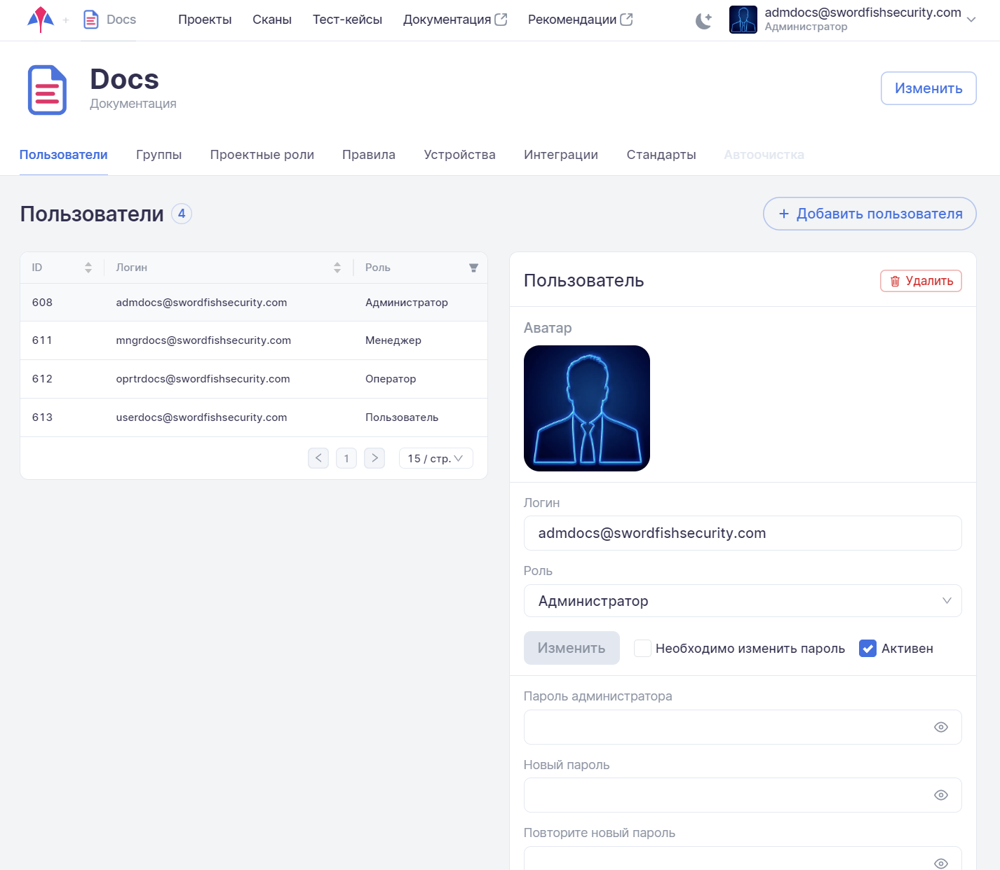
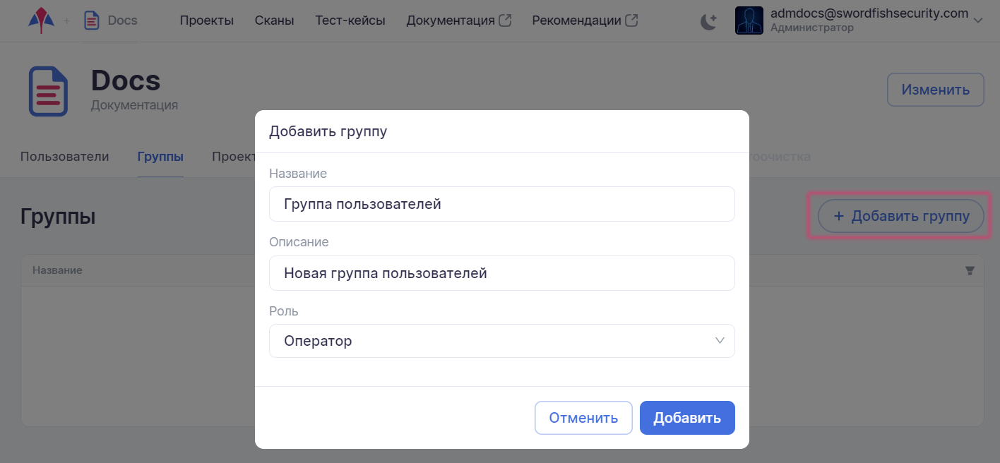
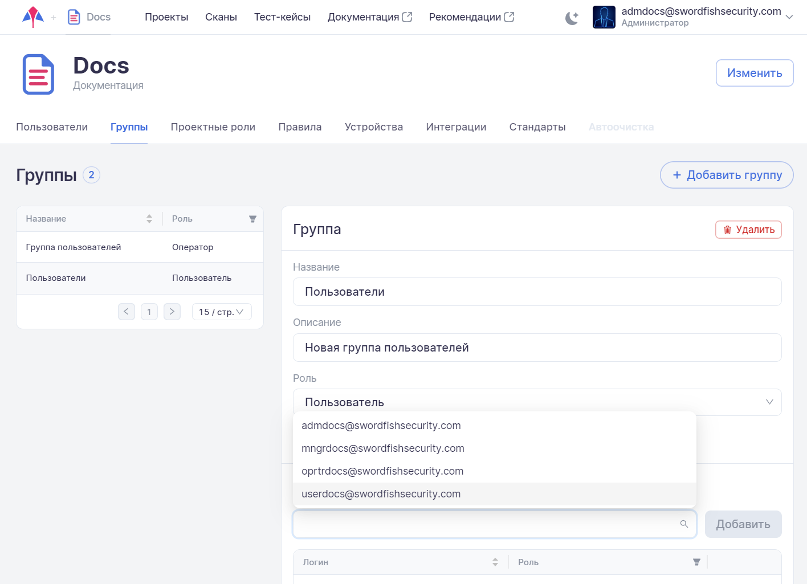
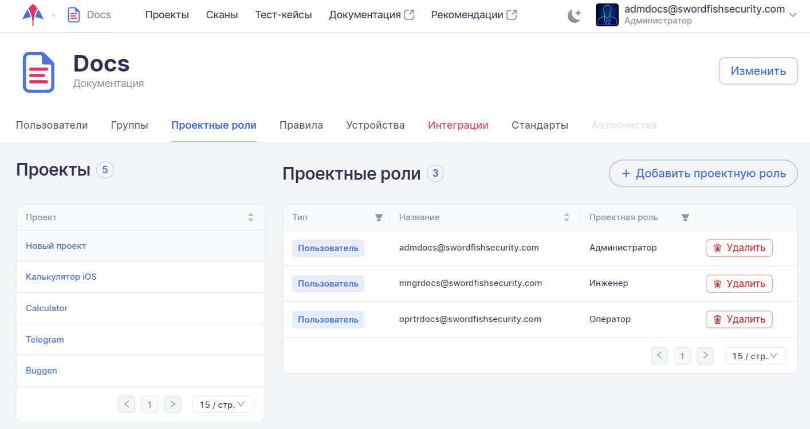

# Пользователи, группы, проекты

## Ролевая модель

Работу с продуктом осуществляют пользователи с различными функциональными обязанностями. В связи с этим ролевая модель системы предусматривает широкие возможности настройки и разграничения прав доступа. В целом она формируется в проекциях административных и проектных прав доступа.

### Административные права доступа

Административные права доступа определяют возможные действия (привилегии) пользователя в рамках компании, например: управление пользователями, группами и устройствами, создание правил и формирование требований, изменение настроек на уровне компании и т. д. В части административных прав доступа определены четыре роли: **Пользователь**, **Оператор**, **Менеджер** и **Администратор**.

!!! note "Примечание"
    Каждая последующая роль включает полный набор привилегий предыдущей роли.

**Пользователь** — имеет минимально возможные административные права в системе. Пока Пользователь не назначен на какой-либо проект, он не может выполнять какие-либо продуктивные действия в системе. После добавления в проект он получает привилегии, определяемые назначенными ему проектными правами доступа, см. раздел «[Проектные права доступа](./polzovateli.md#_4)».

**Оператор** — может просматривать настройки компании (пользователи, группы, правила, требования, устройства, интеграции и т. д.) без возможности их редактирования.

**Менеджер** — может изменять настройки системы в рамках компании, за исключением создания проектов и назначения проектных ролей пользователей.

**Администратор** — отличительной особенностью этой роли являются возможность создания новых проектов и назначение проектных ролей пользователей. Администратор имеет максимально возможные права доступа в рамках административной части ролевой модели. Кроме этого, он имеет доступ ко всем проектам, даже при отсутствии соответствующей проектной роли.

Административные роли пользователей отображаются на вкладке **Пользователи** страницы настроек Компании.

<figure markdown>

</figure>

### Проектные права доступа

Проектные права доступа, как очевидно из названия, позволяют регламентировать действия пользователя в рамках проекта (-ов), например: запуск сканирований, настройки проекта, профилей и т. д. Обычно назначение проектной роли происходит при добавлении пользователя в проект, однако предусмотрена и возможность ее изменения. Пользователь может быть добавлен в проект с одной из следующих ролей:

**Чтение (Viewer)** — доступ только на чтение. Такой пользователь может просматривать всю информацию, имеющую отношение к проекту, на который он назначен: настройки проекта и профилей, результаты сканирований, тест-кейсы, правила и требования и т. д.

**Инженер (Engineer)** — пользователь, активно работающий с системой и приложениями, как правило — разработчик или аналитик информационной безопасности. Он может запускать сканирования, работать с результатами, записывать тест-кейсы и т. д. **Инженер**, фактически, имеет полный доступ к проекту, за исключением возможности добавления новых пользователей, настройки интеграций со сторонними инструментами и удаления проекта. 

**Администратор (Admin)** — в дополнение к привилегиям, доступным пользователям с проектной ролью **Инженер**, проектный **Администратор** имеет возможность выполнять настройки проекта, включая настройку интеграций и добавление пользователей. Кроме этого, при необходимости он, может удалить проект.

!!! note "Примечание"
    Каждая последующая роль включает полный набор привилегий предыдущей роли.

Назначение проектных ролей пользователей осуществляется на вкладке **Проекты** страницы **Настройки**. Более подробную информацию см. в разделе «[Добавление пользователя](./polzovateli.md#_6)».

## Информация о пользователях

Нажав в левом верхнем углу название компании, перейдите к её настройкам. При переходе в этот раздел открывается первая вкладка **Пользователи**.

<figure markdown>

</figure>
 
В левой части данной вкладки представлен полный список пользователей с кратким описанием их характеристик:

* **Id** — цифровой идентификатор пользователя.
* **Логин** — логин (имя) пользователя в системе (в формате адреса электронной почты).
* **Роль** — административная роль пользователя.

При нажатии на строку, соответствующую пользователю, в правой части вкладки появляется подробная информация о нем.

**Администратор** может совершать следующие действия: добавление, редактирование и удаление пользователей.

## Добавление пользователя

!!! note "Примечание"
    Для добавления пользователя в систему необходима административная роль Менеджера или Администратора.

Чтобы добавить нового пользователя в систему, находясь на вкладке **Пользователи**, нажмите кнопку **Добавить пользователя**.

<figure markdown>

</figure>
 
Появляется диалоговое окно **Добавить пользователя**, в котором необходимо указать следующую информацию:

* **Логин** пользователя для аутентификации пользователя в системе (в формате адреса электронной почты).
* Дважды ввести **Пароль**.
* И выбрать административную **Роль** пользователя.

<figure markdown>

</figure>
 
## Редактирование профиля пользователя

Для редактирования профиля пользователя необходимо в **Списке пользователей** в левой части вкладки **Пользователи** нажать на соответствующую пользователю строку. В правой части вкладки отобразится подробная информация о соответствующем пользователе.

<figure markdown>

</figure>
 
Реализована возможность изменения следующих параметров:

* **Аватар** пользователя.
* **Пароль** пользователя (см. раздел «[Смена пароля пользователя](./polzovateli.md#_9)».
* **Логин** пользователя (в формате адреса электронной почты).
* Административная **Роль** пользователя в системе (**Пользователь**/**Оператор**/**Менеджер**/**Администратор**).

Кроме этого, в данном окне **Администратор** может инициировать смену пароля пользователя (при следующем входе пользователя в систему отобразится соответствующее окно), а также изменить его статус (**Активен**/**Неактивен**). Если галочка в поле **Активен** отсутствует, пользователь не сможет войти в систему.

## Удаление пользователя

Для удаления профиля пользователя необходимо нажать кнопку **Удалить** и подтвердить свои действия в появившемся диалоговом окне.

## Смена пароля пользователя

Изменение пароля пользователя производится в профиле пользователя в правом нижнем углу на вкладке **Пароль**. Необходимо ввести пароль **Администратора**, производящего смену пароля пользователя, и дважды — новый пароль пользователя.

## Группы пользователей

В системе предусмотрена возможность группировки пользователей с целью повышения удобства добавления их в проект, а также облегчения разграничения прав доступа.

Например, можно создать группу Администраторы и добавить в нее всех пользователей, которых необходимо наделить администраторскими привилегиями.

!!! note "Примечание"
    Следует отметить, что в основе ролевой модели системы лежит принцип наибольших привилегий. Проиллюстрируем его небольшим примером: если пользователь с административной ролью **Оператор** будет добавлен в группу **Администраторов**, то он будет обладать всеми правами **Администратора**.

!!! note "Примечание"
    При назначении ролей пользователям важно четко понимать разницу между административными и проектными правами доступа. Кроме этого, необходимо отметить, что пользователь не может создавать группы или добавлять пользователей в группы с привилегиями выше своей роли. Например, **Менеджер** может создавать группы, обладающие максимум менеджерскими привилегиями, и не может добавлять/удалять пользователей в группы **Администраторов**.

### Создание/удаление групп пользователей

!!! note "Примечание"
    Для создания/удаления группы пользователей необходима административная роль **Администратора** или **Менеджера**.

Чтобы создать группу пользователей, нажмите название компании, расположенное в левом верхнем углу пользовательского интерфейса. Перейдите на вкладку **Группы** и нажмите кнопку **Добавить группу**. Укажите **Название** и **Описание** группы, а также выберите соответствующую ей административную роль. Более подробную информацию об административных ролях см. выше в разделе «[Административные права доступа](./polzovateli.md#_3)».

<figure markdown>

</figure>
 
Удаление группы пользователей также осуществляется на вкладке **Группы**. Выберите нужную группу в области **Группы** и нажмите на кнопку **Удалить** справа на вкладке **Группа**.

### Добавление/удаление пользователя из группы

Чтобы добавить пользователя в группу, нажмите название компании, расположенное в левом верхнем углу пользовательского интерфейса. Перейдите на вкладку **Группы** и, выбрав в левой части экрана нужную группу, добавьте в нее пользователя, найдя его в поле **Пользователи** и нажав кнопку **Добавить**.

<figure markdown>

</figure>
   
!!! note "Примечание"
    Повторимся, что в основе ролевой модели системы лежит принцип наибольших привилегий — если пользователь с административной ролью **Оператор** будет добавлен в группу, для которой выбраны права **Администратор**, то он будет обладать всеми административными правами **Администратора**.

Чтобы удалить пользователя из группы, нажмите на кнопку **Удалить** в строке соответствующего пользователя.

## Добавление пользователей (групп пользователей) в проект

!!! note "Примечание"
    Для добавления пользователя (группы пользователей) в проект необходима проектная или административная роль Администратор. Более подробную информацию о проектных ролях пользователей см. в разделе «[Проектные права доступа](./polzovateli.md#_4)».

Чтобы добавить пользователя (группу пользователей) в проект, нажмите название компании, расположенное в левом верхнем углу и перейдите на вкладку **Проектные роли**.

<figure markdown>

</figure>

Выберите необходимый проект из списка в левой части экрана (область **Проект**), выберите нужного пользователя (или группу пользователей) в области **Проектные роли** в поле **Пользователь или группа** и назначьте ему необходимую проектную роль, выбрав значение в раскрывающемся списке **Роль**. В завершении нажмите кнопку **Добавить**. Более подробная информация о группах пользователей приведена в разделе «[Группы пользователей](./polzovateli.md#_10)».

Список пользователей, добавленных в проект, можно просмотреть в области **Список проектных ролей**.

!!! note "Примечание"
    При назначении ролей пользователям важно четко понимать разницу между административными и проектными правами доступа. Кроме этого, необходимо отметить, что пользователь не может создавать группы или добавлять пользователей в группы с привилегиями выше своей роли. Например, **Менеджер** может создавать группы, обладающие максимум менеджерскими привилегиями, и не может добавлять/удалять пользователей в группы **Администраторов**.