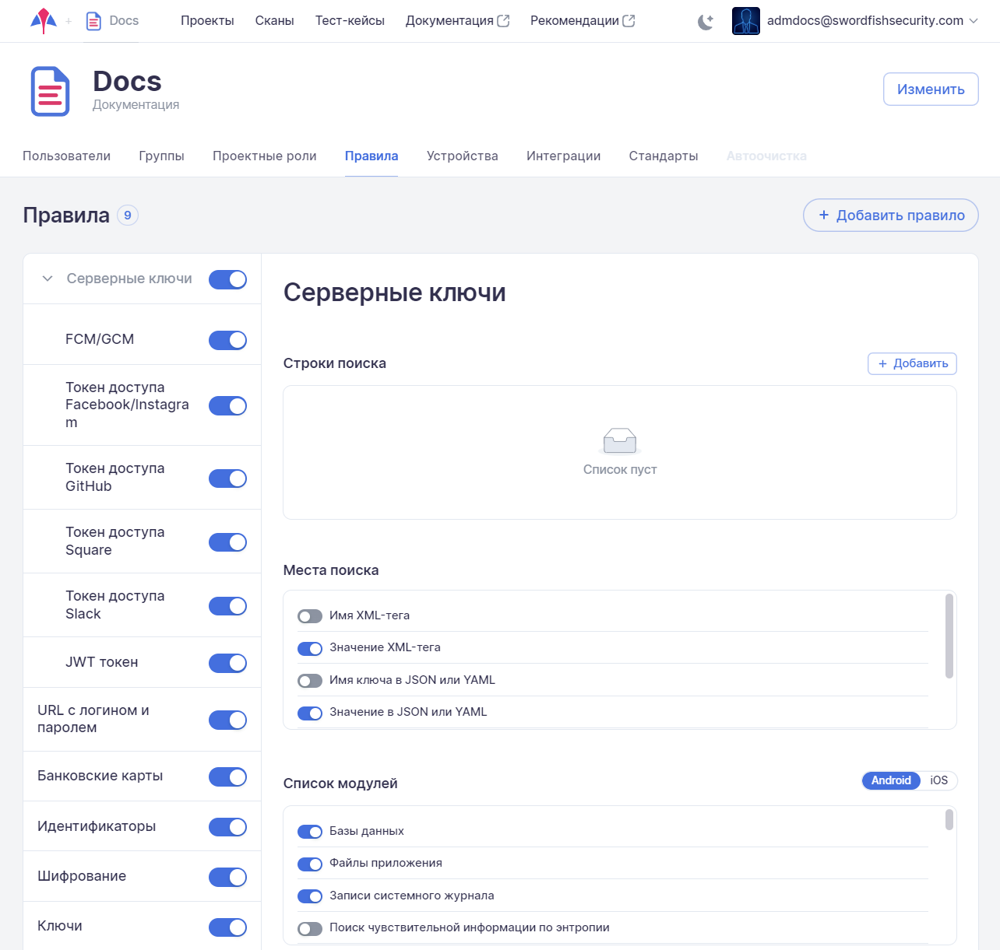
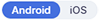

# Правила анализа на уровне компании

Для перехода на вкладку **Правила** необходимо в левом верхнем углу нажать название компании, а далее на странице настроек выбрать соответствующую вкладку.

<figure markdown></figure>

На данной вкладке представлены правила анализа собранных данных для поиска уязвимостей. На этой вкладке возможно добавить, изменить или удалить существующее правило анализа на уровне компании. Новое или измененное правило будет применяться в рамках всех проектов данной компании.

Принципы работы с правилами анализа на уровне компании и на уровне проекта не отличаются друг от друга. В отличие от правил на уровне проекта правила на уровне компании имеют особенности для разных типов архитектуры (Android/iOS), в частности, это касается списка модулей в правиле. Чтобы посмотреть детали правила для Android или для iOS , переведите расположенный справа селектор  на необходимый тип архитектуры.

Описание работы правил, а также их добавление, редактирование и удаление на уровне проекта приведено в разделе «[Правила](../ug/pravila.md)».