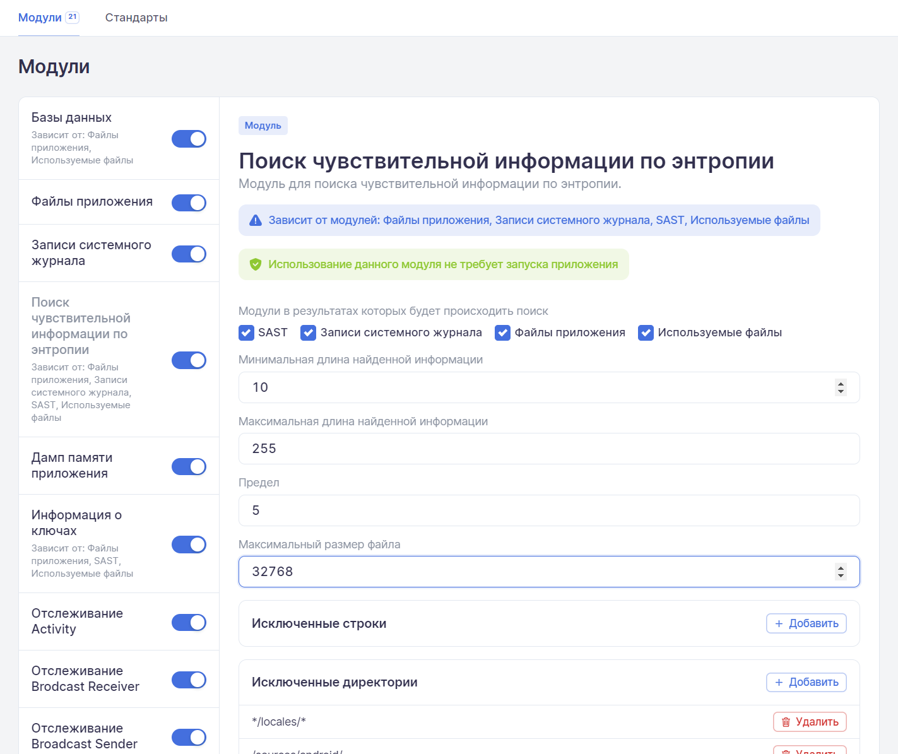
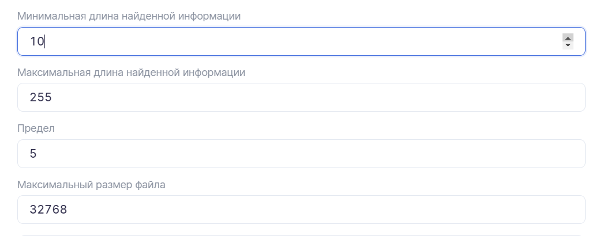
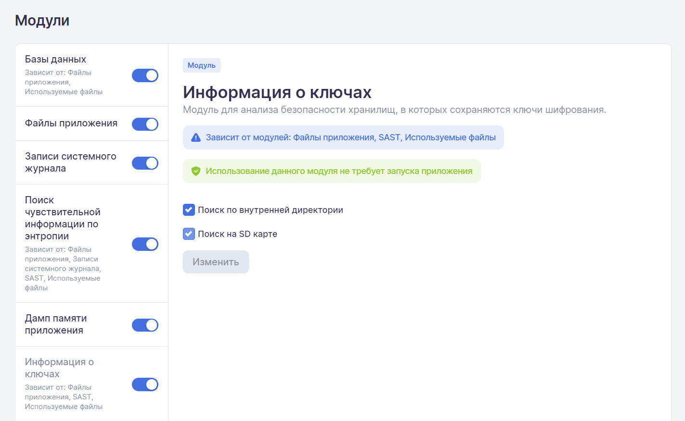
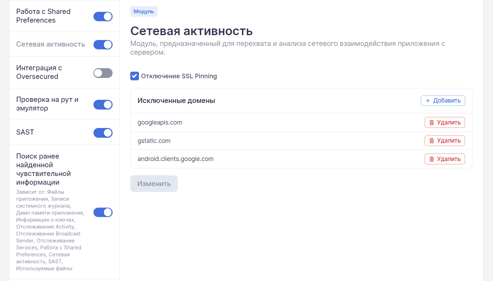
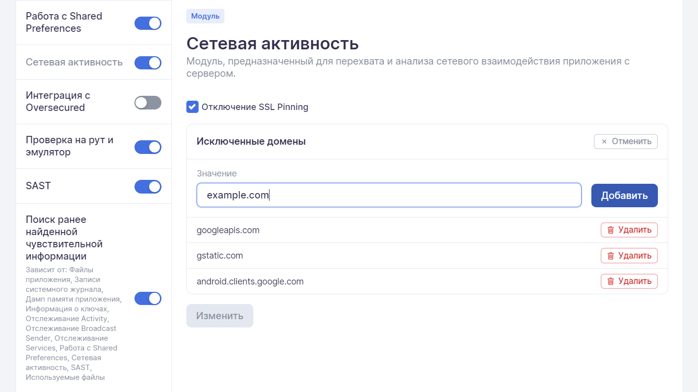
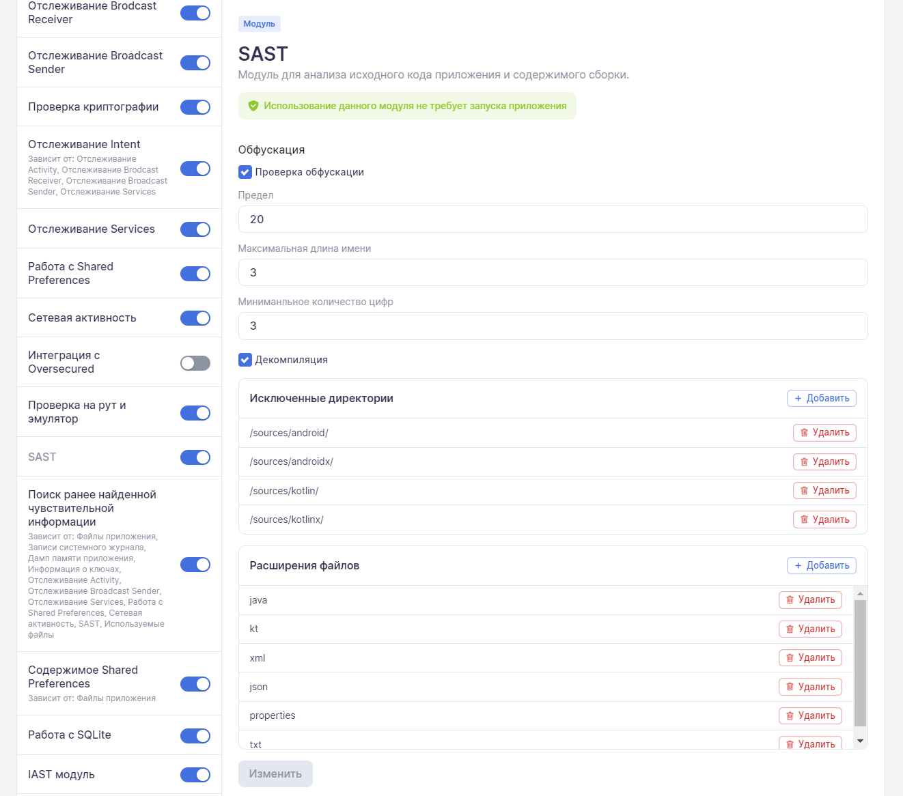
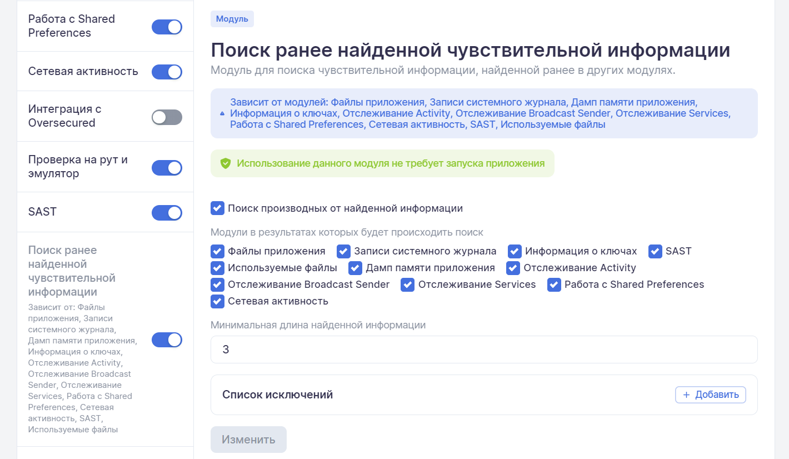
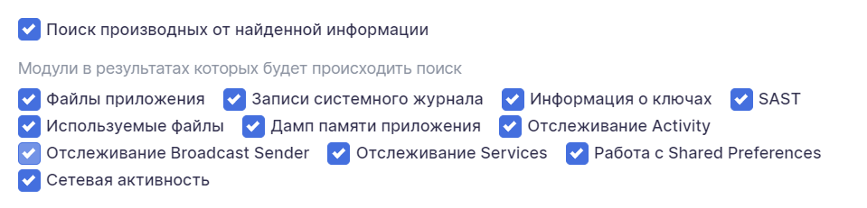
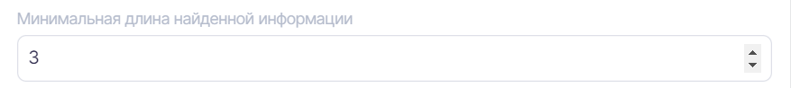

# Приложение 1. Описание модулей для сбора информации

Система включает более двадцати модулей для сканирования и сбора информации о приложении. Каждый модуль отвечает за сбор «своей» информации. Список всех модулей представлен на вкладке **Модули** страницы **Профиль**. Из списка можно выбрать и настроить модули, которые будут включены при сканировании приложения с данным профилем.

Чтобы применить измененные настройки модуля, необходимо нажать кнопку **Изменить** внизу блока настроек. У модулей, которые не имеют настроек, кнопка **Изменить** отсутствует.

<figure markdown></figure>

Описание модулей приведено ниже.

## Базы данных

Модуль предназначен для сбора и анализа баз данных (включая зашифрованные), которые используются в приложении.

Этот модуль зависит от модуля **Файлы приложения** и анализирует данные, полученные в процессе работы последнего. Если модуль **Файлы приложения** выключен, включить модуль **Базы данных** невозможно.

Для более детального анализа приложения модулем **Базы данных** желательно также включить модуль **Используемые файлы**.

Настройки **Поиск по внутренней директории** и **Поиск на SD карте** позволяют выбрать хранилище, в котором будет производиться сбор баз данных и выполняться их анализ.

## Файлы приложения

Модуль предназначен для сбора и анализа файлов, которые приложение при работе сохраняет в своей директории (во внутреннем или внешнем хранилище).

<figure markdown></figure>
 
Настройки модуля позволяют исключить из списка отдельные файлы и директории.

Для архитектуры Android c помощью настроек **Поиск по внутренней директории** и **Поиск на SD карте** можно выбрать хранилище, в котором будет производиться сбор файлов и выполняться их анализ.

!!! note "Примечание"
    Для архитектуры iOS данные настройки не предусмотрены.

### Исключенные файлы

В настройках модуля можно добавлять файлы в исключения. Для таких файлов анализ проводиться не будет. По умолчанию в исключения уже добавлены несколько шаблонных строк.

Для добавления в исключения файлов необходимо нажать кнопку **Добавить** справа от заголовка **Исключенные файлы**, ввести необходимую строку в появившемся поле **Значение**, а затем нажать кнопку **Добавить**.

<figure markdown></figure>
 
Файлы можно исключать из анализа, указывая их имена и/или директории (допускается использование символа «*****»):

* ***/data/data/out.test.app/shared_prefs/common.xml*** — исключить файл ***common.xml*** в директории ***shared_prefs***;
* ***.xml** — исключить все xml-файлы;
* ***/data/data/out.test.app/shared_prefs/\*.xml*** — исключить все xml-файлы в директории ***shared_prefs***.

Поле **Значение** настройки **Исключенные файлы** не зависит от регистра — строки `*.MKV` и `*.mkv` равнозначны.

Для удаления исключения из списка необходимо в настройке **Исключенные файлы** справа от удаляемой строки нажать кнопку **Удалить**, а затем подтвердить действие в появившемся диалоговом окне.

<figure markdown></figure>
 
### Исключенные директории

Аналогичным образом, чтобы добавить в исключения директорию, необходимо нажать кнопку **Добавить** справа от заголовка **Исключенные директории**, ввести необходимую строку в появившемся поле **Значение**, а затем нажать кнопку **Добавить**.

Директории можно исключать из анализа, указывая их имена (допускается использование символа «*****»):

* ***/data/data/out.test.app/files*** — исключить все файлы в директории ***files***. При этом файлы в поддиректории ***/data/data/out.test.app/files/temp*** исключены не будут;
* ***/data/data/out.test.app/files/\**** — исключить все файлы в директории ***files*** и всех ее поддиректориях.

Кроме того, для уникальных имен директорий можно использовать короткую строку ***\*/files/\**** — она равнозначна значению, указанному в примере выше.

Поле **Значение** настройки **Исключенные директории** не зависит от регистра — строки `/data/data/out.test.app/files` и `/dAtA/DaTa/out.test.APP/files` равнозначны.

Для удаления директории из списка исключений необходимо в настройке **Исключенные директории** справа от удаляемой строки нажать кнопку **Удалить**, а затем подтвердить действие в появившемся диалоговом окне.

## Записи системного журнала

Модуль предназначен для мониторинга сообщений, которые приложение записывает в системный журнал.

<figure markdown></figure>
 
В поле **Тэг** можно указать, по какому именно тэгу выполнять мониторинг сообщений (по умолчанию мониторинг выполняется по всем тегам). 

Уровень критичности сообщений можно выбрать из раскрывающегося списка поля **Уровень**.

<figure markdown></figure>
 
Источник сообщений можно выбрать из раскрывающегося списка поля **Источник**.

<figure markdown></figure>
 
## Поиск чувствительной информации по энтропии

Модуль предназначен для поиска в собранных данных уникальных последовательностей символов, потенциально являющихся чувствительной информацией.

<figure markdown></figure>
 
Модуль зависит от модулей **Файлы приложений**, **Записи системного журнала**, **SAST** и **Используемые файлы** — если все перечисленные модули отключены, то энтропийный анализ будет недоступен.

Можно выбрать или исключить данные, собранные ранее модулями **SAST**, **Записи системного журнала**, **Файлы приложений** и **Используемые файлы**, с помощью настроек в разделе **Модули, в результатах которых будет происходить поиск**. Из данных выбранных модулей, согласно настройкам (исключения файлов, директорий и т. д.) извлекаются все строки, каждая из них разбивается на слова и для каждого слова вычисляется энтропия Шеннона. Если значение вычисленной энтропии выше, чем указанное в настройках, строка отмечается, как потенциально содержащая чувствительную информацию.

Поля **Минимальная длина найденной информации** и **Максимальная длина найденной информации** позволяют задать диапазон длины строки, которая будет попадать в анализ на энтропию.

Также задается **Максимальный размер файлов**, в которых будет осуществляться анализ строк, и порог срабатывания в поле **Предел**.

Значения длины информации, размера файла и порога срабатывания либо можно задать стрелками, появляющимися при наведении курсора на соответствующее поле, либо ввести с помощью клавиатуры.

<figure markdown></figure>

### Исключенные строки

В настройках модуля можно добавлять в исключения символьные строки, не являющиеся чувствительной информацией. Таким образом, они не будут включены в результаты анализа.

Для добавления в исключения символьных строк необходимо нажать кнопку **Добавить** справа от заголовка **Исключенные строки**, ввести необходимую строку в появившемся поле **Значение**, а затем нажать кнопку **Добавить**.

<figure markdown></figure>

### Исключенные директории

Аналогичным образом, чтобы добавить в исключения директорию, необходимо нажать кнопку **Добавить** справа от заголовка **Исключенные директории**, ввести необходимую строку в появившемся поле **Значение**, а затем нажать кнопку **Добавить**.

Директории можно исключать из анализа, указывая их имена (допускается использование символа «*****»):

* ***/data/data/out.test.app/files*** — исключить все файлы в директории ***files***. При этом файлы в поддиректории ***/data/data/out.test.app/files/temp*** исключены не будут;
* ***/data/data/out.test.app/files/\**** — исключить все файлы в директории ***files*** и всех ее поддиректориях.

Кроме того, для уникальных имен директорий можно использовать короткую строку ***\*/files/\**** — она равнозначна значению, указанному в примере выше.

Поле **Значение** настройки **Исключенные директории** не зависит от регистра — строки `/data/data/out.test.app/files` и `/dAtA/DaTa/out.test.APP/files` равнозначны.

Для удаления директории из списка исключений необходимо в настройке **Исключенные директории** справа от удаляемой строки нажать кнопку **Удалить**, а затем подтвердить действие в появившемся диалоговом окне.

### Исключенные файлы

В настройках модуля можно добавлять в исключения файлы. Для таких файлов анализ проводиться не будет. По умолчанию в исключения уже добавлены несколько шаблонных строк.

Для добавления в исключения файлов необходимо нажать кнопку **Добавить** справа от заголовка **Исключенные файлы**, ввести необходимую строку в появившемся поле **Значение**, а затем нажать кнопку **Добавить**.

Файлы можно исключать из анализа, указывая их имена и/или директории (допускается использование символа «*****»):

* ***/data/data/out.test.app/shared_prefs/common.xml*** — исключить файл ***common.xml*** в директории ***shared_prefs***;
* ****.xml*** — исключить все xml-файлы;
* ***/data/data/out.test.app/shared_prefs/\*.xml*** — исключить все xml-файлы в директории ***shared_prefs***.

Поле **Значение** настройки **Исключенные файлы** не зависит от регистра — строки `*.MKV` и `*.mkv` равнозначны.

Для удаления исключения из списка необходимо в настройке **Исключенные файлы** справа от удаляемой строки нажать кнопку **Удалить**, а затем подтвердить действие в появившемся диалоговом окне.

## Дамп памяти приложения

Модуль предназначен для получения и анализа дампа памяти приложения (heapdump).

После работы с приложением с устройства из соответствующего процесса выполняется получение его памяти в соответствующем формате. Этот файл анализируется, как текстовое представление. Он доступен для скачивания и впоследствии может быть загружен в профильные инструменты по работе с подобными файлами (профилировщики памяти) в ручном режиме.

Данный модуль позволяет отслеживать хранение различной чувствительной информации в памяти дольше, чем это необходимо. Примером таких данных могут быть пароли, ключи шифрования, сессионные идентификаторы и т. д.

## Информация о ключах

Модуль предназначен для анализа безопасности хранилищ, в которых сохраняются ключи шифрования.

<figure markdown></figure>
 
Модуль зависит от модулей **Файлы приложений**, **SAST** и **Используемые файлы** — если все перечисленные модули отключены, то анализ информации о ключах будет недоступен.

Для Android-приложений с помощью настроек **Поиск по внутренней директории** и **Поиск на SD карте** можно выбрать хранилище, для которого будет выполняться анализ безопасности.

Во время анализа все файлы приложения и файлы из ресурсов (в зависимости от настроек) проходят проверку, являются ли они хранилищем ключей и хранилищем какого именно типа (bks, jks, ssh и т. д.). Также проводится анализ содержимого данных хранилищ. В случае обнаружения внутри хранилища зашифрованных данных, а также если сам контейнер с ключами защищен паролем, проводится попытка подбора пароля из списка наиболее распространенных. В случае успеха в результирующий дефект выводится информация о пароле хранилища и его содержимом.

Уровень критичности результирующего дефекта определяется тем, что именно находится в хранилище (приватные или публичные ключи, сертификаты и т. д.) и где оно расположено (это определяет, имеют ли к нему доступ другие приложения/пользователи).

## Отслеживание Activity

Модуль предназначен для мониторинга Activity, которые запускаются во время работы приложения. Помимо отслеживания факта запуска Activity, модуль также сохраняет и анализирует Intent и его содержимое.

В качестве результата работы модуля представлен полный Intent, с которым была вызвана данная Activity, и все содержимое Intent, включая дополнительные параметры, extras и т. д.

На основе этой информации осуществляется анализ того, что и каким образом передает приложение как внутри себя, так и во внешние Activity.

## Отслеживание Broadcast Receiver

Модуль предназначен для мониторинга использования и регистрации BroadcastReceiver во время работы приложения. Помимо отслеживания факта использования BroadcastReceiver, модуль также сохраняет и анализирует используемый Intent и его содержимое.

В качестве результата работы модуля представлен полный Intent, который принимает в себя зарегистрированный в приложении Receiver, и все содержимое Intent, включая дополнительные параметры, extras и т. д. Отслеживаются как статические, так и динамические Broadcast Receivers.

На основе этой информации осуществляется анализ того, что и каким образом получает приложение как внутри себя, так и от сторонних компонентов.

## Отслеживание Broadcast Sender

Модуль предназначен для мониторинга Broadcast сообщений, которые обрабатываются в приложении.

В качестве результата работы модуля представлен полный Intent, который отправляет зарегистрированный в приложении Sender, и все содержимое Intent, включая дополнительные параметры, extras и т. д.

На основе этой информации осуществляется анализ того, что и каким образом отправляет приложение как внутри себя, так и в сторонние компоненты.

## Проверка криптографии

Модуль предназначен для проверки криптографии. Позволяет обнаружить несколько уязвимостей, связанных с криптографией.

## Отслеживание Intent

Модуль предназначен для мониторинга Intent, которые используются и обрабатываются во время работы приложения.

Данный модуль зависит от модулей **Отслеживание Activity**, **Отслеживание Brodcast Receiver**, **Отслеживание Broadcast Sender** и **Отслеживание Services** — если все перечисленные модули отключены, отслеживание Intent недоступно.

Результаты работы модуля представляют собой консолидированный список всех Intent, которые принимает или обрабатывает приложение в рамках межпроцессного взаимодействия (IPC). Результаты являются суммой Intent из модулей, указанных в настройках модуля.

## Отслеживание Services

Модуль предназначен для мониторинга операций с Services, которые запускает или использует приложение во время работы.

В качестве результата работы модуля представлен полный Intent, с которым были вызваны любые сервисы как внутри, так и из сторонних приложений, и все содержимое Intent, включая дополнительные параметры, extras и т. д.

На основе этой информации осуществляется анализ того, что и каким образом передает или получает приложение при взаимодействии с сервисами.

## Работа с SharedPreferences

Модуль предназначен для мониторинга операций, связанных с изменением содержимого Shared Preferences.

Результаты данного модуля частично пересекаются с результатами модуля **Содержимое Shared Preferences**, но в данном случае происходит отслеживание работы в динамике. То есть с их помощью можно определить, что и в какой момент записывало или считывало приложение в/из Shared Preferences. Это бывает полезно для анализа качества очистки внутренней директории приложения после logout пользователя или для мониторинга того, какие чувствительные данные и какое время находились на устройстве.

## Сетевая активность

Модуль предназначен для перехвата и анализа сетевого взаимодействия приложения с сервером. Позволяет перехватывать HTTP-трафик, HTTPS-трафик, а также трафик веб-сокетов и искать в них уязвимости. 

<figure markdown></figure>
 
Предусмотрена возможность отключения SSL Pinning при запуске приложения с помощью настройки **Отключение SSL Pinning** (выбрана по умолчанию).

Если настройка не выбрана, отключение SSL Pinning не производится. При этом, если трафик приложения по-прежнему виден, создается дефект «Отсутствие или некорректная реализация SSL Pinning». Видимость трафика при выключенном значении означает, что приложение не проверяет сертификат сервера или чрезмерно доверяет системным сертификатам на устройстве.

Если настройка выбрана, осуществляются попытки автоматического отключения SSL Pinning при помощи переопределения методов, отвечающих за проверку сертификата пользователя. При этом, если трафик приложения перехватывается, то дефект не выводится, так как это намеренное изменение логики работы приложения.

!!! note "Примечание"
    Если даже при включенном значении настройки приложение работает некорректно и нет связи с сервером, это означает, что SSL Pinning осуществлен качественно и в автоматическом режиме не отключается.

    Для корректной работы приложения в таком случае рекомендуется отключение данного модуля или работа с приложением без пиннинга.

### Исключенные домены

Исключения бывают необходимы, так как система использует принцип «прозрачного проксирования» и в результаты сканирования могут попадать сетевой трафик и данные от системных приложений Android.

Чтобы исключить какой-либо домен из анализа сетевого взаимодействия, необходимо нажать кнопку **Добавить** справа от заголовка **Исключенные домены**, ввести необходимую строку в появившемся поле **Значение**, а затем нажать кнопку **Добавить**.

<figure markdown></figure>

!!! warning "Важно"
    Чтобы применить все вновь заданные настройки модуля, необходимо нажать кнопку **Изменить** внизу блока настроек.
 
## Интеграция с Oversecured

Модуль предназначен для интеграции c системой статического анализа [Oversecured](https://oversecured.com/).

## Интеграция с AppScreener

Модуль предназначен для интеграции c системой статического анализа [Solar AppScreener](https://rt-solar.ru/products/solar_appscreener/).

## Проверка на рут и эмулятор

Данный модуль обходит проверки приложений на эмулятор и права root и одновременно отслеживает их.

Если приложение не осуществляет проверок, то будет добавлен дефект «Отсутствие проверки на root-доступ» и/или «Отсутствие проверки на запуск на эмуляторе». Если же приложение делает лишь проверку одного типа, например, ищет только файлы типа su или только подозрительные пакеты, то будут добавлены дефекты «Недостаточная проверка на root-доступ» и/или «Недостаточная проверка на запуск на эмуляторе».

Если же проверка на эмулятор и проверка на root осуществляется двумя и более способами, то дефект не добавляется.

!!! note "Примечание"
    Модуль не может отследить, проверяет ли приложение статические поля **Build.*** при проверке на запуск на эмуляторе. Необходимо иметь в виду, что для устранения дефекта «Недостаточная проверка на запуск на эмуляторе» необходимо реализовать три типа проверок (если один из типов — это проверка статических полей). 

!!! note "Примечание"
    Некоторые приложения могут использовать новые проверки, которые модуль не обходит. В таком случае рекомендуется обратиться в службу поддержки для изучения новых способов обхода и добавления их в данный модуль.

## SAST

Модуль предназначен для статического анализа исходного кода приложения и содержимого сборки. Данный модуль для своей работы не требует установки и запуска приложения.

<figure markdown></figure>
 
### Обфускация

Если выбрана настройка **Проверка обфускации** (по умолчанию), будет выполнен анализ уровня обфускации приложения. По умолчанию минимальный уровень обфускации — 20%. Задать минимально допустимый уровень для приложения можно в поле **Предел**. Кроме того, в полях **Максимальная длина имени** и **Минимальное количество цифр** можно задать проверку длины и читаемости имен после обфускации соответственно.

Значения допустимого предела обфускации, длины имен и количества цифр можно задать стрелками, появляющимися при наведении на соответствующее поле, либо ввести с помощью клавиатуры.

<figure markdown></figure>
 
Если выбрана настройка **Декомпиляция** (по умолчанию), будет выполнена попытка получения исходного кода приложения с дальнейшим анализом результатов декомпиляции. В зависимости от объема и сложности приложения, эта процедура может потребовать значительного времени и вычислительных ресурсов.

!!! note "Примечание"
    Для архитектуры iOS настройки обфускации и декомпиляции не предусмотрены.

### Исключенные директории

Чтобы добавить директорию в исключения, необходимо нажать кнопку **Добавить** справа от заголовка **Исключенные директории**, ввести необходимую строку в появившемся поле **Значение**, а затем нажать кнопку **Добавить**.

Директории можно исключать из анализа, указывая их имена (допускается использование символа «*****»):

* ***/data/data/out.test.app/files*** — исключить все файлы в директории ***files***. При этом файлы в поддиректории ***/data/data/out.test.app/files/temp*** исключены не будут;
* ***/data/data/out.test.app/files/\**** — исключить все файлы в директории ***files*** и всех ее поддиректориях.

Кроме того, для уникальных имен директорий можно использовать короткую строку ***\*/files/\**** — она равнозначна значению, указанному в примере выше.

Поле **Значение** настройки **Исключенные директории** не зависит от регистра — строки `/data/data/out.test.app/files` и `/dAtA/DaTa/out.test.APP/files` равнозначны.

Для удаления директории из списка исключений необходимо в настройке **Исключенные директории** справа от удаляемой строки нажать кнопку **Удалить**, а затем подтвердить действие в появившемся диалоговом окне.

### Расширения файлов

Для добавления в исключения файлов по расширению необходимо нажать кнопку **Добавить** справа от заголовка **Расширения файлов**, ввести необходимое расширение (например, `wav` — без кавычек или других символов) в появившемся поле **Значение**, а затем нажать кнопку **Добавить**. 

Поле **Значение** настройки **Расширения файлов** не зависит от регистра — строки `MKV` и `mkv` равнозначны.

Для удаления исключения из настройки **Расширения файлов** необходимо справа от удаляемой строки нажать кнопку **Удалить**, а затем подтвердить действие в появившемся диалоговом окне.

### Исключенные файлы

Для архитектуры iOS также имеется настройка, позволяющая непосредственно указать файлы, которые необходимо исключить из анализа модулем. По умолчанию в исключения уже добавлены ***iTunesMetadata.plist*** и несколько других файлов.

Для добавления в исключения файлов необходимо нажать кнопку **Добавить** справа от заголовка **Исключенные файлы**, ввести необходимую строку в появившемся поле **Значение**, а затем нажать кнопку **Добавить**.

Файлы можно исключать из анализа, указывая их имена и расширения.

Поле **Значение** настройки **Исключенные файлы** не зависит от регистра — строки `Сommon.XML` и `common.xml` равнозначны.

Для удаления исключения из списка необходимо в настройке **Исключенные файлы** справа от удаляемой строки нажать кнопку **Удалить**, а затем подтвердить действие в появившемся диалоговом окне.

!!! note "Примечание"
    Для архитектуры Android возможность исключения файлов по имени не предусмотрена.

## Поиск ранее найденной чувствительной информации

Модуль позволяет проверить отсутствие найденной одним из модулей чувствительной информации в данных других модулей.

<figure markdown></figure>
 
Для архитектуры Android данный модуль основывается на результатах работы модулей **Файлы приложения**, **Записи системного журнала**, **Дамп памяти приложения**, **Информация о ключах**, **Отслеживание Activity**, **Отслеживание Broadcast Sender**, **Отслеживание Services**, **Работа с Shared Preferences**, **Сетевая активность**, **SAST** и **Используемые файлы**. В них же выполняется поиск ранее найденной чувствительной информации. Если все перечисленные выше модули отключены, модуль **Поиск ранее найденной чувствительной информации** будет недоступен.

Для архитектуры iOS данный модуль основывается на результатах работы модулей **Дамп архива приложения**, **Файлы приложения**, **Записи системного журнала**, **Информация о ключах** и **SAST**.

Настройка **Поиск производных от найденной информации** позволяет провести более тщательный анализ данных для обнаружения чувствительной информации, которая была некачественно «скрыта». В качестве производных будут взяты хэш-суммы md5, sha1, sha256, sha512 и значение base64. Все эти производные вместе с исходным значением будут искаться во всех собранных данных приложения. Такой подход хорошо работает, если при аутентификации на сервере мы получили сессионный идентификатор и он, например по ошибке, попал в системный журнал или был закэширован на файловой системе. Другой частый случай — это сохранение хэш-значения чувствительной информации (например, md5 от пароля пользователя) в файлах приложения.

В настройках можно исключить модули, в собранных данных которых не должен выполняться поиск ранее найденной информации.

<figure markdown></figure>
 
Чтобы задать минимальную длину информации, которую модуль будет считать чувствительной, необходимо в поле **Минимальная длина найденной информации** задать нужное значение (по умолчанию — 3). Значение можно задать стрелками, появляющимися при наведении на поле, либо ввести с помощью клавиатуры.

<figure markdown></figure>
 
### Список исключений

В настройках модуля можно добавлять в исключения символьные строки, не являющиеся чувствительной информацией. Таким образом, они не будут включены в результаты анализа.

Для добавления в исключения символьных строк необходимо нажать кнопку **Добавить** справа от заголовка **Список исключений**, ввести необходимую строку в появившемся поле **Значение**, а затем нажать кнопку **Добавить**.

## Содержимое SharedPreferences

Модуль предоставляет информацию о содержимом Shared Prefences на момент окончания сканирования.

Данный модуль зависит от модуля **Файлы приложения**, так как является производным от него. Точнее говоря, из файлов приложения отбираются файлы, относящиеся к Shared Preferences, и выводятся в качестве результатов работы отдельного модуля для удобства просмотра и навигации.

## Работа с SQLite

Модуль предназначен для отслеживания запросов к базам данных. Обрабатываются как запросы, так и полученные результаты.

В рамках работы данного модуля также отслеживается создание и открытие зашифрованных баз данных при помощи библиотеки [SQLCipher](https://github.com/sqlcipher/sqlcipher). При перехвате данных функций определяется используемый для шифрования пароль, который в дальнейшем анализируется на стойкость и проводится его поиск по данным других модулей для избежания хранения в открытом виде.

Данный модуль тесно связан с модулем **Базы Данных**, но предоставляет данные в динамике, благодаря чему можно отслеживать появление <nobr>и/или</nobr> удаление чувствительной информации из баз данных, использующихся в приложении.

## IAST модуль

Модуль реализует IAST анализ, основанный на построении графа вызовов методов, которые используются в построении классического ***tainted flow***, но в динамике.

Данный модуль определяет все потенциальные точки входа в приложение, в которые могут попасть контролируемые пользователем данные, и проводит отслеживание этих данных во время работы приложения. То есть модуль отслеживает, как именно эти данные в дальнейшем используются и куда попадают. В случае попадания этих данных в потенциально опасные точки выхода из приложения (обращение к файловой системе, открытие URL в WebView, попадание данных в запрос к базе данных и т. д.), выдается соответствующий этим точкам выхода дефект. К примеру, если данные поступили от AppLink/DeepLink в одном из параметров и в дальнейшем попали в метод открытия WebView, то будет заведен дефект «Возможность открытия произвольного URL в WebView». Аналогично проводится дополнительная валидация потенциальных уязвимостей.

В рамках работы данного модуля предусмотрен механизм автоматического вызова различных экспортируемых (доступных для других пользователей и приложений компонентов и методов) данных для уточнения анализа и улучшения покрытия вне зависимости от действий пользователя в приложении во время сканирования.

В результате выявления дефекта показан полный flow (путь) данных от точки входа в приложение до точки выхода. Несмотря на то, что это динамика, модуль позволяет определить, где именно в декомпилированном коде была вызвана указанная в деталях дефекта функция, что позволяет построить путь движения данных не только в динамике, но и по коду приложения.

## Используемые файлы

Модуль предназначен для сбора и анализа файлов, которые приложение использует во время работы. Это могут быть как файлы внутри директории приложения, так и любые другие файлы в системе.

Данный модуль зависит от модуля **Файлы приложения**, так как является производным от него.

При этом данный модуль отслеживает любые обращения к файлам в системе, даже если их фактически нет. В процессе проверки наличия на устройстве root-доступа могут быть вызваны функции проверки файла в определенных директориях или попытка записи вне директории приложения. Такие методы также отслеживаются и логируются.

В результатах сканирования можно просмотреть содержимое файлов, к которым обращалось приложение во время работы, для отслеживания хранения в них различной чувствительной информации.

## Дамп архива приложения

Модуль предназначен для анализа содержимого архива приложения. Он позволяет скачать из дампа памяти на устройстве расшифрованный бинарный файл для поиска в нем чувствительной информации.
