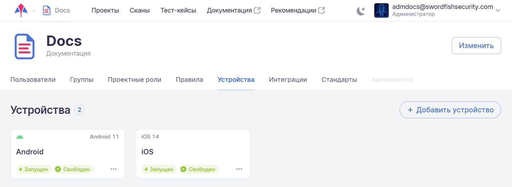
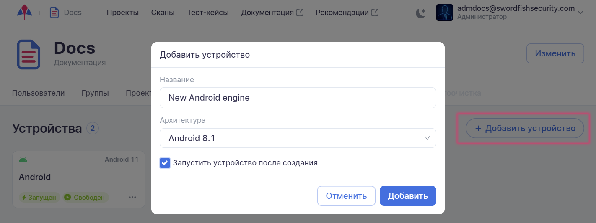
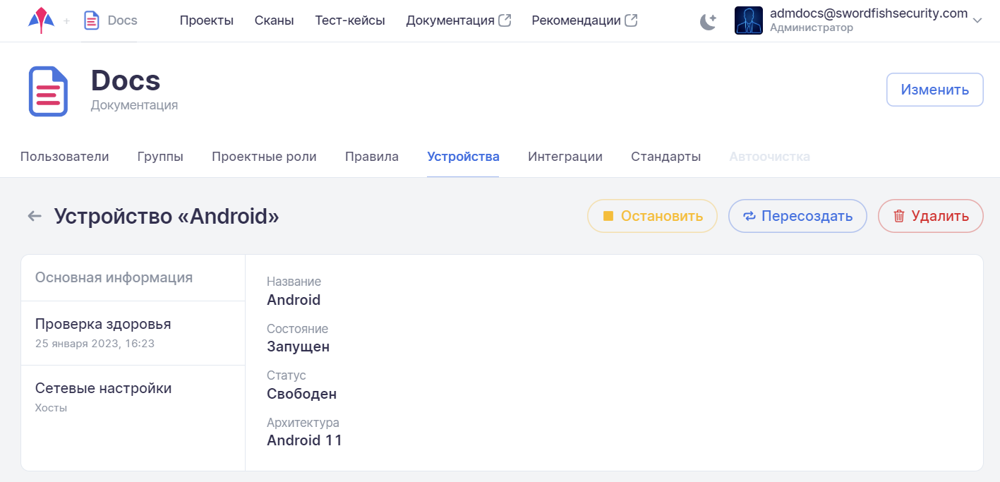
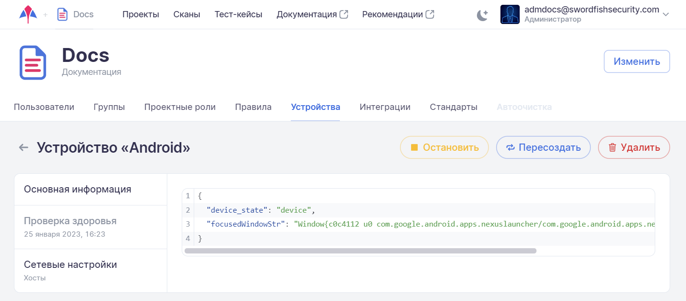
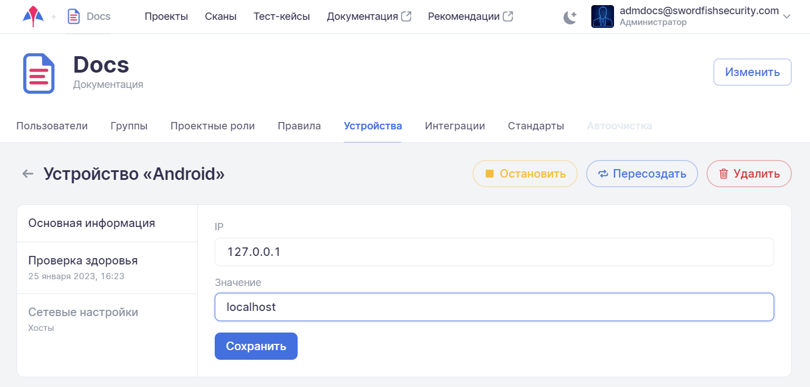

# Устройства

Для просмотра списка устройств компании необходимо в левом верхнем углу нажать название компании, а далее на странице настроек  выбрать вкладку **Устройства**.

<figure markdown></figure>
 
На данной вкладке представлены относящиеся к компании устройства, которые можно использовать для проведения сканирования приложений. Например, если у компании существует два устройства, то возможен запуск двух сканирований одновременно. Если для запуска на сканирование будет выбран третий тест, для начала его выполнения придется дождаться окончания одного из двух запущенных тестов и освобождения одного из двух устройств.

Каждое устройство представлено на странице отдельной карточкой со следующей информацией:

* Имя устройства в системе.
* Архитектура — операционная система устройства.
* Состояние устройства ~(Запущен, Запускается, Остановлен, Останавливается, Перезапускается, Настраивается или Не существует).
* Статус устройства (Свободен, Сканирование или Занят тест-кейсом).

## Управление устройствами

Администратор компании может добавить устройство к уже существующим в компании. Нажмите на кнопку **Добавить устройство** в правой части экрана. В появившемся окне **Добавить устройство** укажите название устройства и выберите его архитектуру из выпадающего списка. Вновь созданное устройство будет запущено сразу после создания, если будет выбрана опция **Запустить устройство после создания**.

<figure markdown></figure>

Чтобы посмотреть детальную информацию об устройстве, нажмите на его карточку. Вновь открывшаяся страница, помимо детальной информации об устройстве на вкладках **Основная информация**, **Проверка здоровья** и **Сетевые настройки**, предоставляет возможность остановить/запустить, пересоздать или удалить устройство с помощью соответствующих кнопок справа вверху.

<figure markdown></figure>
 
На вкладке **Проверка здоровья** приведена информация о текущем состоянии устройства.

<figure markdown></figure>
 
На вкладке **Сетевые настройки** для Android-устройства можно добавить или удалить хосты.

<figure markdown></figure>
 
Для iOS-устройства на этой вкладке можно задать внешний IP-адрес.

<figure markdown></figure>