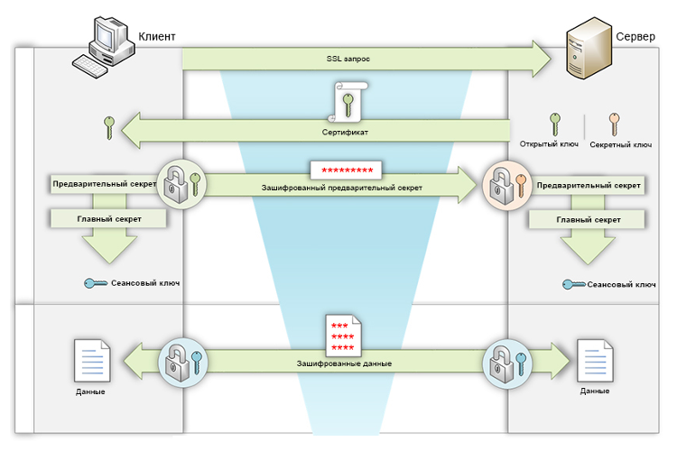
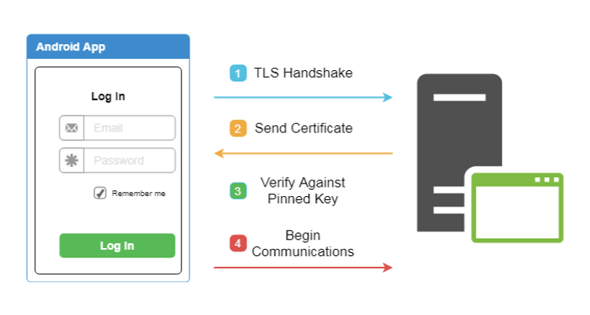

# Отсутствует или некорректно реализован SSL-pinning

<table class='noborder'>
    <colgroup>
      <col/>
      <col/>
    </colgroup>
    <tbody>
      <tr>
        <td rowspan="2"></td>
        <td>Критичность:<strong> ВЫСОКАЯ</strong></td>
      </tr>
      <tr>
        <td>Способ обнаружения:<strong> SAST, APK</strong></td>
      </tr>
    </tbody>
</table>

## Описание

Недостаточное внимание к настройке правильного клиент-серверного взаимодействия может привести к перехвату трафика между приложением и сервером. Модель злоумышленника в таком случае может быть самой разной, к примеру, публичные Wi-Fi сети, скомпрометированные сетевые устройства, злоумышленник в одной сети с устройством и т. д.

Классической атакой, которая возможна в случае отсутствия или некорректной реализации защиты от перехвата трафика, является MiTM («Man in the Middle») или «Человек по середине».

Наглядно процесс этой атаки представлен на картинке ниже:

<figure markdown>

<figcaption>Рис. 1. Схема атаки Man-In-The-Middle</figcaption>
</figure>

На данном изображении происходит примерно следующее:

1. Приложение обращается к своему серверу через точку доступа, подконтрольную злоумышленнику. 

2. На этой точке доступа развернут Proxy-сервер, через который проходит весь трафик.

3. При подключении к данной точке доступа клиенту предлагают установить сертификат корневого центра сертификации, чтобы пользоваться интернетом (через функциональность Captive portal).

4. На каждый запрос, проходящий через Proxy, он генерирует собственный сертификат, подписанный своим корневым сертификатом (и этот же сертификат уже установлен на клиентском устройстве).

В такой конфигурации весь трафик приложения будет доступен злоумышленнику, так как он выдает себя за конечного адресата мобильного устройства и при установке «защищенного» соединения отдает свой сертификат со своим ключом. И именно с Proxy-сервером устанавливается защищенное соединение по классической схеме, представленной ниже (сервер в данном случае — это Proxy злоумышленника):

<figure markdown>

<figcaption>Рис. 2. Процесс SSL-Handshake</figcaption>
</figure>

С другой стороны, Proxy-сервер устанавливает аналогичное соединение с backend мобильного приложения и передает ему данные, которые пришли от клиента. Но в этот момент он может полностью читать или модифицировать данные, которые ему пришли от мобильного приложения.

Такая атака возможна только если приложение доверяет сертификатам, хранящимся в пользовательском хранилище, и если не реализована защита в виде SSL-Pinning. Тем не менее, подобные атаки достаточно часто используются и распространены.

## Рекомендации

Основной рекомендацией в данном случае является использование SSL-Pinning. Суть этого метода в том, что на этапе SSL-Handshake (Рис. 2) после второго шага, когда сервер присылает нам свой сертификат с открытым ключом, приложение проверяет, что определенные параметры этого сертификата совпадают с тем, что ожидает получить приложение (то есть некоторые данные, которые «зашиты» в приложении и которые мы ожидаем получить от своего сервера). Схематично это изображено на рисунке 3.

<figure markdown>

<figcaption>Рис. 3. Процесс SSL-Pinning</figcaption>
</figure>

Чтобы более точно понимать, как именно его можно реализовать, необходимо понимать, что именно можно проверять, на каких этапах и каким образом это можно реализовать.

### Что такое сертификат

Сертификат — это электронный документ, который позволяет проверить аутентичность его предъявителя (пользователя, сервиса, системы). Обычно содержит публичный ключ его владельца, сводную информацию о сертификате (имя владельца, срок действия и т. д.) и информацию о том, кто именно издал этот сертификат.

<figure markdown>

</figure>

Все данные криптографически подписаны выпустившей сертификат организацией (обычно это крупные доверенные компании) и поэтому могут быть проверены в любое время.

### Какие виды SSL-Pinning бывают

#### Certificate Pinning

Первая реализация — это Certificate Pinning. В этом случае проверяется непосредственно сам сертификат, включая метаданные (кому выдан сертификат, срок окончания, данные владельца и т. д.). Такая реализация наиболее безопасна, так как даже небольшое изменение в сертификате вызовет несоответствие и приведет к невозможности установить соединение.

Но у сертификата есть срок действия, поэтому каждый раз, когда выпускается новый сертификат, должна выходить новая версия приложения.

#### Public key Pinning

Это упрощенная реализация проверки сертификата. Во время этой проверки проверяется только открытый ключ вместо всего сертификата. Так как обновление сертификата возможно без изменения открытого ключа, такой способ позволит не выпускать обновление приложения каждый раз при смене сертификата.

Но стоит иметь ввиду, что в компании должна быть предусмотрена политика ротации таких ключей, так что рано или поздно ключ будет обновлен.

### Какие сертификаты возможно проверять

1. Сертификат конечного сервера, с которым осуществляется соединение.
    1. Гарантирует с почти 100% уверенностью, что это ваш сертификат, даже если корневой центр сертификации был скомпрометирован.
    2. Если сертификат становится недействительным по какой-либо причине (либо по истечении срока действия, либо по компрометации), то осуществить соединение с сервером не получится, пока не выйдет обновление приложения.
    3. Позволяет использовать самоподписанные сертификаты — что может быть полезно при разработке.
2. Сертификат промежуточного центра сертификации.
    1. Проверяя промежуточный сертификат, вы доверяете промежуточному центру сертификации.
    2. Пока вы используете того же поставщика сертификатов, любые изменения сертификатов конечного сервера будут работать без обновления приложения.
3. Сертификат центра сертификации (корневой сертификат, CA).
    1. Проверка корневого сертификата означает, что вы доверяете корневому центру сертификации, а также любым посредникам, которые используют данный центр сертификации.
    2. Если корневой сертификат скомпрометирован, то соединение нельзя считать защищенным и необходимо срочно менять все сертификаты.
4. Всю цепочку сертификатов.
    1. Это самая надежная проверка с точки зрения безопасности, так как проверяются все возможные изменения в любом из сертификатов.
    2. В то же время — самая сложная в поддержке, так как при изменении любого из сертификатов, участвующих в цепочке, необходимо обновлять приложение.

###Как проверять

Для каждой из возможных библиотек реализация будет своя собственная, зависящая от конкретной библиотеки и ее версии. Но в Android существует встроенный механизм реализации Pinning на уровне системы, а именно конфигурация сетевого взаимодействия. Конфигурация сетевого взаимодействия — это XML-файл, в котором настраиваются параметры сетевой безопасности для приложения Android. Данная настройка задается специальным атрибутом в ***AndroidManifest.xml*** — `android:networkSecurityConfig`.

Пример подключения:

    <?xml version="1.0" encoding="utf-8"?>
    <manifest ... >
        <application android:networkSecurityConfig="@xml/network_security_config"
                        ... >
            ...
        </application>
    </manifest>

Network Security Config позволяет достаточно просто подключить механизм Certificate Pinning в приложении. Но стоит учитывать определенные нюансы. Рассмотрим конфигурацию, которая с первого взгляда выглядит, как правильно настроенная, и разберем, как ее можно немного улучшить:

    <network-security-config>
        <domain-config>
            <domain includeSubdomains="true">example.com</domain>
            <pin-set>
                <pin digest="SHA-256">7HIpactkIAq2Y49orFOOQKurWxmmSFZhBCoQYcRhJ3Y=</pin>
            </pin-set>
        </domain-config>
    </network-security-config>

Этот пример имеет два небольших недостатка:

1. Для отпечатка сертификата (pin-set) не установлен срок действия. 
2. Нет резервного сертификата.

Если срок действия вашего сертификата подойдет к концу и в настройках не указан срок действия, приложение перестанет подключаться к серверу и будет выдавать ошибку. Но если установлен срок действия и он подойдет к концу, приложение перейдет на использование доверенных центров сертификации, установленных в системе. И вместо того, чтобы получить неработоспособное приложение, вы получите отсутствие SSL-Pinning в течении некоторого времени, пока не обновите сертификат в приложении.

Чтобы этого избежать, если вы знаете сертификат, который будет изменен на вашем сервере после истечения срока текущего, можно сразу указать его в настройках «резервных сертификатов».

Вот пример **наиболее** корректного использования функционала Certificate Pinning:

    <network-security-config>
        <domain-config>
            <domain includeSubdomains="true">example.com</domain>
            <pin-set expiration="2021-01-01">
                <pin digest="SHA-256">7HIpactkIAq2Y49orFOOQKurWxmmSFZhBCoQYcRhJ3Y=</pin>
                <!-- backup pin -->
                <pin digest="SHA-256">fwza0LRMXouZHRC8Ei+4PyuldPDcf3UKgO/04cDM1oE=</pin>
            </pin-set>
        </domain-config>
    </network-security-config>

Несмотря на всё удобство использования Network Security Config, некоторые проверки придется выполнять самостоятельно в коде приложения. Например, все равно нужно будет определить, выполняет ли ваше приложение проверку имени хоста, поскольку Network Security Config не защитит от проблем такого типа.

**Так же перед имплементацией необходимо убедиться, что сторонние библиотеки поддерживают Network Security Config. В противном случае эти средства защиты могут вызвать проблемы в вашем приложении. Кроме того, Network Security Config не поддерживается сетевыми соединениями более низкого уровня, такими как веб-сокеты.**

Далее рассмотрим несколько примеров наиболее популярных библиотек для реализации сетевого взаимодействия и то, как внутри каждой из них можно реализовать SSL-Pinning.

#### OkHttp

При реализации в OkHttp можно воспользоваться классом [CertificatePinner](https://github.com/square/okhttp/wiki/HTTPS#certificate-pinning).

    CertificatePinner certPinner = new CertificatePinner.Builder()
            .add("appmattus.com",
                "sha256/4hw5tz+scE+TW+mlai5YipDfFWn1dqvfLG+nU7tq1V8=")
            .build();
    OkHttpClient okHttpClient = new OkHttpClient.Builder()
            .certificatePinner(certPinner)
            .build();

**В OkHttp возможно использовать данный функционал, начиная с версии 2.1. Но, к сожалению, ранние версии подвержены [уязвимости](https://medium.com/square-corner-blog/vulnerability-in-okhttps-certificate-pinner-2a7326ad073b#.kkns7f3jk), которая исправлена только в версии выше 2.7.5 и выше 3.2.0. Необходимо убедиться в том, что используемая версия библиотеки не подвержена данной уязвимости.
**

#### Retrofit

Retrofit используется поверх OkHttp, поэтому его использование похоже на аналогичные операции с `OkHttpClient`, как показано в примере выше.

    Retrofit retrofit = new Retrofit.Builder()
            .baseUrl("https://appmattus.com")
            .addConverterFactory(GsonConverterFactory.create())
            .client(okHttpClient)
            .build();

#### Picasso

Для Picasso, если используется OkHttp, по аналогии с примером выше, необходимо настроить OkHttpClient. В настоящее время Picasso 2 не поддерживает OkHttp 3, поэтому может потребоваться дополнительная библиотека [Picasso 2 OkHttp3](https://github.com/JakeWharton/picasso2-okhttp3-downloader).

    Picasso picasso = new Picasso.Builder(getApplicationContext())
            .downloader(new OkHttpDownloader(okHttpClient))
            .build();
    Picasso.setSingletonInstance(picasso);

Реализация при помощи `UrlConnectionDownloader` немного сложнее, но возможно реализовать аналогичный метод, как в библиотеке Volley (о котором рассказано ниже), перегрузив метод `openConnection` загрузчика и переопределив `HostnameVerifier`.

#### HttpUrlConnection

Если используется `HttpUrlConnection`, то рекомендуется пересмотреть подход в сторону OkHttp. Версия `HttpUrlConnection`, встроенная в Android, зафиксирована, поэтому с обновлениями могут возникнуть сложности.

В документе Android «[Security with HTTPS and SSL](https://developer.android.com/training/articles/security-ssl.html#Pinning)» предлагаемая реализация основана на pinning сертификатов с помощью собственного **TrustManager** и **SSLSocketFactory**. Однако, как и в случае с другими API, в данной рекомендации будут примеры с использованием SPKI.

    private void validatePinning(
            X509TrustManagerExtensions trustManagerExt,
            HttpsURLConnection conn, Set<String> validPins)
            throws SSLException {
        String certChainMsg = "";
        try {
            MessageDigest md = MessageDigest.getInstance("SHA-256");
            List<X509Certificate> trustedChain =
                    trustedChain(trustManagerExt, conn);
            for (X509Certificate cert : trustedChain) {
                byte[] publicKey = cert.getPublicKey().getEncoded();
                md.update(publicKey, 0, publicKey.length);
                String pin = Base64.encodeToString(md.digest(),
                        Base64.NO_WRAP);
                certChainMsg += "    sha256/" + pin + " : " +
                        cert.getSubjectDN().toString() + "\n";
                if (validPins.contains(pin)) {
                    return;
                }
            }
        } catch (NoSuchAlgorithmException e) {
            throw new SSLException(e);
        }
        throw new SSLPeerUnverifiedException("Certificate pinning " +
                "failure\n  Peer certificate chain:\n" + certChainMsg);
    }
    private List<X509Certificate> trustedChain(
            X509TrustManagerExtensions trustManagerExt,
            HttpsURLConnection conn) throws SSLException {
        Certificate[] serverCerts = conn.getServerCertificates();
        X509Certificate[] untrustedCerts = Arrays.copyOf(serverCerts,
                serverCerts.length, X509Certificate[].class);
        String host = conn.getURL().getHost();
        try {
            return trustManagerExt.checkServerTrusted(untrustedCerts,
                    "RSA", host);
        } catch (CertificateException e) {
            throw new SSLException(e);
        }
    }

И данная имплементация должна быть вызвана следующим образом:

    TrustManagerFactory trustManagerFactory =
            TrustManagerFactory.getInstance(
                    TrustManagerFactory.getDefaultAlgorithm());
    trustManagerFactory.init((KeyStore) null);
    // Find first X509TrustManager in the TrustManagerFactory
    X509TrustManager x509TrustManager = null;
    for (TrustManager trustManager : trustManagerFactory.getTrustManagers()) {
        if (trustManager instanceof X509TrustManager) {
            x509TrustManager = (X509TrustManager) trustManager;
            break;
        }
    }
    X509TrustManagerExtensions trustManagerExt =
            new X509TrustManagerExtensions(x509TrustManager);
    ...
    URL url = new URL("https://www.appmattus.com/");
    HttpsURLConnection urlConnection = 
            (HttpsURLConnection) url.openConnection();
    urlConnection.connect();
    Set<String> validPins = Collections.singleton
            ("4hw5tz+scE+TW+mlai5YipDfFWn1dqvfLG+nU7tq1V8=");
    validatePinning(trustManagerExt, urlConnection, validPins);

В данном случае вызов `urlConnection.connect()` выполняет SSL Handshake, однако не передает никаких данных, пока не будет вызван `urlConnection.getInputStream()`.

#### Volley

Стандартный способ использования библиотеки Volley — это Pinning сертификатов, как показано в статье «[Android Security Tip: Public Key Pinning with Volley Library](https://medium.com/@faruktoptas/android-security-tip-public-key-pinning-with-volley-library-fb85bf761857)». Проект Github [Public Key Pinning with Android Volley library](https://github.com/faruktoptas/volley-public-key-pinning) показывает, как можно настраивать **SSLSocketFactory** для привязки к SPKI.

Можно использовать альтернативный метод, в дополнение к перечисленным выше подходам. Он заключается в использовании класса `HostnameVerifier`. Этот класс используется для проверки того, что имя хоста в URL-адресе соответствует тому, что указано в сертификате.

Переопределить `HostnameVerifier` можно следующим образом:

    RequestQueue requestQueue = Volley.newRequestQueue(appContext,
            new HurlStack() {
        @Override
        protected HttpURLConnection createConnection(URL url) throws IOException {
            HttpURLConnection connection = super.createConnection(url);
            if (connection instanceof HttpsURLConnection) {
                HostnameVerifier delegate =
                        urlConnection.getHostnameVerifier();
                HostnameVerifier pinningVerifier =
                        new PinningHostnameVerifier(delegate);
                urlConnection.setHostnameVerifier(pinningVerifier);
            }
            return connection;
        }
    });
    ...
    public static class PinningHostnameVerifier
            implements HostnameVerifier {
        private final HostnameVerifier delegate;
        private PinningHostnameVerifier(HostnameVerifier delegate) {
            this.delegate = delegate;
        }
        @Override
        public boolean verify(String host, SSLSession sslSession) {
            if (delegate.verify(host, sslSession)) {
                try {
                    validatePinning(sslSession.getPeerCertificates(),
                            host, validPins);
                    return true;
                } catch (SSLException e) {
                    throw new RuntimeException(e);
                }
            }
            return false;
        }
    }

## Ссылки

1. [Network security configuration  |  Android Developers](https://developer.android.com/training/articles/security-config) 

2. [A Security Analyst’s Guide to Network Security Configuration in Android P](https://www.nowsecure.com/blog/2018/08/15/a-security-analysts-guide-to-network-security-configuration-in-android-p/)

3. [GitHub - square/okhttp: Square’s meticulous HTTP client for the JVM, Android, and GraalVM.](https://github.com/square/okhttp/wiki/HTTPS#certificate-pinning) 

4. [Vulnerability in OkHttp’s Certificate Pinner](https://medium.com/square-corner-blog/vulnerability-in-okhttps-certificate-pinner-2a7326ad073b#.kkns7f3jk) 

5. [GitHub - JakeWharton/picasso2-okhttp3-downloader: A OkHttp 3 downloader implementation for Picasso 2.](https://github.com/JakeWharton/picasso2-okhttp3-downloader)

6. [Security with HTTPS and SSL  |  Android Developers](https://developer.android.com/training/articles/security-ssl.html#Pinning) 

7. [Android Security Tip: Public Key Pinning with Volley Library](https://medium.com/@faruktoptas/android-security-tip-public-key-pinning-with-volley-library-fb85bf761857) 

8. [GitHub - faruktoptas/volley-public-key-pinning: Public key pinning with Android volley networking library](https://github.com/faruktoptas/volley-public-key-pinning)