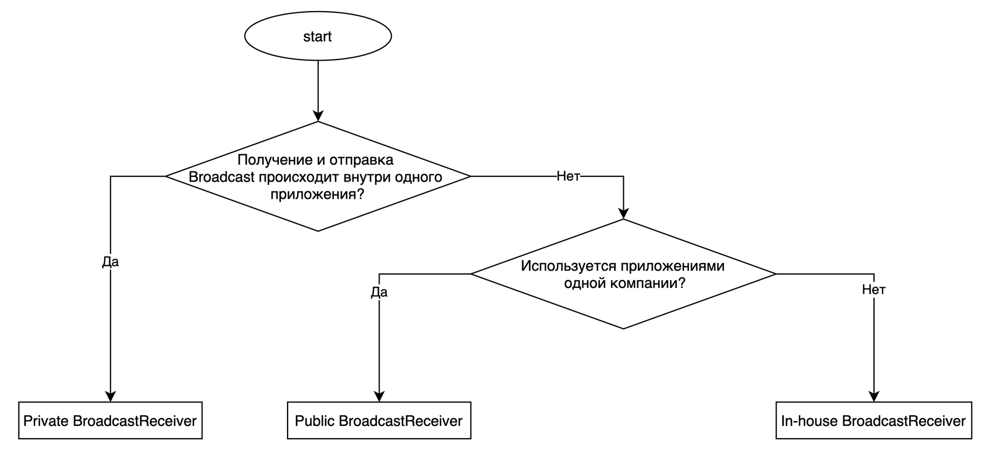

# Передача sensitive-информации в BroadcastReceiver

<table class='noborder'>
    <colgroup>
      <col/>
      <col/>
    </colgroup>
    <tbody>
      <tr>
        <td rowspan="2"></td>
        <td>Критичность:<strong> КРИТИЧНЫЙ</strong></td>
      </tr>
      <tr>
        <td>Способ обнаружения:<strong> DAST, SENSITIVE INFO</strong></td>
      </tr>
    </tbody>
</table>

## Описание

Приложение включает чувствительную информацию в **Intent** для запуска **BroadcastReceiver**. Это может привести к перехвату этой информации сторонними приложениями.

Межпроцессное взаимодействие (IPC) в Android осуществляться при помощи специальных объектов — **Intent**. Параметры обработчиков **Intent** задаются в основной файле манифеста приложения — ***AndroidManifest.xml*** либо, в случае с динамическими **BroadcastReceivers**, в коде приложения. В случае, если используется неявные **Intent** (адресат сообщения не указан явно либо используется механизм широковещательных сообщений, Broadcast), данные, содержащиеся в таких сообщениях, могут быть скомпрометированы. Кроме того, вредоносными приложениями могут использоваться механизмы делегирования управления процесса, такие как неявные вызовы компонентов приложений или объекты типа **PendingIntent**, для перехвата потока управления и фишинговых атак.

Опасность представляют объекты типов **Activity**, **Service**, **BroadcastReceiver** и **ContentProvider**, открытые для взаимодействия с другими приложениями и не относящиеся к системным Android-вызовам (таким как `android.intent.action.MAIN`). **BroadcastReceiver** по умолчанию открыт для взаимодействия с другими приложениями, в этом случае возможен перехват **Intent** с конфиденциальной информацией или перехват управления.

## Рекомендации

При отправке **Broadcast** во внутренний **BroadcastReceiver** с передачей чувствительной информации должен использоваться явный **Intent**, **Private BroadcastReceiver** или **LocalBroadcastManager**. Также следует помнить, что приложение не должно включать чувствительную информацию в **Public Broadcast**.

Для получения Broadcast необходимо создать **BroadcastReceiver**. Риски при использовании **BroadcastReceiver** и соответствующие им защитные меры различаются в зависимости от типа **Broadcast**.

Для определения типа **BroadcastReceiver**, который планируется создавать, можно воспользоваться таблицей и диаграммой, представленными ниже. У приложения, получающего **Broadcast**, нет возможности проверить имя пакета, из которого произошла его отправка, поэтому невозможно создать **Partner BroadcastReceiver** [по аналогии с Activity](https://appsec.atlassian.net/wiki/spaces/MSR/pages/1586692303/sensitive-+Activity).

<figure markdown>

</figure>

<figure markdown>

</figure>

Также **BroadcastReceiver** может быть статическим или динамическим в зависимости от способа объявления.

<figure markdown>

</figure>

**Пример создания Private BroadcastReceiver**

**Private BroadcastReceiver** является наиболее безопасным т.к. он получит **Broadcast** только из того же самого приложения, в котором был объявлен. **Private BroadcastReceiver** может быть объявлен только статически.

Правила (получение **Broadcast**):

1. Явно указывайте атрибут **exported="false"**;
2. Проводите проверку и безопасную обработку полученного **Intent**, несмотря на то, что он был получен из того же самого приложения;
3. В **Intent** результата можно включать конфиденциальную информацию, т.к. его отправка и получение происходит внутри приложения;

**Объявление компонента в AndroidManifest.xml**

    <?xml version="1.0" encoding="utf-8"?>
    <manifest xmlns:android="http://schemas.android.com/apk/res/android"
    package="com.appsec.android.broadcast.privatereceiver" >
    <application
    android:icon="@drawable/ic_launcher"
    android:label="@string/app_name"
    android:allowBackup="false" >
    <!-- Private Broadcast Receiver -->
    <!-- *** 1 *** Явно указывайте атрибут exported="false" -->
    <receiver
    android:name=".PrivateReceiver"
    android:exported="false" />
    <activity
    android:name=".PrivateSenderActivity"
    android:label="@string/app_name"
    android:exported="true" >
    <intent-filter>
    <action android:name="android.intent.action.MAIN" />
    <category android:name="android.intent.category.LAUNCHER" />
    </intent-filter>
    </activity>
    </application>
    </manifest>

**Получение Broadcast**

    package com.appsec.android.broadcast.privatereceiver;
    import android.app.Activity;
    import android.content.BroadcastReceiver;
    import android.content.Context;
    import android.content.Intent;
    import android.widget.Toast;
    public class PrivateReceiver extends BroadcastReceiver {
        @Override
        public void onReceive(Context context, Intent intent) {
            
            // *** 2 *** Проводите проверку и безопасную обработку полученного
            // Intent, несмотря на то, что он был получен из того же самого приложения
            String param = intent.getStringExtra("PARAM");
            Toast.makeText(context,
                    String.format("Received param: \"%s\"", param),
                    Toast.LENGTH_SHORT).show();
            
            // *** 3 *** В Intent результата можно включать конфиденциальную
            // информацию, т.к. его отправка и получение происходит внутри приложения
            setResultCode(Activity.RESULT_OK);
            setResultData("Чувствительная информация");
            abortBroadcast();
        }
    }

**Правила (отправка Broadcast):**

1. Используйте явный **Intent** с указанием имени класса **BroadcastReceiver** внутри приложения.
2. Можно отправлять чувствительную информацию.
3. Проводите проверку и безопасную обработку полученных данных результата, несмотря на то, что они были получены из **BroadcastReceiver** того же самого приложения.
    
        package com.appsec.android.broadcast.privatereceiver;
        import android.app.Activity;
        import android.content.BroadcastReceiver;
        import android.content.Context;
        import android.content.Intent;
        import android.os.Bundle;
        import android.view.View;
        import android.widget.TextView;
        public class PrivateSenderActivity extends Activity {
            public void onSendNormalClick(View view) {
                // *** 1 *** Используйте явный Intent с указанием имени класса BroadcastReceiver внутри приложения
                Intent intent = new Intent(this, PrivateReceiver.class);
                // *** 2 *** Можно отправлять чувствительную информацию
                intent.putExtra("PARAM", "Чувствительная информация от отправителя");
                sendBroadcast(intent);
            }
            
            public void onSendOrderedClick(View view) {
                // *** 1 *** Используйте явный Intent с указанием имени класса BroadcastReceiver внутри приложения
                Intent intent = new Intent(this, PrivateReceiver.class);
                // *** 2 *** Можно отправлять чувствительную информацию
                intent.putExtra("PARAM", "Чувствительная информация от отправителя");
                sendOrderedBroadcast(intent, null, mResultReceiver, null, 0, null, null);
            }
            
            private BroadcastReceiver mResultReceiver = new BroadcastReceiver() {
                @Override
                public void onReceive(Context context, Intent intent) {
                    
                    // *** 3 *** Проводите проверку и безопасную обработку полученных данных
                    // результата, несмотря на то, что они были получены из BroadcastReceiver
                    // того же самого приложения
                    // См.п. "Безопасная обработка входных данных"
                    
                    String data = getResultData();
                    PrivateSenderActivity.this.logLine(
                            String.format("Received result: \"%s\"", data));
                }
            };
            
            private TextView mLogView;
            
            @Override
            public void onCreate(Bundle savedInstanceState) {
                super.onCreate(savedInstanceState);
                setContentView(R.layout.main);
                mLogView = (TextView)findViewById(R.id.logview);
                }
                
                private void logLine(String line) {
                    mLogView.append(line);
                    mLogView.append("\n");
                }
            }

## Ссылки

1. [https://developer.android.com/guide/components/intents-filters.html](https://developer.android.com/guide/components/intents-filters.html)

2. [https://developer.android.com/training/basics/intents/index.html](https://developer.android.com/training/basics/intents/index.html)

3. [https://cwe.mitre.org/data/definitions/927.html](https://cwe.mitre.org/data/definitions/927.html)

4. [https://github.com/OWASP/owasp-mstg/blob/master/Document/0x05h-Testing-Platform-Interaction.md#testing-for-injection-flaws-mstg-platform-2](https://github.com/OWASP/owasp-mstg/blob/master/Document/0x05h-Testing-Platform-Interaction.md#testing-for-injection-flaws-mstg-platform-2)