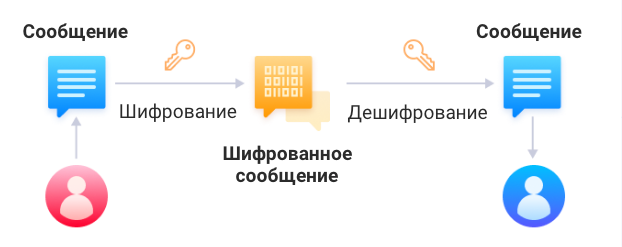
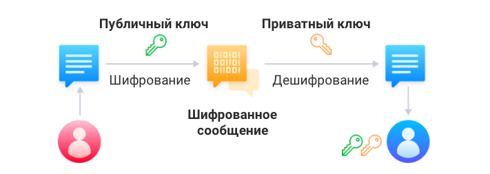
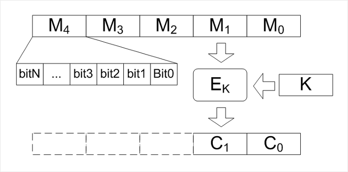
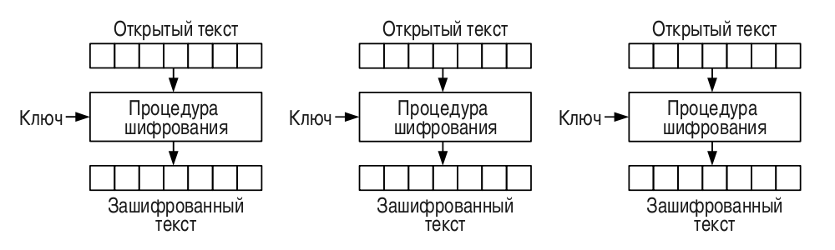
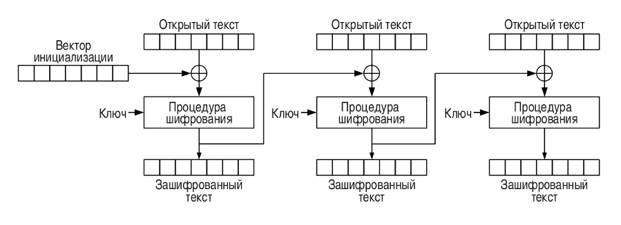
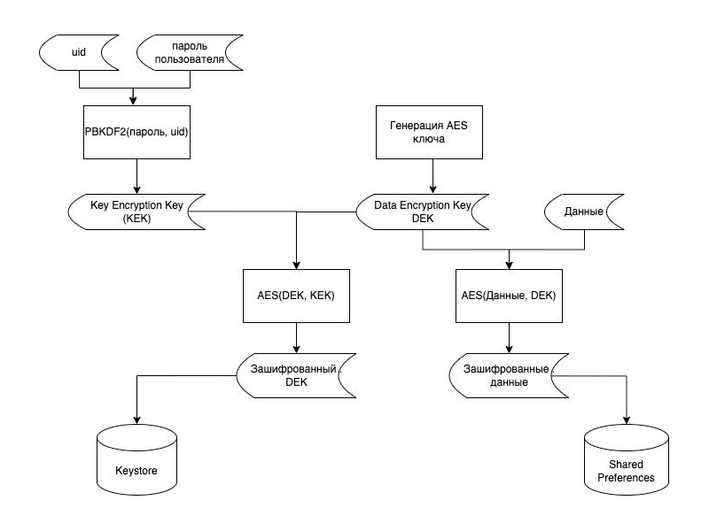

# Небезопасное использование криптографических алгоритмов

В ходе развития программных и аппаратных средств, а также в связи с новыми исследованиями в теории чисел и научной криптографии существующие решения и подходы шифрования данных могут устаревать. При выборе того или иного решения для шифрования данных следует всегда убеждаться, что выбранный алгоритм (трансформация) не устарел и на него нет успешных криптографических атак. Если же выбирается целое программное решение (библиотека, фреймворк, API), следует убедиться, что оно само не содержит ошибок или уязвимостей и также использует актуальные подходы к шифрованию.

## Общие понятия

Чтобы лучше понимать описанное далее, рекомендуется ознакомиться с основными понятиями и определениями из мира криптографии. Не будем глубоко погружаться в математику и сложные вычисление, но остановимся на базовых вещах, которые помогут лучше понять подсвеченные инструментом проблемы.

**Шифр** — совокупность заранее оговоренных способов преобразования исходного секретного сообщения с целью его защиты.

**Сообщение (открытый текст)**, полученное после преобразования с использованием любого шифра, называется **шифрованным сообщением** (закрытым текстом, криптограммой). В иностранной литературе закрытый текст и исходное сообщение называют **ciphertext** и **plaintext** соответственно.

**Ключ** — информация, необходимая для шифрования и расшифровки сообщений.

<span style='color: black; background: lightgreen'>**Соль** — случайный набор данных, добавляемый к сообщению при хешировании для усложнения обратного преобразования (поиска исходных данных по известному результату хеширования).

**Криптостойкостью** называется характеристика шифра, определяющая его стойкость к дешифрованию без знания ключа.

Шифрование бывает симметричное и асимметричное. В симметричном (для шифрования и расшифровки используется один и тот же ключ) основной проблемой является безопасная передача данного значения между сторонами. Поэтому, как правило, его применяют, если шифровать/расшифровывать данные необходимо только на устройстве и никуда их передавать не нужно.

<figure markdown><figcaption>Симметричное шифрование</figcaption></figure>

При асимметричном шифровании используются два ключа, которые называются публичный (public key) и приватный (private key). Эти ключи математически связаны друг с другом и их пара уникальна. На публичном ключе происходит шифрование данных, а приватным — расшифровка. Данный алгоритм используют чаще, если есть необходимость передавать данные куда-либо вне устройства.

<figure markdown><figcaption>Асимметричное шифрование</figcaption></figure>
 
Помимо различия в ключах, алгоритмы шифрования бывают блочные и поточные. Поточные шифры в рамках данной уязвимости не рассматриваются. Особенность блочных шифров в том, что они работают с блоками строго определенной длины. То есть, если входная информация по размеру больше, чем умеет обрабатывать тот или иной алгоритм, то она будет разделена на блоки, каждый из которых будет зашифрован.

<figure markdown><figcaption>Классический пример блочного шифрования</figcaption></figure>

Далее, в каждом из следующих блоков будет приведено описание недостатков, которые могут возникнуть при реализации шифрования, и способы эти недостатки устранить.

## Слабый или устаревший алгоритм шифрования

!!! warning "Важное замечание"
    Следует отметить, что приведенные ниже списки и оценки не являются точными с научной точки зрения. Дело в том, что безопасность многих перечисленных ниже алгоритмов может быть существенно повышена выбором соответствующих настроек или режимов, а также часто зависит от контекста использования самого алгоритма. Тем не менее в общем случае следует избегать использования таких алгоритмов, если вы не уверены в том, что делаете.

В настоящее время небезопасными, устаревшими и ненадежными считаются следующие алгоритмы:

* DES и его варианты (3DES, DESed, 2TDEA) с любыми настройками.
* IDEA.
* Blowfish — при шифровании больших (более 4 Гб) объемов данных.
* AES в режиме ECB (трансформация AES/ECB) — режим ECB является самым небезопасным режимом блочного шифрования, в этом режиме все блоки шифруются независимо друг от друга одним и тем же ключом, что оставляет статистику исходного сообщения, а также позволяет провести атаку подменой блоков и некоторые другие виды атак. Для AES предпочтительно выбирать трансформацию AES/GCM — режим GCM работает достаточно быстро и, кроме того, добавляет аутентификацию к шифруемому сообщению, что не позволяет злоумышленнику внести изменения в результат шифрования.
* AES в режиме CBC (AES/CBC…) — для режима CBC известна атака «padding oracle». В режиме CBC блок данных шифруется, а затем выполняется XOR между результатом шифрования и следующим блоком данных. Последний блок данных дополняется по тем или иным правилам (например заполняется байтами, каждый из которых равен числу дополненных байт). Суть атаки состоит в том, что имея «на руках» шифротекст и возможность получать ответ «Оракула» о том, правильное ли дополнение использовано или нет, злоумышленник получает возможность расшифровать все сообщение, кроме первого блока (при неизвестном векторе инициализации), а при известном — целиком. Атака осуществима, когда у злоумышленника есть возможность получать ответ «Оракула», например при клиент-серверном взаимодействии «Оракулом» может выступать сервер, возвращающий ответ 200 или 400 в случае правильного или неправильного дополнения.
* RSA с ключом менее 2048 бит (лучше использовать 3072).
* DSA с ключом менее 2048 бит (лучше использовать 3072).

Стандартным и наиболее распространенным способом шифрования данных является использование алгоритма «AES/GCM» либо «AES/CBC».

``` java
public String encrypt(String message) throws NoSuchAlgorithmException,
            NoSuchPaddingException, IllegalBlockSizeException,
            BadPaddingException, InvalidKeyException,
            UnsupportedEncodingException, InvalidAlgorithmParameterException {

        byte[] srcBuff = message.getBytes("UTF8");

        SecretKeySpec skeySpec = new SecretKeySpec(KEY, "AES");
        IvParameterSpec ivSpec = new IvParameterSpec(ivx);
        Cipher ecipher = Cipher.getInstance("AES/CBC/PKCS7Padding");
        ecipher.init(Cipher.ENCRYPT_MODE, skeySpec, ivSpec);

        byte[] dstBuff = ecipher.doFinal(srcBuff);

        String base64 = Base64.encodeToString(dstBuff, Base64.DEFAULT);

        return base64;

    }
```

Другой распространенной проблемой является использование алгоритма AES без указания режима сцепления блоков, так как по умолчанию используется режим ECB (Electronic Code Book — электронная кодовая книга). При данном режиме каждый блок шифруется отдельно и они никак не связаны друг с другом, что может упростить дешифровку сообщения. При случайном совпадении двух блоков на выходе получится одинаковый шифротекст, что даст возможность облегчить подбор ключа шифрования.

<figure markdown><figcaption>Режим сцепления блоков ECB</figcaption></figure>
 
В случае же использования любого другого метода сцепления блоков появляется зависимость блоков друг от друга. Таким образом, расшифровать сообщение можно только целиком и даже два абсолютно одинаковых блока будут иметь разный шифротекст на выходе. Как пример можно рассмотреть режим CBC (Cipher Block Chaining — сцепление блоков).

<figure markdown><figcaption>Режим сцепления блоков CBC</figcaption></figure>
 
## Простой вектор инициализации

**Initialization vector (IV)** — произвольное число для предотвращения повторения шифрования данных в первом блоке. Может быть использовано вместе с ключом для шифрования данных.

Использование пустого или предсказуемого вектора инициализации является недопустимым в операциях шифрования. Для его генерации рекомендуется использовать класс `SecureRandom`.

``` java
val iv = ByteArray(ivLength)
SecureRandom().nextBytes(iv)
```

`ivLength` (то есть длина вектора инициализации) зависит от режима работы. И для большинства режимов, включая CBC, IV должен иметь ту же длину, что и блок. Алгоритм AES использует 128-битные блоки, поэтому длина вектора инициализации равна 128 битам (`ivLength` = 16 байт).

После генерации вектора инициализации достаточно создать экземпляр Cipher с его помощью:

``` java
cipher.init(Cipher.ENCRYPT_MODE, key, IvParameterSpec(iv))
cipher.init(Cipher.DECRYPT_MODE, key, IvParameterSpec(iv))
```

## Слабый ключ шифрования

Одним из основных параметров в шифровании является ключ шифрования. В целом от него зависит, насколько стойким в итоге будет шифротекст. И к его выбору стоит подойти наиболее ответственно. Одними из самых распространенных проблем являются использование предсказуемого или слишком короткого ключа шифрования, а также использование каких-либо данных пользователя в прямом виде (без процедуры расширения ключа). 

Отдельной темой является дальнейшее хранение данного ключа, поэтому надежнее всего использовать встроенные механизмы системы для генерации ключей шифрования (Android KeyStore). При этом все задачи по хранению и генерации ключей система берет на себя.

``` java
final KeyGenerator keyGenerator = KeyGenerator
        .getInstance(KeyProperties.KEY_ALGORITHM_AES, ANDROID_KEY_STORE);

final KeyGenParameterSpec keyGenParameterSpec = new KeyGenParameterSpec.Builder(alias,
        KeyProperties.PURPOSE_ENCRYPT | KeyProperties.PURPOSE_DECRYPT)
        .setBlockModes(KeyProperties.BLOCK_MODE_GCM)
        .setEncryptionPaddings(KeyProperties.ENCRYPTION_PADDING_NONE)
        .build();

keyGenerator.init(keyGenParameterSpec);
final SecretKey secretKey = keyGenerator.generateKey();

final Cipher cipher = Cipher.getInstance(TRANSFORMATION);
cipher.init(Cipher.ENCRYPT_MODE, secretKey);

iv = cipher.getIV();

encryption = cipher.doFinal(textToEncrypt.getBytes("UTF-8"));
```

## Неверные параметры для алгоритма генерации ключа

Использование любых данных пользователя в качестве ключа шифрования — это достаточно распространенная, но очень плохая практика. Как правило, таким значениям недостает длины или случайности, поэтому специально для таких случаев предусмотрели процедуру получения ключа шифрования из данных пользователя и называется она «Процедура расширения ключа» или «Функция определения ключа на основе пароля». Рассмотрим мы ее на примере одной из функций под названием PBKDF2 (Password-Based Key Derivation Function):

* PBKDF2 выполняет функцию усиления в несколько итераций для получения ключа. Обычно это около 10 тысяч итераций.
* Рост количества итераций увеличивает время, необходимое для успешной атаки с использованием полного перебора (brute force).

``` java
/**
* Creates a hash in base64 of the user's password using pbkdf2 since we have no nice alternatives like bcrypt.
* @param password user's password
* @return a bas64 representation of the pbkdf2 hash
* @throws GeneralSecurityException
*/
public static String generateUserHash(String password) throws GeneralSecurityException {
    byte[] salt = new byte[HASH_SALT_SIZE];
    (new SecureRandom()).nextBytes(salt);

    byte[] hash = generateUserHash(password, salt);

    byte[] output = new byte[HASH_SALT_SIZE + HASH_OUTPUT_SIZE];

    System.arraycopy(salt, 0, output, 0, salt.length);
    System.arraycopy(hash, 0, output, salt.length, HASH_OUTPUT_SIZE);

    return Base64.encodeToString(output, Base64.DEFAULT);
}

/**
* Creates a hash in bytes of the user's password.
* @param password the user's password
* @param salt the salt to use when creating the hash
* @return the pbkdf2 hash of the user's password in bytes
* @throws GeneralSecurityException
*/
public static byte[] generateUserHash(String password, byte[] salt) throws GeneralSecurityException {
/*
https://security.stackexchange.com/a/47188/79148
We use PBKDF2 because android doesn't natively support bcrypt, scrypt, or argon2i.
Additionally, keep in mind that this will only provide 20 bytes of security instead
of 32 bytes because we're using HmacSHA1. Android doesn't support HmacSHA256.
You can use SpongyCastle/BouncyCastle to include support for PBKDF2-HmacSHA256.
*/
    SecretKeyFactory factory = SecretKeyFactory.getInstance("PBKDF2WithHmacSHA1");
    PBEKeySpec keySpec = new PBEKeySpec(password.toCharArray(), salt, HASH_ITERATIONS, HASH_OUTPUT_SIZE * 8);
    SecretKey hash = factory.generateSecret(keySpec);

    return hash.getEncoded();
}
```

В итоге мы получим достаточно адекватный ключ шифрования, удовлетворяющий всем необходимым параметрам (длина, случайность). И так как мы используем данные, которые вводит пользователь, можем не хранить этот ключ постоянно, а генерировать его налету каждый раз, когда нам необходимо зашифровать или расшифровать данные.

Чтобы обработать ситуацию, когда мы используем пароль пользователя в процедуре расширения ключа и шифрования данных, а пользователь внезапно решил сменить пароль, возможно применение алгоритма KEK&DEK (Key Encryption Key & Data Encryption Key). При таком подходе мы генерируем ключ шифрования для данных при помощи `SecureRandom`, шифруем на нем нужные нам данные, а после для безопасного хранения этого ключа используем процедуру расширения на основе пароля пользователя и получившимся ключом шифруем ключ шифрования данных. Схематично это выглядит следующим образом.

<figure markdown><figcaption>Примерная схема с использованием двух ключей</figcaption></figure>

При таком подходе мы сначала создаем ключ для шифрования данных (Data Encryption Key). Затем на нем зашифровываем данные и уже этот ключ шифруем при помощи нового ключа (Key Encryption Key). Как раз этот KEK можно либо сохранить в Keystore, либо генерировать каждый раз (например, на основе пароля пользователя). При таком механизме мы избавляемся от повторной зашифровки данных в случае изменения/компрометации ключа. Нам достаточно повторно зашифровать только DEK и не трогать данные (конечно, это не так, если у нас скомпрометирован DEK, но такой вариант маловероятен). В этом случае, каков бы ни был объем данных, которые нужно сохранить в секрете, время повторного шифрования всегда будет одинаковым, так как сами зашифрованные данные мы не трогаем. 

## Использован уязвимый алгоритм хеширования

**Хэширование** — особое преобразование любого объема информации, в результате которого получается некое значение (**хэш**) — уникальная короткая символьная строка, которая присуща только этому массиву входящей информации. 

Приведем некоторые свойства хэш-функций, на основе которых выбирают правильный алгоритм хэширования:

* Детерминированность.
* Скорость.
* Сложность обратного вычисления.
* Небольшие изменения во вводимых данных изменяют хэш.
* Устойчивость к коллизиям.

Основными врагами таких алгоритмов являются огромные базы данных уже посчитанных различных хэшей для очень большого количества разных строк. Есть целые сервисы, которые занимаются тем, что все время считают различные хэши от всех возможных комбинаций символов. Конечно, сначала им «скармливают» все базы паролей и утечек, они считают их, а потом пользовательские запросы. И уже после они занимаются подсчетом оставшихся значений. Принцип работы таких сервисов прост: вбиваешь интересующий тебя хэш, а в ответе видишь, есть ли он в базе и какое значение ему соответствует. И для большинства паролей, задаваемых пользователями, такие совпадения есть. Как пример — приложение, которое хранит пин пользователя, как простой `SHA-1(pin)`. И, конечно, первой же ссылкой в Google, если вбить туда значение этого хэша, будет пин-код пользователя. Другой проблемой являются коллизии, когда два абсолютно разных значения после преобразования дают одинаковый хэш. И алгоритмы хэширования, как правило, признают устаревшими как раз после того, как становится возможным за приемлемое время подобрать данные для успешной коллизии. Как хороший пример невозможности использования SHA-1 является данный [репозиторий](https://github.com/nneonneo/sha1collider). Он наглядно показывает, как два документа (оригинальный и измененный), могут получить одинаковое значение хэша.

Чтобы избежать подобных вещей, используйте соль при хэшировании. Это существенно повысит энтропию и позволит не беспокоиться хотя бы о базе посчитанных хэшей.

И конечно, стоит запомнить, что:

* MD5 не подходит для любых криптографических целей.
* SHA1 не подходит для любых криптографических целей.

!!! note "Примечание"
    * При генерации случайных данных для любых целей криптографии (соль, вектор инициализации, ключ) следует использовать `SecureRandom`, а не обычный `Random`.
    * Также при создании вектора инициализации и соли не следует использовать тривиальные данные, например заполнять массив нулями или использовать другие значения с низкой энтропией.
    * При генерации ключа (PBE, PBKDF2) следует устанавливать количество итераций как можно большим, исходя из возможностей аппаратной части и требований безопасности. В системе «Стингрей» оценочно небезопасным считается значение менее 10 000 итераций.
    * Нельзя использовать пароль как ключ шифрования напрямую (то есть без использования алгоритмов генерации ключа)

### <span style='color: black; background: lightgreen'>Использование слова в качестве соли

<span style='color: black; background: lightgreen'>Иногда разработчики в качестве значения соли используют набор байт, являющийся словом или фразой естественного языка. Такая ошибка свидетельствует, что значение соли захардкожено (в коде или ресурсах приложения), а не вычисляется случайным образом.

### <span style='color: black; background: lightgreen'>Использование соли с низкой энтропией

<span style='color: black; background: lightgreen'>Для хеширования взята соль, заполненная, скорее всего, не случайными данными, а например нулями [0, 0, 0, …] или другими повторяющимися данными.

## Ссылки

1. [https://www.baeldung.com/java-encryption-iv](https://www.baeldung.com/java-encryption-iv) 
2. [https://proandroiddev.com/secure-data-in-android-initialization-vector-6ca1c659762c](https://proandroiddev.com/secure-data-in-android-initialization-vector-6ca1c659762c) 
3. [https://medium.com/beautycoder/android-security-and-fingerprint-ef0f6f344888](https://medium.com/beautycoder/android-security-and-fingerprint-ef0f6f344888) 
4. [https://developer.android.com/training/articles/keystore](https://developer.android.com/training/articles/keystore) 
5. [https://medium.com/@josiassena/using-the-android-keystore-system-to-store-sensitive-information-3a56175a454b](https://medium.com/@josiassena/using-the-android-keystore-system-to-store-sensitive-information-3a56175a454b) 
6. [https://habr.com/ru/company/swordfish_security/blog/658433/](https://habr.com/ru/company/swordfish_security/blog/658433/) 
7. [https://habr.com/ru/company/swordfish_security/blog/664720/](https://habr.com/ru/company/swordfish_security/blog/664720/)
8. [https://github.com/d0nutptr/Android-Security-Examples/blob/master/Cryptography/app/src/main/java/com/iismathwizard/cryptonote/Crypto.java](https://github.com/d0nutptr/Android-Security-Examples/blob/master/Cryptography/app/src/main/java/com/iismathwizard/cryptonote/Crypto.java) 
9. [https://github.com/flast101/padding-oracle-attack-explained/blob/master/oracle.py](https://github.com/flast101/padding-oracle-attack-explained/blob/master/oracle.py) 
10. [https://habr.com/ru/post/247527/?ysclid=l9wqtx7li4787340116](https://habr.com/ru/post/247527/?ysclid=l9wqtx7li4787340116) 
11. [https://en.wikipedia.org/wiki/Padding_oracle_attack](https://en.wikipedia.org/wiki/Padding_oracle_attack)
