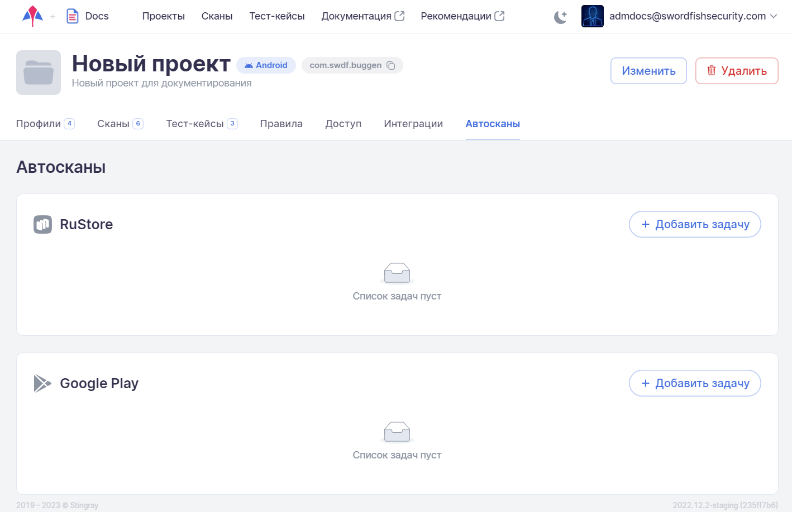
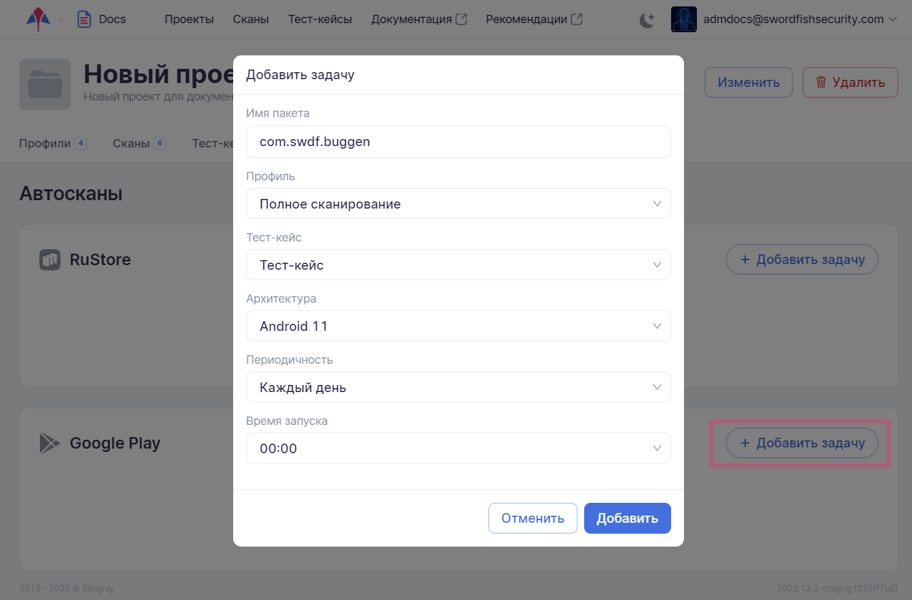
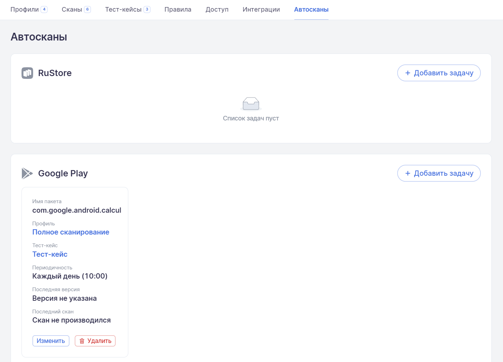
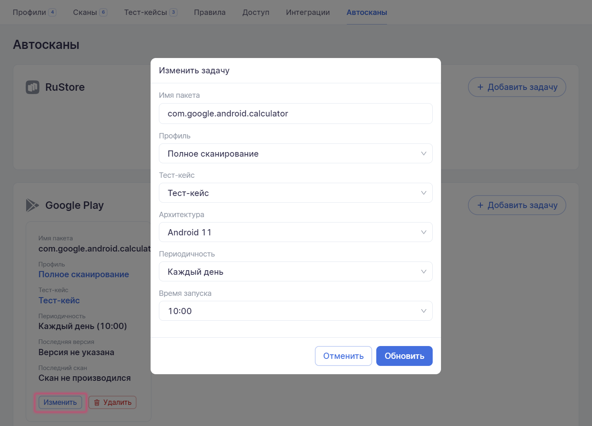

# Автосканы

С помощью автосканов можно реализовать настройку автоматического сканирования приложения при появлении новой версии в магазине приложений ([RuStore](https://www.rustore.ru/), [Google Play](https://play.google.com) или [App Store](https://www.apple.com/app-store/)).

Для перехода на вкладку **Автосканы** необходимо в левом верхнем углу нажать название проекта, а далее на странице настроек выбрать соответствующую вкладку.

На вкладке **Автосканы** показаны все магазины приложений, интеграция с которыми включена для проекта на уровне компании, а также все уже настроенные задачи автосканирования, относящиеся непосредственно к тому магазину приложений, в котором система будет проверять наличие новой версии сканируемого приложения.

<figure markdown></figure>
 
## Добавление автоскана

Для добавления нового автоскана в список задач нажмите на кнопку **Добавить задачу** в поле того магазина приложений, где система будет отслеживать наличие новой версии сканируемого приложения в соответствии с заданным интервалом проверки. 

В появившемся окне **Добавить задачу** задайте следующие параметры: 
 
* **Имя пакета** анализируемого приложения.
* **Профиль** сканирования, с которым будет запущено сканирование в случае появления новой версии.
* **Тест-кейс**, который уже был ранее записан и сохранен в системе, и который будет выполнен при запуске автоскана в случае появления новой версии.
* **Архитектура**, на которой будет запущено сканирование.
* **Периодичность**, с которой система будет проводить проверку появления новой версии приложения в магазине приложений (один раз / каждый час / каждый день / каждую неделю / каждый месяц). При выборе некоторых значений из этого списка в дополнительном поле надо задать еще один параметр, например, для еженедельной проверки надо выбрать день недели.

<figure markdown></figure>

Нажмите на кнопку **Добавить**. Задача появится в поле выбранного магазина приложений.

<figure markdown></figure>

После появления такой задачи автосканирования система будет согласно заданному графику проверок заходить в указанный магазин приложений, смотреть на версию приложения с указанным именем пакета и проверять, существуют ли уже выполненные сканирования данного приложения с доступной в магазине приложений версией. Если такая версия уже сканировалась, никаких действий не будет предпринято. Если выполненных сканирований нет, значит, в магазине появилась новая версия и ее необходимо просканировать. В этом случае система загрузит новую версию из магазина и отправит ее на автоматическое сканирование с указанными в задаче параметрами.

## Изменение / удаление автоскана

Для изменения параметров автоскана нажмите на кнопку Изменить в поле задачи автосканирования. В появившемся окне **Изменить задачу** скорректируйте необходимые параметры и нажмите на кнопку **Обновить**. 

<figure markdown></figure>
 
Для удаления автоскана нажмите на кнопку **Удалить** в поле задачи автосканирования и подтвердите это действие в появившемся диалоговом окне.
