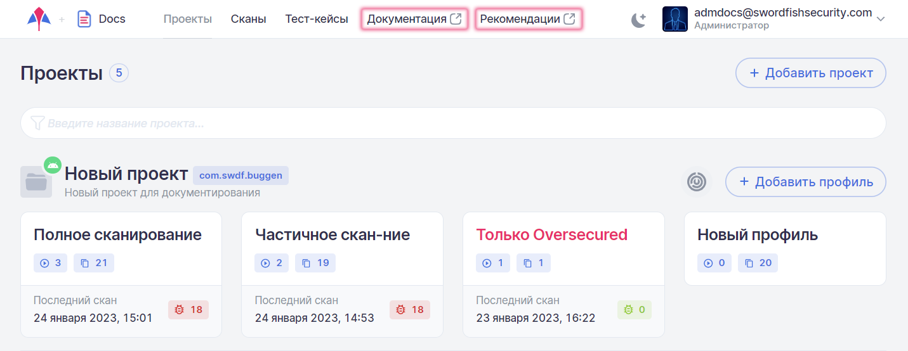

# Документация и рекомендации

Неотъемлемой частью системы **Стингрей** являются эксплуатационная документация и рекомендации по устранению уязвимостей. Если установка системы произведена on-premises, они доступны без сети Интернет.

Для перехода в необходимый раздел выберите соответствующий пункт основного меню **Документация** или **Рекомендации**.

<figure markdown></figure>