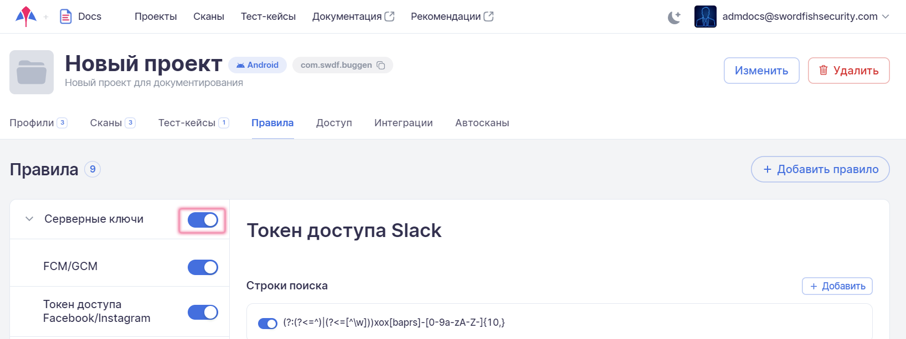
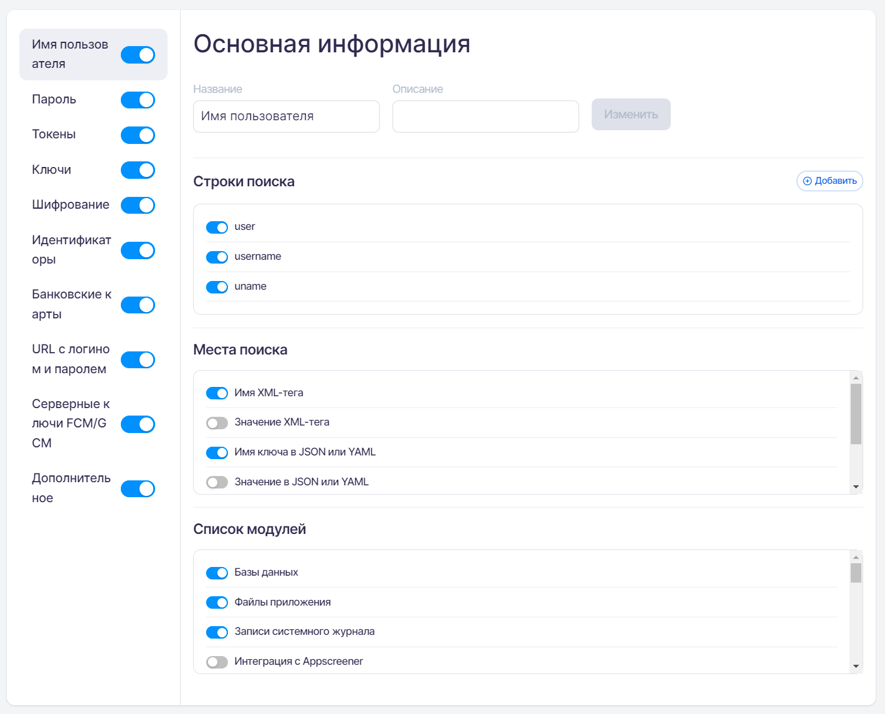
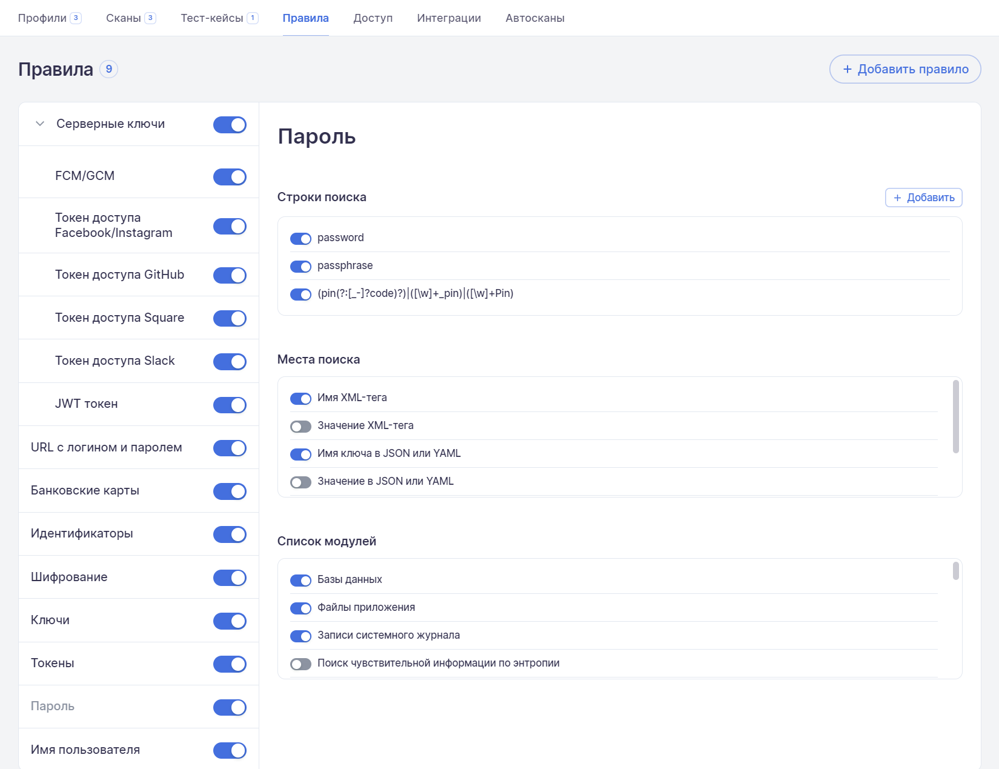
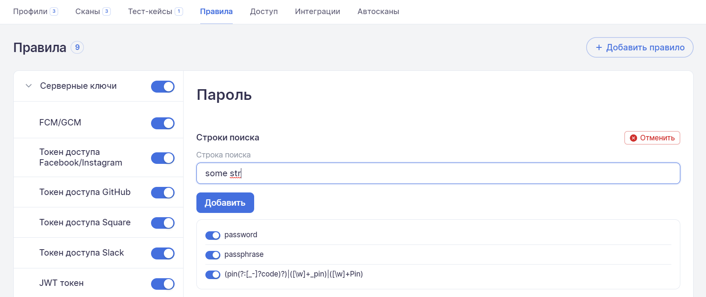
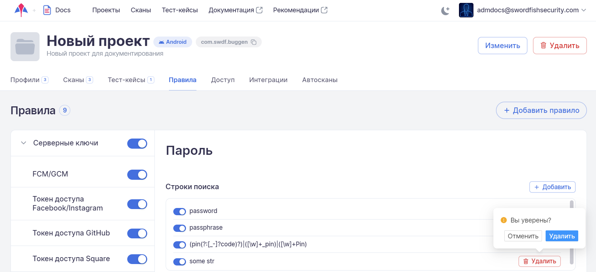
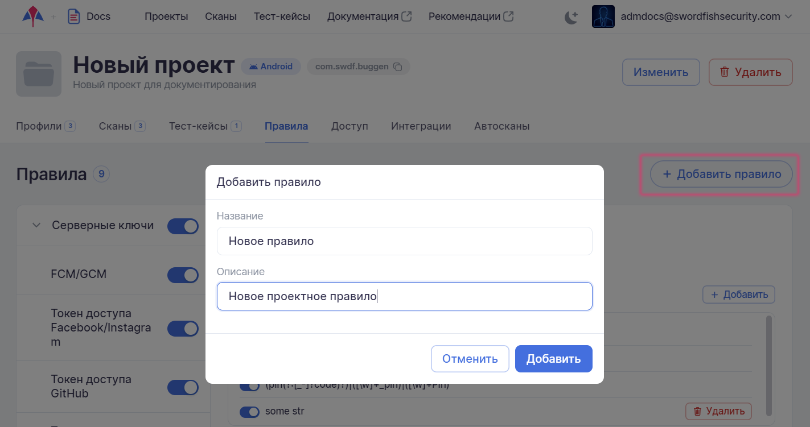
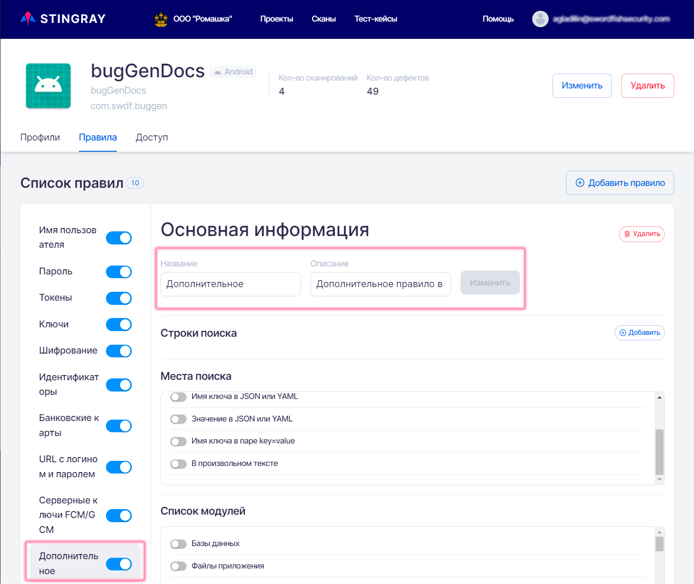
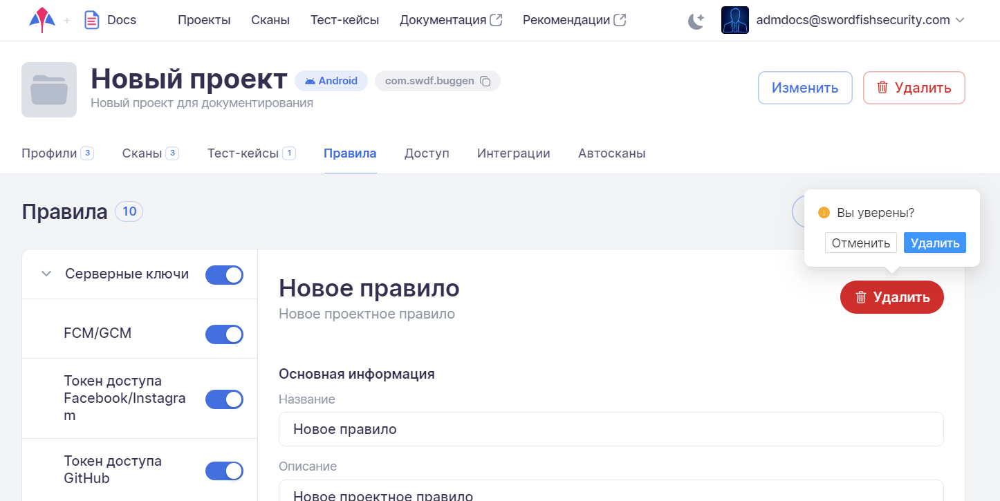

# Правила

На данной вкладке представлены правила анализа уязвимостей, которые применяются для выбранного проекта. В общем случае правила соответствуют определенным на уровне компании (см. раздел «[Правила анализа на уровне Компании](../ag/pravila_analiza_na_urovne_organizacii.md)» в Руководстве по установке, настройке и интеграции), но есть возможность изменить или добавить правила в соответствии со спецификой сканируемого приложения. Необходимо отметить, что правила, добавленные непосредственно в проекте, будут применяться только в рамках этого проекта.

<figure markdown>

</figure>
 
## Переопределение правил анализа

На странице проекта на вкладке **Правила** представлены правила анализа собранных данных для поиска уязвимостей. На этой вкладке возможно добавить, изменить, отключить или удалить существующее правило анализа для конкретного проекта. То есть, заданное на этой вкладке новое или измененное правило будет применяться в рамках только этого проекта, а не для всех проектов данной компании.

## Описание работы правил анализа

Основная цель применения правил анализа — модификация системы под особенности своего приложения для эффективной работы по поиску уязвимостей. Каждое приложение и его данные уникальны по формату и содержанию. Применение  правил анализа, настроенных под специфику проекта, позволяет максимально увеличить покрытие системой всех возможностей для поиска уязвимостей для каждого конкретного приложения.

Правила анализа, по которым происходит поиск части уязвимостей, представляют собой набор строк или регулярных выражений, которые необходимо искать в собранных в ходе сканирования приложения данных. Каждое правило определяет, какую строку или регулярное выражение искать, в данных каких модулей и в каком месте/каких форматах данных. Такой подход позволяет значительно сократить количество ложных срабатываний при поиске уязвимостей.

В системе существует два вида правил анализа:

* Внутренние правила поиска уязвимостей, не подлежащие настройке и недоступные пользователю для просмотра и редактирования. Они не представлены на вкладке **Правила**.
* Правила, которые занимаются поиском чувствительной информации. Как раз они и представлены на вкладке Правила и описаны в этом разделе. Эти правила пользователь системы может модифицировать и настроить под работу со своим приложением.

На вкладке **Правила** каждое правило анализа представлено отдельной строкой слева в **Списке правил**. Строка правила имеет следующие поля:

* Имя правила.
* Селектор состояния правила. Если селектор находится во включенном положении , то правило является активным и будет применяться при анализе собранных данных для поиска уязвимостей. Если селектор находится в выключенном положении , то правило является неактивным и не будет применяться при анализе собранных данных для поиска уязвимостей.

<figure markdown>

</figure>
 
Выбранное правило подсвечивается и справа отображается **Основная информация** о нем:

* **Название** — имя правила.
* **Описание** — описание правила.
* **Строки поиска** — набор строк и регулярных выражений для поиска конфиденциальной информации.
* **Места поиска** — где именно искать необходимую информацию, в каких файлах и форматах данных.
* **Список модулей** — модули системы, для которых будет применяться данное правило.

<figure markdown>

</figure>
  
Рассмотрим, как работают правила анализа на примере одного из правил.

<figure markdown>

</figure>
  
Это правило анализа в данный момент является активным и называется «Пароль». Оно определяет, что следующие паттерны:

* Регулярные выражения вида `pin(?:[_-]?code)?`.
* Строка password.
* Строка passphrase.

будут искаться в данных, собранных всеми модулями системы, выбранными в поле **Список Модулей**, в следующих местах, выбранных в поле **Места поиска**:

* Имя XML-тега.
* Имя ключа в JSON или YAML.

Пользователь имеет возможность сделать неактивным или отредактировать это правило в случае необходимости.

## Редактирование правил анализа

Редактирование правил анализа может быть произведено на вкладке **Правила**. Для редактирования выберите необходимое правило слева в **Списке правил**. Справа в поле **Основная информация** можно изменить и сохранить следующие параметры:

* **Название** правила. Для сохранения произведенных изменений нажмите кнопку **Изменить** справа.
* **Описание** правила анализа. Для сохранения произведенных изменений нажмите кнопку **Изменить** справа.
* В поле **Строки поиска** можно добавить строку или регулярное выражение для поиска конфиденциальной информации. Для этого необходимо нажать на кнопку **Добавить** справа в поле **Строки поиска**, в появившемся поле Строка поиска задать собственно новую строку или регулярное выражение и нажать кнопку **Добавить**:

    <figure markdown>
    
    </figure>

    Все ранее определенные регулярные выражения для данного правила перечислены в этом поле в списке ниже. Строки поиска, заданные на уровне компании, можно отключить с помощью селектора, расположенного рядом с каждой строкой. Строки поиска, заданные на уровне проекта, можно отключить или удалить. Для удаления строки поиска нажмите кнопку **Удалить** справа. 

    <figure markdown>
    
    </figure>
 
* **Места поиска** — у активных мест поиска селектор находится в положении , у неактивных — в положении . Для изменения необходимо нажать на селектор. Его положение изменится и будет отображено уведомление об успешном изменении.
* **Список модулей**, для которых будет применяться данное правило. Любой из модулей сканирования в системе можно выбрать и добавить в правило. Включение и отключение происходит аналогично полю **Места поиска**.

## Добавление правил анализа

Для добавления нового правила анализа нажмите кнопку **Добавить правило** в правом верхнем углу. В появившемся окне **Добавить правило** необходимо ввести имя и описание правила и нажать кнопку **Добавить** внизу справа.

<figure markdown>

</figure>
 
Добавленное правило будет отображено в списке и доступно для дальнейшего редактирования. У вновь добавленного правила поле **Строки поиска** является пустым, а в полях **Места поиска** и **Список модулей** все селекторы находятся в положении выключено .

<figure markdown>

</figure>
 
## Удаление правил анализа

Удаление правил анализа может быть произведено на вкладке **Правила**. Для удаления правила нажмите на кнопку **Удалить** в правом верхнем углу поля **Основная информация**.

<figure markdown>

</figure>
 
В появившемся диалоговом окне необходимо подтвердить или отменить удаление.

<figure markdown>

</figure>
 
!!! note "Примечание"
    В системе есть девять предустановленных правил, заданных на уровне компании, которые на уровне проекта можно только отключить, но нельзя удалить. Пользователь может удалить только прочие внесенные в список правила.