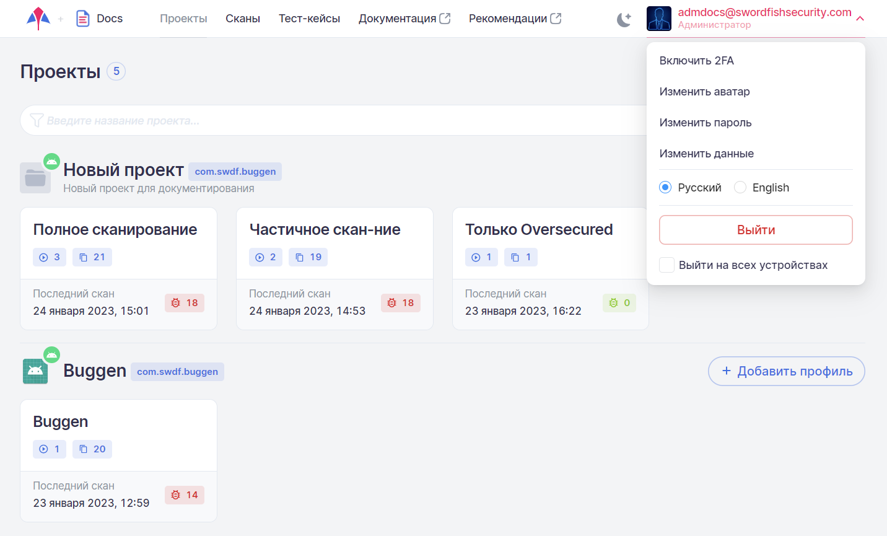

# Профиль пользователя

Для редактирования профиля пользователя необходимо нажать на адрес его электронной почты в правом верхнем углу пользовательского интерфейса и в раскрывшемся меню выбрать необходимый пункт. Кроме этого, используя данное меню, можно выйти из системы.

<figure markdown></figure>
  
## Двухфакторная аутентификация

Для включения двухфакторной аутентификации выберите пункт **Включить 2FA**. После этого система предложит ввести пароль пользователя.

<figure markdown></figure>
  
После ввода пароля отсканируйте появившийся QR-код с помощью **Google Authenticator** (скачать в [Google Play](https://play.google.com/store/apps/details?id=com.google.android.apps.authenticator2&hl=ru&gl=US) или [App Store](https://apps.apple.com/ru/app/google-authenticator/id388497605)) и введите сформированный в приложении код.

<figure markdown></figure>
  
Для отключения двухфакторной аутентификации выберите пункт **Отключить 2FA** и в появившемся окне введите код, отображаемый в **Google Authenticator**.

## Изменение аватара пользователя

После нажатия пункта **Изменить аватар** откроется стандартное диалоговое окно браузера, используя которое выберите файл изображения в поддерживаемом формате. 

## Изменение пароля пользователя

Выберите пункт **Изменить пароль**, а затем укажите старый и новый пароли в соответствующих полях.

!!! note "Примечание"
    При необходимости можно включить отображение паролей, нажав иконку .

## Изменение логина пользователя

Выберите пункт **Изменить данные** и отредактируйте логин пользователя.

!!! note "Примечание"
    Логин указывается в формате электронной почты.

## Изменение языка пользовательского интерфейса

Выберите язык пользовательского интерфейса, нажав соответствующий пункт.

## Выход из системы

Чтобы выйти из системы, нажмите пункт **Выйти**. Если выбрана опция **Выйти на всех устройствах**, произойдет выход на всех устройствах, на которых пользователь авторизован в системе.
