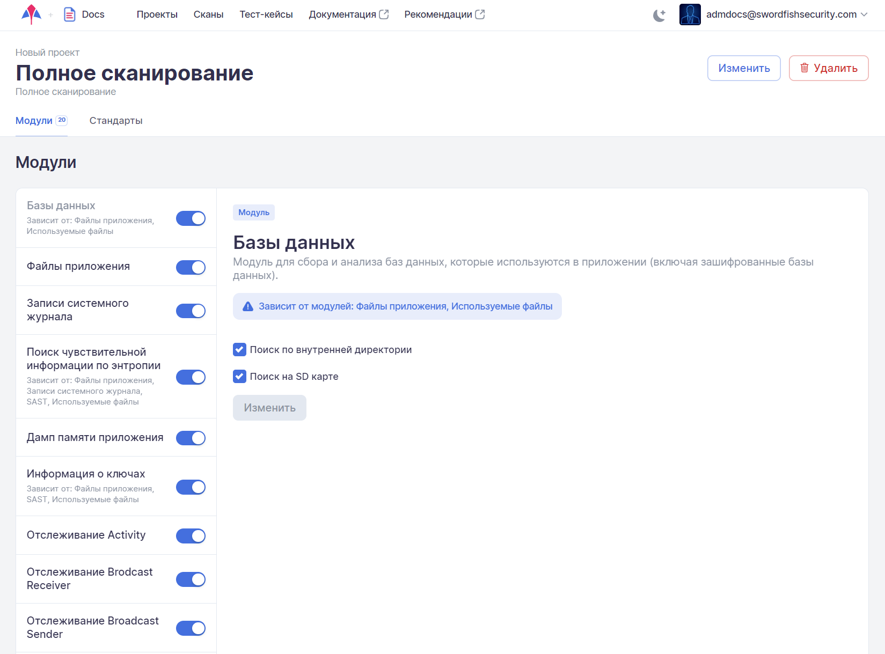
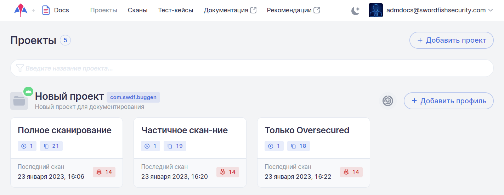
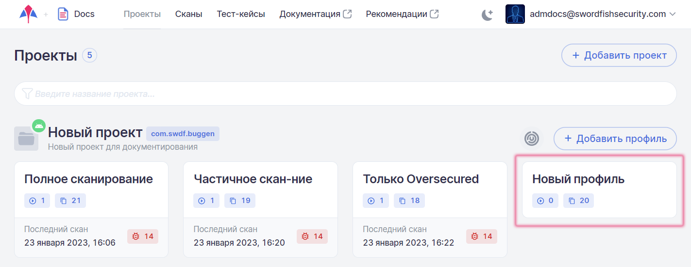
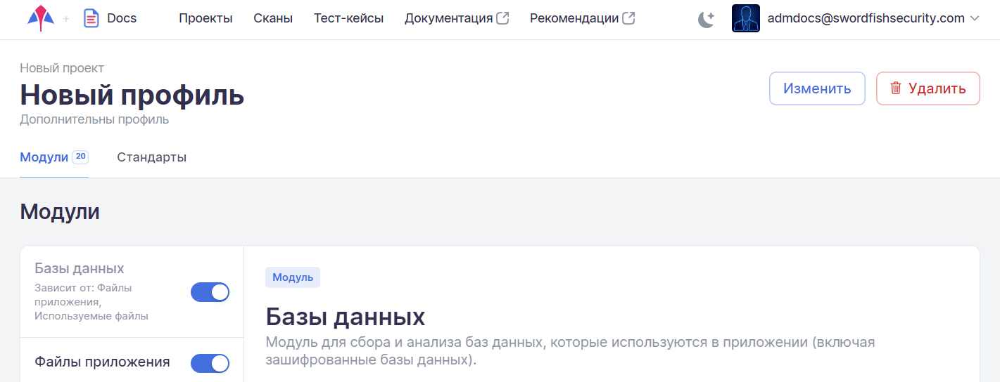
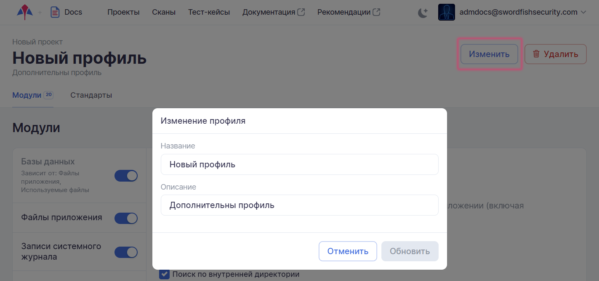
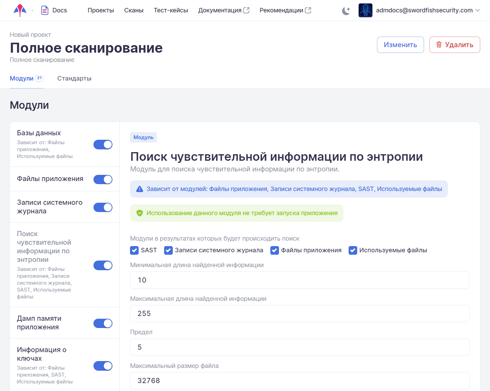
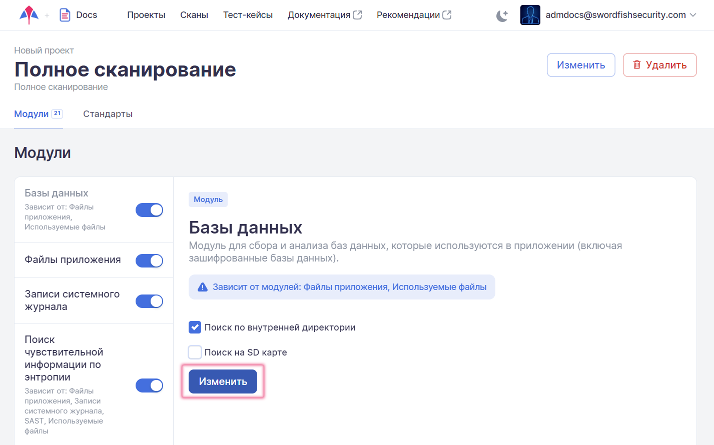
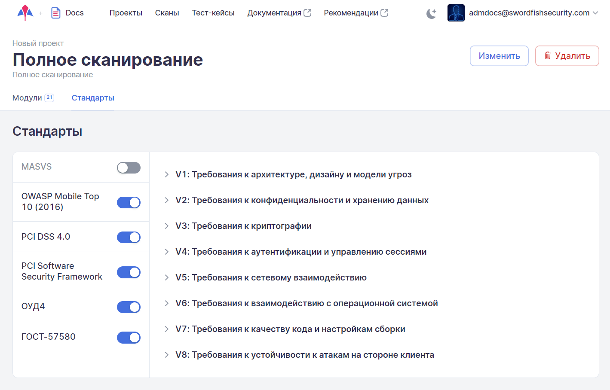

# Профили

По нажатию на имя профиля на странице **Проекты** или на вкладке **Профили** страницы с информацией о проекте открывается страница профиля  с детальной информацией о нем.

<figure markdown>

</figure>

На странице профиля можно получить информацию о настройках модулей сканирования в данном профиле (включить, отключить или настроить их), просмотреть и включить или отключить стандарты безопасности, на соответствие которым будет проверяться анализируемое данным профилем приложение. 
В верхней части страницы представлена общая информация о профиле:

* Имя профиля.
* **Проект**, к которому относится профиль.
* **Количество сканирований** в рамках профиля.
* **Количество дефектов**, найденных за время существования профиля.

На странице присутствуют две вкладки: **Модули** и **Стандарты**. Их детальное описание приведено ниже в этом разделе.

## Добавление / редактирование / удаление профиля

Профили сканирования относятся к проектам. На странице **Проекты** представлены все существующие в системе проекты и их профили сканирования. Каждый профиль представлен в виде карточки с краткой информацией о нем. Для каждого проекта показан список его профилей. На этой странице можно добавить новый профиль сканирования для существующего проекта или просмотреть информацию о существующих профилях.

<figure markdown>

</figure>
 
Для добавления нового профиля в проект нажмите кнопку **Добавить профиль** справа в поле проекта. В появившемся окне **Добавить профиль** введите название профиля и его краткое описание, а затем нажмите кнопку **Добавить** в правом нижнем углу окна. Вновь созданный профиль появится в списке профилей проекта.

<figure markdown>

</figure>
 
Для редактирования или удаления профиля нажмите имя профиля, который необходимо отредактировать или удалить.

<figure markdown>

</figure>
 
Откроется страница с детальной информацией о профиле.

<figure markdown>

</figure>

Чтобы отредактировать параметры профиля, нажмите кнопку **Изменить** справа вверху. В появившемся окне можно изменить название и описание профиля:

<figure markdown>

</figure>

Чтобы удалить профиль, нажмите кнопку **Удалить** справа вверху и подтвердите это действие нажатием на кнопку **Удалить** в появившемся диалоговом окне.

<figure markdown>

</figure>
 
Добавление, удаление и редактирование профиля можно осуществить двумя способами. Рассмотрим второй способ.

На странице **Проекты** показаны имена проектов и список их профилей. По нажатию на имя проекта открывается страница **Проект** с вкладками **Профили**, **Правила** и **Доступ**.

<figure markdown>

</figure>
  
На вкладке **Профили** можно добавить новый профиль нажатием на кнопку **Добавить профиль**. В появившемся окне **Добавить профиль** введите название профиля и его краткое описание и нажмите кнопку **Добавить** в правом нижнем углу окна. Вновь созданный профиль появится в списке профилей проекта.

Нажмите карточку профиля в списке профилей, чтобы изменить информацию профиля или удалить профиль. Откроется страница этого профиля. Описание редактирования и удаления профиля на странице профиля приведено выше в этом разделе.

## Модули

На данной вкладке представлены настройки модулей для сбора информации о приложении, на основе которой будет произведен дальнейший анализ. На этой вкладке возможно включить или выключить конкретный модуль и провести соответствующие настройки.

<figure markdown></figure>
  
Система включает более двадцати модулей сканирования, см. «[Приложение 1. Описание модулей для сбора информации](../ag/prilozhenie_1.md)». Список всех модулей для сканирования и сбора информации о приложении представлен на вкладке **Модули** на странице профиля. Из этого списка можно выбрать и настроить те модули, которые будут включены при сканировании приложения с этим профилем. Дальнейший анализ и поиск уязвимостей приложения будет производиться на основе собранных в ходе сканирования данных.

Для эффективной работы с приложением возможно включить или выключить каждый конкретный модуль и провести соответствующие настройки.

Включить или выключить модуль можно с помощью тумблера, расположенного справа от его названия. У всех включенных модулей тумблер находится во включенном положении , у всех выключенных модулей тумблер находится в выключенном положении . Для изменения статуса модуля с «включен» на «выключен» и наоборот достаточно кликнуть мышкой тумблера модуля.

Каждый модуль имеет набор специфических для него настроек. При выборе модуля из списка модулей в левой части вкладки в правой части вкладки  отображаются его настройки, которые можно изменить и сохранить, нажав кнопку **Изменить** внизу вкладки.

<figure markdown>

</figure>
  
Блок информации для каждого модуля включает:

* **Название** модуля.
* **Описание**  модуля.
* Список модулей, от которых зависит этот модуль.
* **Настройки**, которые можно изменить (если применимо для данного модуля — ряд модулей не имеет изменяемых настроек).

Работа некоторых модулей зависит от результатов других модулей. Это отмечено в списке модулей в левой части экрана через дополнительную информацию, расположенную снизу имени модуля, см. рис. ниже. Если все «родительские» модули выключены, то зависящий от них модуль также будет автоматически выключен.

<figure markdown>

</figure>
  
## Стандарты

На данной вкладке доступно управление стандартами информационной безопасности, на соответствие которым будет проверено анализируемое приложение.

На вкладке **Стандарты** страницы компании перечислены все стандарты информационной безопасности и входящие в них требования, на соответствие которым можно проверить приложение. Список всех стандартов и требований представлен также на вкладке **Стандарты** на странице профиля. Из этого списка можно выбрать стандарты, на соответствие которым будут проверяться результаты тестирования приложения с этим профилем. Список входящих в стандарт требований представлен на правой части вкладки.

Система предоставляет возможность включить или выключить проверку на соответствие стандартам информационной безопасности.

У всех включенных для проверки стандартов тумблер находится во включенном положении , у всех выключенных стандартов тумблер находится в выключенном положении . Для изменения статуса стандарта с «включен» на «выключен» и наоборот достаточно кликнуть мышкой тумблер стандарта.

<figure markdown>

</figure>