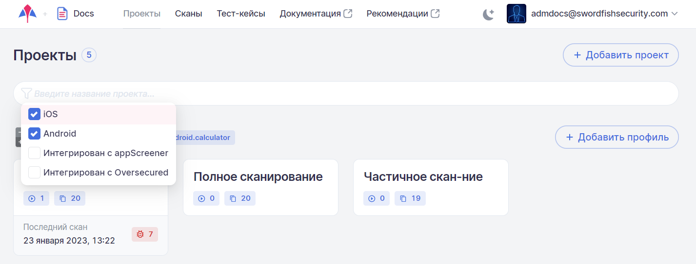
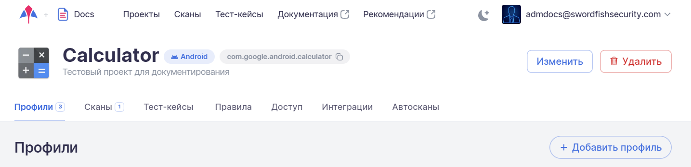
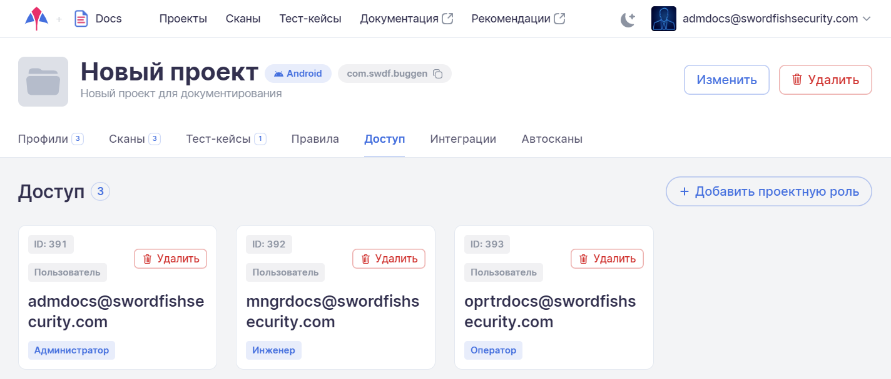
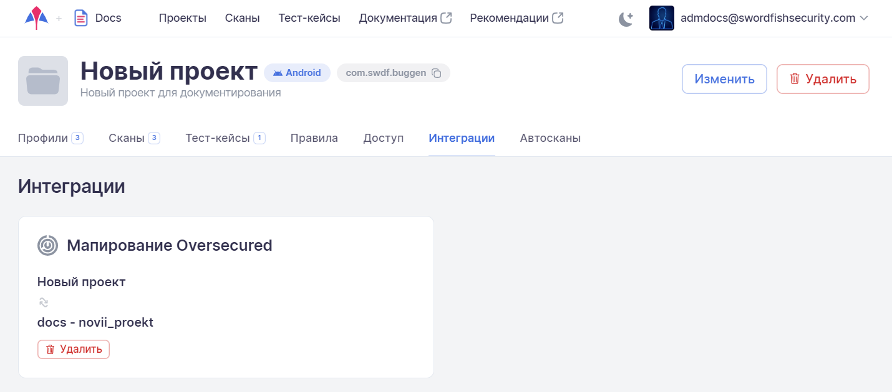
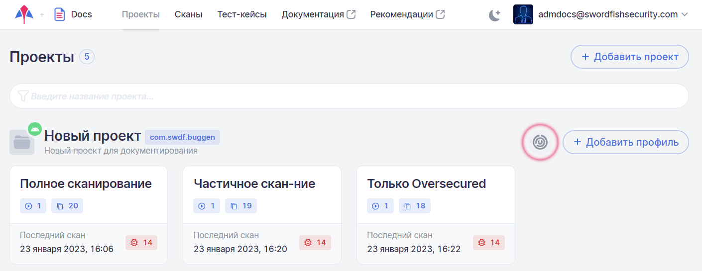

# Проекты

## Список проектов

На странице **Проекты** указаны все существующие в данной Компании проекты и их профили сканирования.

<figure markdown></figure>

Для каждого проекта отображаются его название, имя пакета (package name) и архитектура приложения (Android/iOS). На данной странице можно получить краткую информацию о существующих профилях проекта, количестве найденных дефектов во время последнего сканирования для каждого из профилей, количестве проведенных сканирований, дате последнего сканирования и о количестве включенных модулей.

Существует возможность поиска и фильтрации проектов. Чтобы найти проект(ы), введите его имя или часть его имени в поле поиска.

<figure markdown></figure>
 
Отфильтровать проекты по нескольким параметрам (архитектура – Android и/или iOS, интеграция с appScreener и/или Oversecured) можно с помощью кнопки , которая располагается слева в поле поиска.

<figure markdown></figure>

Также на странице проектов можно добавить новый проект или добавить новый профиль сканирования для существующего проекта.

По нажатию на имя проекта открывается страница проекта с общей информацией и семью вкладками: **Профили**, **Сканы**, **Тест-кейсы**, **Правила**, **Доступ**, **Интеграции** и **Автосканы**.

<figure markdown></figure>

По нажатию на имя профиля в карточке профиля, на поле **Количество сканов** или на поле **Количество модулей** открывается страница профиля с общей информацией о нем (см. раздел «[Профили](../ug/profile.md)»).

По нажатию на поле **Количество дефектов** в карточке профиля открывается страница с результатами последнего сканирования с использованием данного профиля (см. раздел «[Результаты сканирования](./rezultaty_skanirovanij.md)»).

<figure markdown></figure>

## Информация о проекте

В верхней части страницы проекта представлена общая информация по проекту, включающая:

* Аватар проекта.
* Название проекта.
* Описание проекта.
* Название пакета.
* Архитектура проекта (Android или iOS).

<figure markdown></figure>
  
## Добавление / редактирование / удаление проекта

Для работы с проектами необходимо выбрать пункт **Проекты** в основном меню, расположенном в верхней части экрана.

<figure markdown></figure>
  
Для добавления нового проекта нажмите на кнопку **Добавить проект**, расположенную справа.

В появившемся окне **Добавить проект** введите название проекта, его краткое описание и выберите архитектуру (Android/iOS). Также в соответствующем поле можно указать имя сканируемого пакета (приложения). При этом в имени пакета можно использовать символ «*» в качестве универсального знака, заменяющего один или несколько символов. Если оставить это поле пустым, оно будет автоматически заполнено после первого сканирования. При выборе опции **Скопировать профили из существующего проекта** в появившемся поле **Проект для копирования** можно выбрать уже существующий в компании проект. Это позволит создать новый проект вместе с уже существующими и настроенными в выбранном для копирования проекте профилями и избежать их повторного добавления и настройки в новом проекте.  

Нажмите кнопку **Добавить** в правом нижнем углу окна. Вновь созданный проект появится на странице **Проекты**.

<figure markdown></figure>
  
Для редактирования кликните мышкой имя проекта на странице **Проекты**.

На открывшейся странице проекта нажмите кнопку **Изменить**:

<figure markdown></figure>
 
В появившемся окне **Изменение данных проекта** можно отредактировать следующие параметры:

* В поле **Название** отредактировать имя проекта.
* Изменить описание проекта в соответствующем поле.
* Изменить имя пакета в соответствующем поле.

<figure markdown></figure>

После редактирования информации проекта нажмите кнопку **Обновить** в правом нижнем углу окна.

Изменить аватар проекта можно, кликнув мышкой текущий аватар и выбрав файл с картинкой для нового.

Также на странице проекта можно его удалить. Для этого нажмите кнопку **Удалить** в правой части экрана и подтвердите это действие в появившемся диалоговом окне.

<figure markdown></figure>

## Список профилей проекта

На вкладке **Профили** доступно управление профилями сканирования, включенными в данный проект. Здесь доступен просмотр и добавление нового профиля сканирования. Более подробная информация о работе с профилями приведена в разделе «[Профили](./profile.md)».

<figure markdown></figure>

## Список сканирований проекта

На вкладке **Сканы** приведен список всех выполненных в проекте сканирований. Использование этой вкладки позволяет работать со сканированиями проекта без перехода в пункт **Сканы** основного меню и фильтрации необходимых данных по имени проекта. Более подробная информация о работе со сканированиями приведена в разделе «[Результаты сканирований](../ug/rezultaty_skanirovanij.md)».

<figure markdown></figure>
 
## Тест-кейсы проекта

На вкладке **Тест-кейсы** приведен список всех ранее записанных тест-кейсов проекта. Использование этой вкладки позволяет работать с тест-кейсами проекта без перехода в пункт **Тест-кейсы** основного меню и фильтрации необходимых данных по имени проекта. Более подробная информация о работе с тест-кейсами приведена в разделе «[Тест-кейсы](../ug/testcases.md)».

<figure markdown></figure>
 
## Правила проекта

На вкладке **Правила** доступно управление правилами анализа уязвимостей, которые применяются для данного проекта. Порядок работы с правилами описан в разделе «[Правила](../ug/pravila.md)».

<figure markdown></figure>
 
## Назначение проектных прав доступа

На вкладке **Доступ** осуществляется назначение проектных прав доступа как для отдельных пользователей, так и для групп. Более подробная информация о ролевой модели приложения приведена в разделе «[Пользователи, группы, проекты](../ag/polzovateli.md   )».

<figure markdown></figure>

## Интеграции проекта

На вкладке **Интеграции** приведены сведения об интеграциях проекта с инструментами **appScreener** и **Oversecured**. Использование этой вкладки позволяет получить информацию об интеграциях проекта и настроить их без перехода на страницу компании и далее на вкладку **Интеграции** с последующим выбором конкретного инструмента.

<figure markdown></figure>
  
При отображении интеграций проекта на этой вкладке система проверяет валидность используемых токенов. Если токен не является валидным, отображается сообщение об ошибке. Если токен является валидным, но проект в системе не отмапирован на проект в **appScreener** или **Oversecured**, система предоставляет возможность провести мапирование, выбрав один из проектов из раскрывающегося списка.

На странице **Проекты** проект, имеющий интеграцию с **Oversecured**, будет отмечен значком  рядом с кнопкой Добавить профиль, а проект, имеющий интеграцию с **appScreener**, будет отмечен значком .

<figure markdown></figure>
 
Более подробная информация о интеграциях приведена в разделе «[Интеграции](../ag/integracii.md)».

## Автосканы проекта

На вкладке **Автосканы** приведен список всех настроенных автосканов проекта. Более подробная информация об автосканах приведена в разделе «[Автосканы]()».

<figure markdown></figure>
