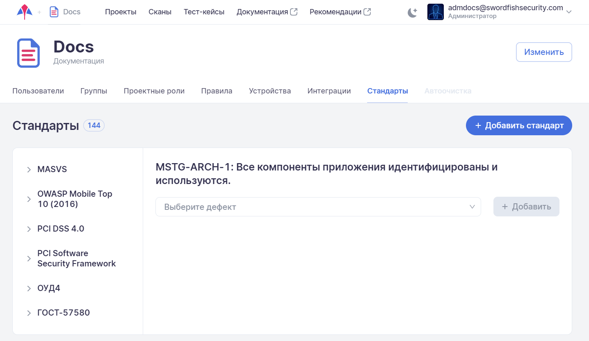

# Стандарты

Для перехода на вкладку **Стандарты** необходимо в левом верхнем углу нажать название компании, а далее на странице настроек выбрать соответствующую вкладку.

<figure markdown></figure>
 
На данной вкладке представлены стандарты информационной безопасности и входящие в них требования, на соответствие которым можно проверить сканируемые приложения. На этой вкладке можно добавить, изменить или удалить стандарт на уровне компании. Проверка на соответствие каждому из этих стандартов может быть проведена во всех проектах данной компании.

Рассмотрим способы управления стандартами и требованиями в системе.

## Редактирование существующего стандарта

При редактировании существующего стандарта требований можно провести несколько операций:

* Изменить название и описание стандарта.
* Удалить стандарт.
* Добавить новую категорию (группу требований).
* Добавить новое требование.
* Изменить название и описание категории.
* Удалить категорию.
* Изменить название и описание требования.
* Удалить требование.

Для корректировки названия и описания или удаления существующего стандарта наведите мышку на название стандарта. Справа от названия стандарта появится значок «».

<figure markdown></figure>
 
Нажмите левой кнопкой мышки на значок «» и выберите из выпадающего меню пункт **Изменить** для редактирования названия и описания стандарта или пункт **Удалить** для его удаления.

<figure markdown></figure>

Для редактирования названия и описания стандарта выберите пункт выпадающего меню **Изменить**, в появившемся окне скорректируйте название и описание стандарта и нажмите на кнопку **Обновить**.

<figure markdown></figure>
  
Для добавления категории или требования выберите пункт выпадающего меню **Добавить**, затем подпункт **Категория** или **Требование** соответственно, введите название и описание категории или требования в поле ввода и нажмите на кнопку **Сохранить**.

<figure markdown></figure>
  
Для корректировки названия и описания или удаления существующей категории наведите мышку на её название. Справа от названия категории появится значок <nobr>«»</nobr>. Нажмите левой кнопкой мышки на значок «» и выберите из выпадающего меню пункт **Изменить** для редактирования названия и описания категории или пункт **Удалить** для её удаления.

<figure markdown></figure>
 
Для редактирования названия и описания категории выберите пункт выпадающего меню **Изменить**, скорректируйте название и описание категории в появившемся окне и нажмите на кнопку **Обновить**.

<figure markdown></figure>
  
Для корректировки названия и описания или удаления существующего требования наведите мышку на его название. Справа от названия требования появится значок «». Нажмите левой кнопкой мышки на значок «» и выберите из выпадающего меню пункт **Изменить** для редактирования названия и описания требования или пункт **Удалить** для его удаления.

<figure markdown></figure>
 
Для редактирования названия и описания требования выберите пункт выпадающего меню **Изменить**, скорректируйте название и описание требования в появившемся окне и нажмите на кнопку **Обновить**.

<figure markdown></figure>
 
## Добавление нового стандарта

Для добавления нового стандарта нажмите на кнопку **Добавить стандарт** справа вверху на вкладке **Стандарты**.

<figure markdown></figure>

В появившемся окне укажите название и описание нового стандарта и нажмите на кнопку **Добавить**. Вновь созданный стандарт будет добавлен в список стандартов в системе.

<figure markdown></figure>
 
## Связывание типов дефектов с требованиями

Система содержит определенный набор требований и определенный набор типов дефектов. Как было сказано выше, с каждым требованием соотносятся определенные типы дефектов, при нахождении которых в приложении требование будет считаться не выполненным.

Чтобы посмотреть, какие типы дефектов связаны с требованием, и/или связать с требованием новый тип дефектов, выберите интересующее требование. В правой части экрана появится список уже связанных с ним типов дефектов и поле для выбора новых типов.

<figure markdown></figure>
 
Чтобы добавить к требованию новый тип дефектов, выберите из выпадающего списка один из имеющихся в системе типов в поле **Выберите дефект** и нажмите на кнопку **Добавить**. Вновь выбранный тип дефектов будет добавлен в список дефектов, связанных с этим требованием.

<figure markdown></figure>