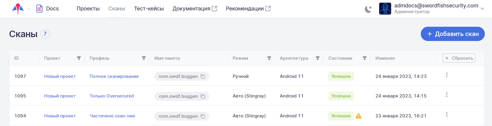
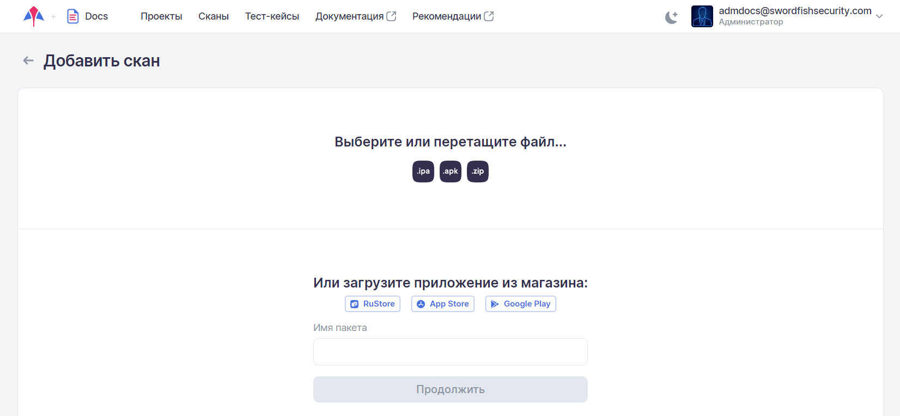
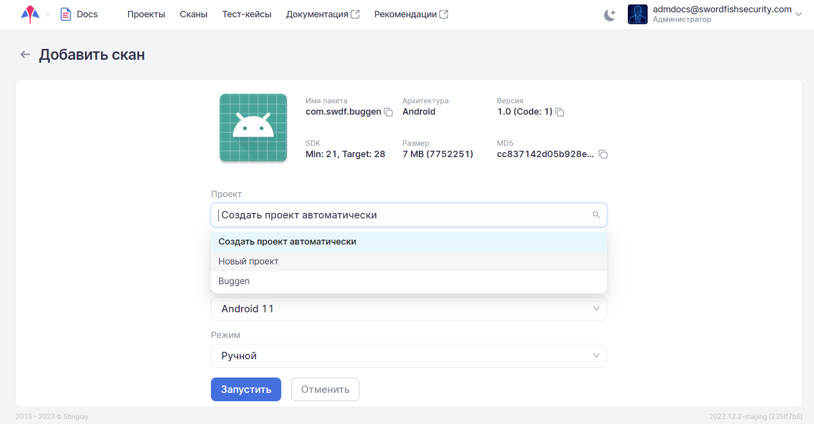
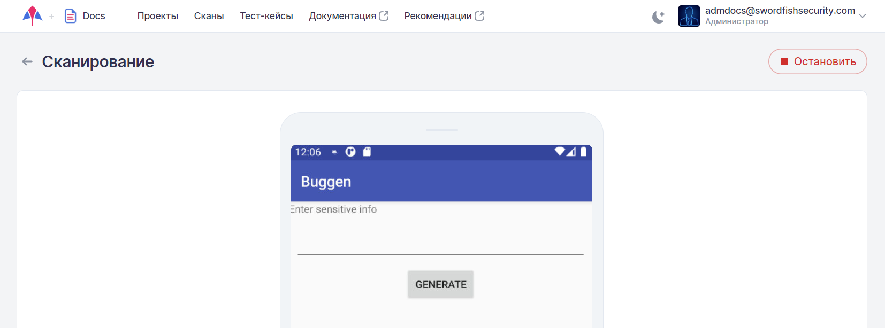
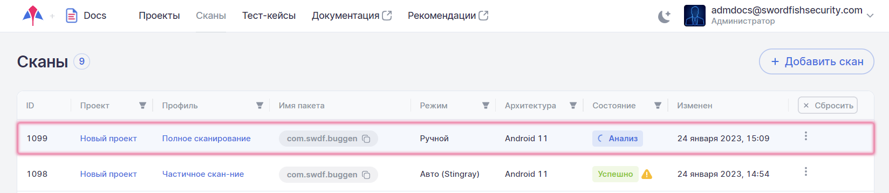

# Запуск сканирования

Запуск сканирования может быть произведен в ручном или в автоматическом режиме. Для запуска сканирования выберите пункт основного меню **Сканы** и нажмите на кнопку **Добавить скан** в правом верхнем углу.

<figure markdown></figure>
 
Выберите или перетащите на появившуюся страницу **Добавить скан** apk-файл, aab-файл (в формате Android App Bundle), ipa-файл или zip-файл, содержащий split apk сканируемого приложения или загрузите приложение из магазина, указав имя пакета в соответствующем поле, и нажмите на кнопку **Продолжить**.

<figure markdown></figure>
 
!!! note "Примечание"
    Если пакет с выбранным именем и хеш-суммой уже загружен, в целях экономии ресурсов его повторная загрузка не производится, а используется файл, уже имеющийся на сервере.

<figure markdown></figure>
 
После выбора файла на странице **Добавить скан** будут представлены необходимые для запуска анализа приложения поля:

* Информация о файле тестируемого приложения: **имя пакета**, **название/код версии**, **Target SDK**, **Min SDK**, **имя/размер/хеш файла** и **тип архитектуры**.
* **Проект** — проект, в рамках которого будет проводиться сканирование. Если приложение сканируется в системе впервые, в этом поле по умолчанию предлагается опция **Создать проект автоматически**. Таким образом, можно предварительно не создавать для запуска сканирования проект и профиль, а использовать данную опцию. В этом случае будут автоматически созданы проект и профиль с именем сканируемого пакета, указанном в поле **Имя пакета**.

    !!! note "Примечание"
        Если проект был уже однажды создан автоматически, а при повторной загрузке приложения была вновь выбрана опция **Создать проект автоматически**, система не будет создавать новый проект, а использует ранее автоматически созданный проект.

    Чтобы указать существующий проект, нажмите на поле **Проект** и выберите необходимое значение из выпадающего списка.

    <figure markdown></figure>

    !!! note "Примечание"
        Для выбора доступны либо проекты с незаполненным при создании полем **Имя пакета** (см. раздел «[Проекты](./projects.md)»), либо те, для которых в данном поле указан пакет, выбранный в предыдущем шаге. Если приложение сканируется в системе впервые, в этом поле по умолчанию предлагается опция **Создать проект автоматически**.

* **Профиль** — профиль, в рамках которого будет проводиться сканирование. Если приложение сканируется в системе впервые, в этом поле по умолчанию предлагается опция **Создать профиль автоматически**. Данная опция в поле **Профиль** работает аналогично приведенному выше ее описанию для поля **Проект**.

    Чтобы указать существующий профиль, нажмите на поле **Профиль** и выберите необходимое значение из выпадающего списка.

    <figure markdown></figure>

* **Режим** — ручное или автоматическое (Stingray / Appium) сканирование.
* **Тест-кейс** — эта опция появляется в случае выбора опции **Авто (Движок Stingray)** и позволяет выбрать воспроизводимый тест-кейс.

    !!! note "Примечание"
        Отображаются только тест-кейсы выбранного проекта.

* **Архитектура** — архитектура устройства, на котором будет запущено приложение.

    !!!note "Примечание"
        При отсутствии доступных для выполнения сканирования агентов в поле **Архитектура** отображается сообщение **Нет доступных устройств для данной архитектуры**.

## Автоматическое сканирование

Для запуска сканирования в автоматическом режиме необходимо сделать следующие шаги:

* Выбрать и загрузить файл мобильного приложения с расширением \*.apk, \*.aab (в формате Android App Bundle), \*.ipa или \*.zip, содержащий split apk, для которого будет проводиться сканирование.

    !!! note "Примечание"
        Если пакет с выбранным именем и хеш-суммой уже загружен, в целях экономии ресурсов его повторная загрузка не производится, а используется файл, уже имеющийся на сервере.

* Выбрать проект из выпадающего списка существующих в системе проектов.
    
    !!! note "Примечание"
        Для выбора доступны либо проекты с незаполненным при создании полем **Имя пакета** (см. раздел «[Проекты](./projects.md)»), либо те, для которых в данном поле указан пакет, выбранный в предыдущем шаге. Если приложение сканируется в системе впервые, в этом поле по умолчанию предлагается опция **Создать проект автоматически**.

* Выбрать профиль сканирования из выпадающего списка.
* Выбрать архитектуру, на которой будет проводиться сканирование. Отметим, что в данном поле будет доступна для выбора только та архитектура, на которой был записан тест-кейс и которая активна в системе.
* В поле **Режим** выбрать **Авто (Движок Stingray)** сканирование из выпадающего списка.
* Во вновь появившемся внизу поле выбрать имя уже существующего в системе тест-кейса для запуска сканирования в автоматическом режиме.

<figure markdown></figure>
  
По нажатию кнопки **Запустить** происходит запуск сканирования и переход на страницу **Сканирование**. Будет отображена страница с экраном устройства без возможности взаимодействия с ним. Передача изображения с экрана устройства необходима для анализа работы тест-кейса. В ходе сканирования на экране устройства отображаются следующие статусы:

* **Устройство подгатавливается** — выполняется подготовка устройства к сканированию.
* **Запуск приложения** — выполняется запуск приложения.

<figure markdown></figure>

Во время проведения автоматического сканирования также идет запись видео, которое при завершении доступно на вкладке **Запись** сканирования на странице с детальными результатами сканирования для данного теста.

При нажатии на кнопку  будет осуществлен переход к странице со списком всех сканирований. При переходе на страницу **Сканы** можно увидеть новую строку, отображающую текущий результат автоматического сканирования. При нажатии на **ID** тест-кейса, когда соответствующее сканирование имеет состояние **Создан**, **Запускается** или **Запущен**, происходит возврат на страницу с экраном устройства. После завершения сканирования приложения его состояние примет значение **Анализ** на время обработки полученных результатов. Затем состояние сканирования поменяется на **Успешно** или **Неуспешно** в зависимости от результата. Если нажать на **ID** тест-кейса, когда сканирование имеет состояние **Анализ**, **Успешно** или **Неуспешно**, произойдет переход на страницу с детальными результатами сканирования, см. раздел «[Результаты сканирований](./rezultaty_skanirovanij.md)».

### Автоматическое сканирование с использованием Appium
 
* Выберите пункт меню **Сканы**.
* Нажмите на кнопку **+Добавить скан**.
* Загрузите файл тестируемого приложения, перетащив его в область загрузки. Также можно нажать на область загрузки, что приведет к открытию стандартного диалогового окна браузера. Кроме этого, если настроена соответствующая интеграция (см. раздел «[Интеграции](../ag/integracii.md)»), можно загрузить файл тестируемого приложения непосредственно из следующих магазинов приложений: **RuStore**, **Google Play**.
* После загрузки приложения выберите проект, профиль и архитектуру в соответствующих полях.
* Выберите режим сканирования **Авто (Движок Appium)** и, нажав кнопку **Choose file**, выберите файл Appium-скрипта.

    !!! note "Примечание"
        В настоящий момент поддерживается тестирование только Android-приложений.

    !!! note "Примечание"
        В рамках текущей реализации для используемых Appium-скриптов существует ряд ограничений:

        * язык тестового сценария — только Python;
        * воспроизводятся только скрипты, сгенерированные рекордером утилиты **Appium Inspector** — любые отклонения приведут к возникновению ошибки;
        * используются только функции, доступные для генерации скрипта через **Appium Inspector**;
        * импорт и вызов функций Python, не относящихся к Appium и работе с приложением, не выполняются.

        Дополнительная информация об Appium-скриптах приведена в [Приложении 4](../ag/prilozhenie_4.md).

* Нажмите на кнопку **Запустить**, чтобы начать автоматическое тестирование с использованием загруженного скрипта.

## Ручное сканирование

* Выберите пункт меню **Сканы**.
* Нажмите на кнопку **+Добавить скан**.
* Выберите или перетащите на появившуюся страницу **Добавить скан** apk-файл, aab-файл (в формате Android App Bundle), ipa-файл или zip-файл, содержащий split apk сканируемого приложения. При загрузке файла система определит его архитектуру и отфильтрует все возможные подходящие значения в полях на появившейся странице.

    <figure markdown></figure>
 
    !!! note "Примечание"
        Если пакет с выбранным именем и хеш-суммой уже загружен, в целях экономии ресурсов его повторная загрузка не производится, а используется файл, уже имеющийся на сервере.

* Выберите проект из выпадающего списка существующих в системе проектов.

    !!! note "Примечание"
        Для выбора доступны либо проекты с незаполненным при создании полем **Имя пакета** (см. раздел «[Проекты](./projects.md)»), либо те, для которых в данном поле указан пакет, выбранный в предыдущем шаге. Если приложение сканируется в системе впервые, в этом поле по умолчанию предлагается опция **Создать проект автоматически**.

* Выберите профиль сканирования из выпадающего списка.
* Выберите архитектуру, на которой будет проводиться сканирование.
* В поле **Режим** выберите **Ручное** сканирование из выпадающего списка.

По нажатию кнопки **Запустить** происходит запуск сканирования и переход на страницу **Сканирование**. Будет отображена страница с экраном устройства и с запущенным приложением. Ручное сканирование выглядит, как обычная работа пользователя с приложением. Все действия пользователя записываются в виде последовательности шагов тест-кейса.

<figure markdown></figure>

После того, как все необходимые действия по сканированию приложения были сделаны, нажмите на кнопку **Остановить**. После нажатия сканирование будет остановлено, система перейдет в режим анализа данных. При нажатии на кнопку  будет осуществлен переход к странице со списком всех сканирований. Идентифицировать полученные результаты ручного сканирования можно по данным в столбце **Изменен**.

Следует отметить, что для обработки только что полученных результатов ручного сканирования требуется некоторое время, поэтому для детального просмотра и анализа результатов необходимо дождаться окончания их обработки. Статус сканирования в столбце **Состояние** может принимать одно из следующих значений:

* **Создан** — сканирование создано и помещено в очередь сканирования.
* **Запускается** — сканирование уже в обработке и перед запуском проходит необходимая техническая предварительная работа (установка приложения, его запуск и т. д.).
* **Запущен** — происходит процесс сканирования и взаимодействие с приложением, в зависимости от типа сканирования, вручную или через тест-кейсы.
* **Анализ** — взаимодействие с приложением закончено, идет процесс анализа собранных данных.
* **Неуспешно** — сканирование завершилось с ошибкой.
* **Успешно** — сканирование завершено успешно.
* **Повторный анализ** — был запущен и еще не завершился повторный анализ результатов сканирования.
* **Ожидание повторного анализа** — система получила запрос на повторный анализ результатов сканирования, но сам анализ еще не был запущен.
* **Отменен** — сканирование отменено с использованием расположенного справа раскрывающегося меню.

<figure markdown></figure>

## Запуск сканирования из командной строки

Сканирование приложения можно запустить не только из пользовательского интерфейса системы, но также из командной строки. Процесс формирования командной строки и запуска сканирования подробно описан в разделе «[Интеграции](../ag/integracii.md)».

## Запуск сканирования из систем сборки

Для запуска сканирования приложений из систем сборки созданы средства инструментальной поддержки, позволяющие значительно упростить этот процесс. Запуск сканирования из систем сборки подробно описан в разделе «[Интеграции](../ag/integracii.md)».